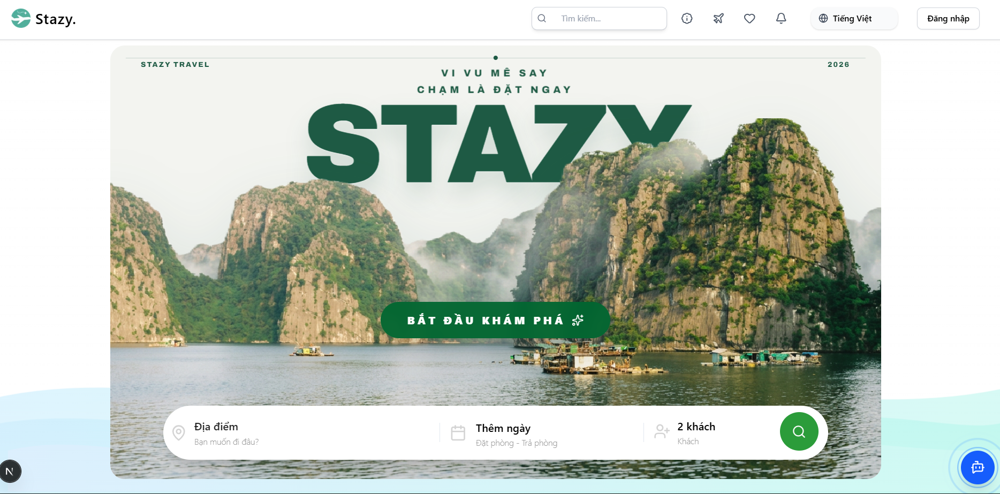
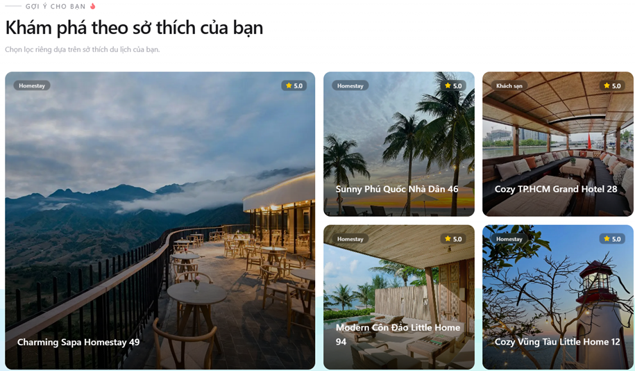
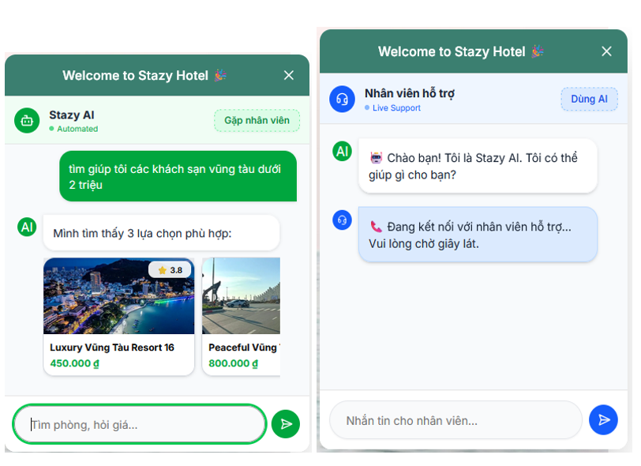
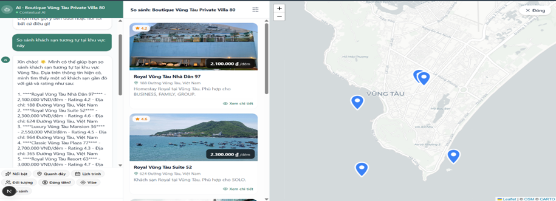
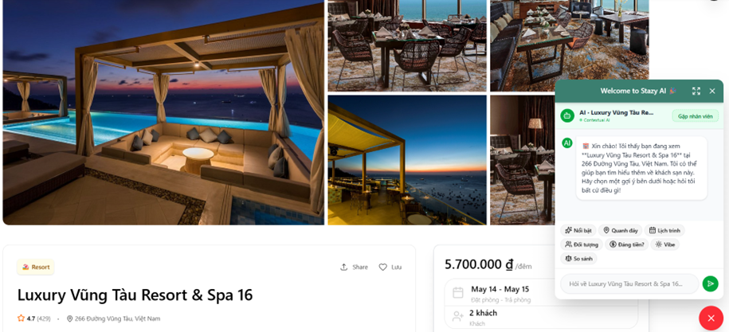
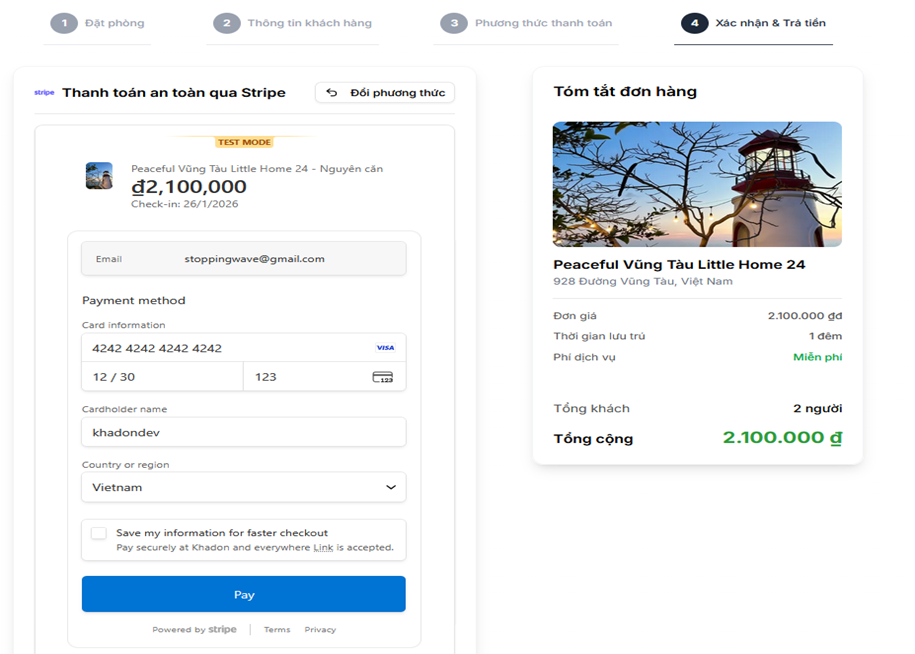

<p align="center">
  
</p>

# STAZY - Microservices Hotel Booking System

> A modern hotel booking platform with microservices architecture, AI recommendations, and real-time notifications.

## Table of Contents

- [Overview](#overview)
- [Demo](#demo)
- [Tech Stack](#tech-stack)
- [System Architecture](#system-architecture)
- [Requirements](#requirements)
- [Setup](#setup)
- [Run the Project](#run-the-project)
- [Services and Ports](#services-and-ports)
- [API Routes](#api-routes)

## Overview

STAZY is a hotel booking ecosystem built with microservices and event-driven communication.

- Smart search and booking flow
- AI recommendation powered by machine learning
- Stripe payment integration
- Real-time notifications with Socket.io
- Admin dashboard with analytics
- Email automation
- Kafka-based event streaming

## Demo

Demo video: [https://www.youtube.com/watch?v=sTJITGJX0XQ](https://www.youtube.com/watch?v=sTJITGJX0XQ)

The screenshots below follow the intended user journey:

1. Homepage
   
2. Recommendation
   
3. Chat 1
   
4. Chat 2
   
5. Detail
   
6. Payment
   

## Tech Stack

### Frontend Applications

- **Client** (Next.js 16 + React 19)
  - Port: `3002`
  - UI: Radix UI, Tailwind CSS 4
  - State: TanStack Query, Zustand
  - Auth: Clerk

- **Admin** (Next.js 16 + React 19)
  - Port: `3003`
  - UI: Radix UI, Tailwind CSS 4
  - Charts: D3.js
  - Auth: Clerk

### Backend Services

- **Product Service** (Express 5)
  - Port: `8000`
  - Manages hotels, rooms, categories, and users

- **Booking Service** (Fastify 5)
  - Port: `8001`
  - Handles bookings, Redis locks, and cron jobs

- **Payment Service** (Hono)
  - Port: `8002`
  - Handles Stripe checkout and webhooks
  - Must be exposed via ngrok for Stripe webhook testing

- **Search Service** (FastAPI / Python)
  - Port: `8008`
  - AI recommendation and semantic search
  - Uses scikit-learn, Transformers, Sentence-Transformers, and pgvector

- **Socket Service** (Fastify + Socket.io)
  - Port: `3005`
  - Real-time chat and notifications

- **Email Service** (Node.js standalone)
  - Sends booking confirmation emails

### Shared Packages

- `@repo/product-db`: Prisma schema and client for PostgreSQL
- `@repo/booking-db`: Prisma schema and client for MongoDB
- `@repo/kafka`: Kafka client configuration
- `@repo/types`: Shared TypeScript types
- `@repo/typescript-config`: Shared tsconfig
- `@repo/eslint-config`: Shared ESLint config

### Infrastructure

- Kafka cluster: `9094`, `9095`, `9096`, UI at `8080`
- PostgreSQL: `5432`
- Redis: `6379`
- MongoDB: legacy support for booking-db
- Docker: container orchestration

## System Architecture

```text
Client (:3002)      Admin (:3003)
        \              /
         \            /
          API Gateway (:3000)
     /      |       |       \
Product  Booking  Payment  Search
:8000    :8001    :8002    :8008
     \      |       |       /
              Kafka Cluster
       PostgreSQL / Redis / MongoDB
```

## Requirements

Install the following:

1. Node.js 18+
2. pnpm 9.0.0
3. Docker Desktop
4. Python 3.10+
5. ngrok
6. Git

Required accounts:

- Clerk
- Stripe
- Cloudinary

## Setup

### 1. Clone the repository

```bash
git clone <repository-url>
cd stazy
```

### 2. Install dependencies

```bash
npm install -g pnpm@9.0.0
pnpm install
```

Run `pnpm install` once at the repository root. The workspace will install dependencies for all apps and packages.

### 3. Start Docker services

```bash
cd packages/kafka
docker compose up -d
docker ps
```

This starts Kafka, PostgreSQL, Redis, and related tooling.

### 4. Set up databases

```bash
cd packages/product-db
pnpm prisma generate
pnpm prisma db push
```

### 5. Set up Python environment for search-service

```bash
cd apps/search-service
python -m venv venv
venv\Scripts\activate
pip install -r requirements.txt
```

### 6. Expose payment service with ngrok

```bash
ngrok http 8002
```

Update the Stripe webhook URL with the generated ngrok address.

### 7. Configure environment variables

Create `.env` files for each service using the values described in the Vietnamese README.

## Run the Project

### Development

```bash
turbo dev
```

### Run a single service

```bash
pnpm --filter client dev
pnpm --filter admin dev
pnpm --filter product-service dev
pnpm --filter booking-service dev
pnpm --filter payment-service dev
pnpm --filter socket-service dev
```

### Search Service

```bash
cd apps/search-service
venv\Scripts\activate
python main.py
```

### Production build

```bash
pnpm build
pnpm --filter client build
pnpm --filter admin build
```

## Services and Ports

| Service         | Technology          | Port   | Description                      |
| --------------- | ------------------- | ------ | -------------------------------- |
| Client          | Next.js 16          | `3002` | Customer-facing application      |
| Admin           | Next.js 16          | `3003` | Admin dashboard                  |
| Product Service | Express 5           | `8000` | Hotel and product management API |
| Booking Service | Fastify 5           | `8001` | Booking and reservation API      |
| Payment Service | Hono                | `8002` | Stripe checkout and webhook API  |
| Socket Service  | Fastify + Socket.io | `3005` | Real-time chat and notifications |
| Search Service  | FastAPI             | `8008` | AI recommendation and search     |
| Kafka UI        | -                   | `8080` | Kafka management UI              |
| PostgreSQL      | pgvector / pg16     | `5432` | Main database                    |
| Redis           | Redis 7.2           | `6379` | Cache and distributed locks      |
| Kafka Broker 1  | Apache Kafka        | `9094` | Event streaming                  |
| Kafka Broker 2  | Apache Kafka        | `9095` | Event streaming                  |
| Kafka Broker 3  | Apache Kafka        | `9096` | Event streaming                  |

## API Routes

### Client

- `/` - Home
- `/hotels` - Hotel list
- `/hotels/[id]` - Hotel details
- `/search` - Search
- `/profile` - User profile
- `/my-bookings` - Booking history
- `/checkout` - Checkout
- `/sign-in` - Sign in
- `/sign-up` - Sign up

### Admin

- `/` - Dashboard home
- `/analytics` - Analytics
- `/products` - Product management
- `/bookings` - Booking management
- `/users` - User management
- `/notifications` - Notifications
- `/message` - Support chat

### Product Service

- `GET /health`
- `GET /hotels`
- `GET /hotels/:id`
- `POST /hotels`
- `PUT /hotels/:id`
- `DELETE /hotels/:id`

### Booking Service

- `GET /health`
- `POST /`
- `GET /user-bookings`
- `GET /bookings`
- `GET /check-availability`

### Payment Service

- `GET /health`
- `POST /sessions/create-checkout-session`
- `GET /sessions/:session_id`
- `POST /webhooks/stripe`

### Search Service

- `GET /`
- `POST /search-by-base64`
- `POST /search-by-text`
- `POST /search-by-image-url`
- `GET /recommend/:user_id`
- `POST /agent/chat`

### Socket Service

- `connection`
- `message`
- `notification`
- `typing`
- `disconnect`

## Notes

- Do not commit `.env` files.
- Payment service requires ngrok for Stripe webhooks.
- The full Vietnamese documentation is available in [README.md](README.md).
