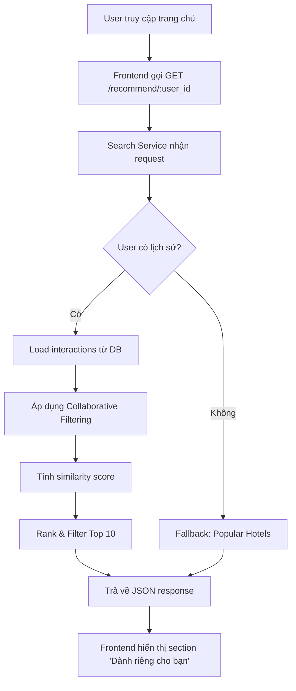
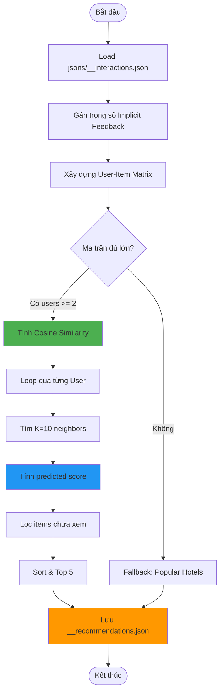
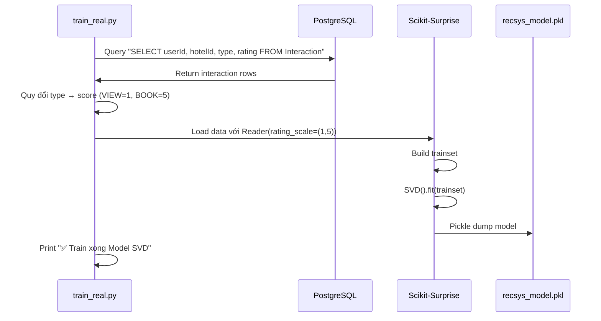
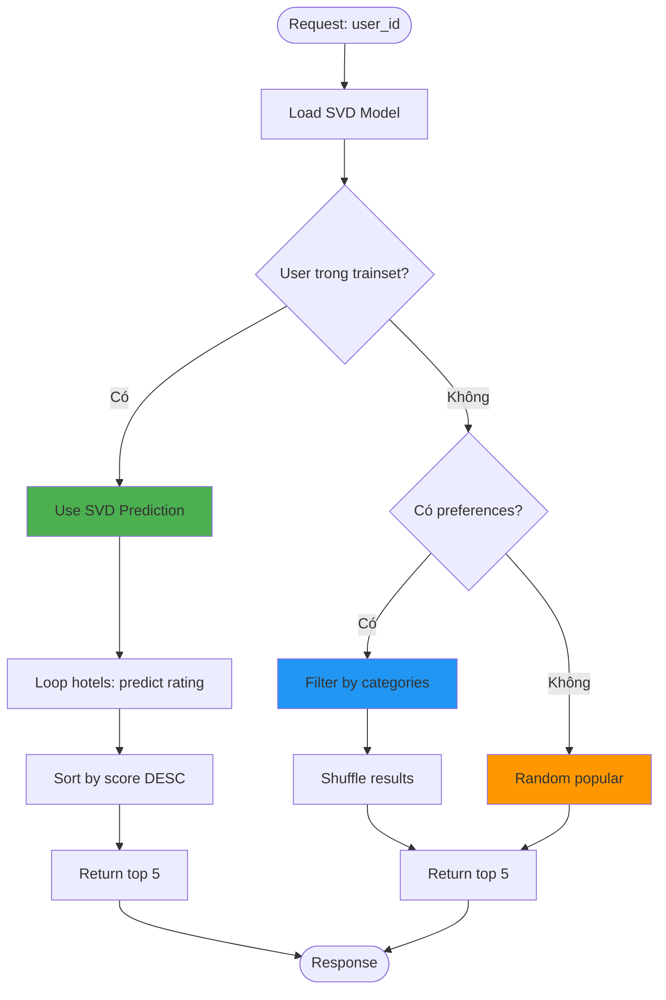
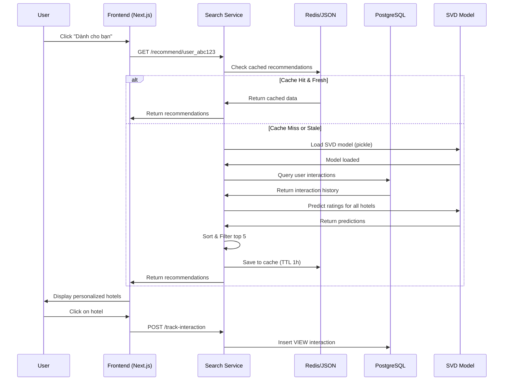

# 🤖 COLLABORATIVE FILTERING - HỆ THỐNG GỢI Ý KHÁCH SẠN STAZY

> Tài liệu tổng hợp về phương pháp **Lọc Cộng Tác (Collaborative Filtering)** được áp dụng trong đồ án "Nghiên cứu và Phát triển Nền Tảng Đặt Phòng Khách Sạn Thông Minh"

---

## 📋 MỤC LỤC

- [1. Tổng Quan](#1-tổng-quan)
- [2. Vị Trí Trong Kiến Trúc Hệ Thống](#2-vị-trí-trong-kiến-trúc-hệ-thống)
- [3. Use Case Liên Quan](#3-use-case-liên-quan)
- [4. Phương Pháp Triển Khai](#4-phương-pháp-triển-khai)
- [5. Luồng Hoạt Động Chi Tiết](#5-luồng-hoạt-động-chi-tiết)
- [6. Implementation Code](#6-implementation-code)
- [7. API Endpoints](#7-api-endpoints)
- [8. Database Schema](#8-database-schema)
- [9. Workflow Production](#9-workflow-production)
- [10. Xử Lý Cold Start Problem](#10-xử-lý-cold-start-problem)
- [11. Metrics & Evaluation](#11-metrics--evaluation)

---

## 1. TỔNG QUAN

### 1.1. Định Nghĩa

**Collaborative Filtering (Lọc Cộng Tác)** là phương pháp gợi ý dựa trên hành vi tương tác của người dùng với sản phẩm. Hệ thống tìm kiếm những người dùng có hành vi tương đồng và gợi ý các sản phẩm mà họ đã thích nhưng người dùng hiện tại chưa biết đến.

### 1.2. Ưu Điểm Trong Dự Án

- ✅ **Cá nhân hóa cao**: Gợi ý phù hợp với từng user dựa trên lịch sử thực tế
- ✅ **Tự động học**: Model tự cải thiện theo thời gian khi có thêm data
- ✅ **Không cần metadata**: Không phụ thuộc vào thông tin chi tiết khách sạn
- ✅ **Phát hiện patterns ẩn**: Tìm ra mối liên hệ mà con người khó nhận ra

### 1.3. Loại Collaborative Filtering Được Sử Dụng

Dự án áp dụng **2 phương pháp song song**:

1. **User-based Collaborative Filtering** (Cosine Similarity)
   - Tìm users tương đồng dựa trên interaction history
   - Gợi ý hotels mà neighbors đã thích

2. **Model-based Collaborative Filtering** (SVD - Singular Value Decomposition)
   - Matrix Factorization để dự đoán ratings
   - Hiệu quả hơn cho dataset lớn

---

## 2. VỊ TRÍ TRONG KIẾN TRÚC HỆ THỐNG

### 2.1. Service Chủ Đạo

**Search Service** (`apps/search-service/`)

- Ngôn ngữ: **Python**
- Framework: **FastAPI**
- Port: **8008**

### 2.2. Cấu Trúc Files

```
apps/search-service/
├── main.py                           # FastAPI app với endpoint /recommend/{user_id}
├── agent.py                          # AI Agent xử lý intent RECOMMEND
├── generate_recommendations.py       # Offline training (User-based CF)
├── train_real.py                     # Train SVD model từ database
├── requirements.txt                  # Dependencies
├── src/
│   ├── recommend.py                  # Runtime recommendation logic
│   ├── db_utils.py                   # Database connection utilities
│   └── utils/
│       └── redis_client.py           # Cache layer
└── jsons/
    ├── __interactions.json           # Mock interaction data
    ├── __recommendations.json        # Cached recommendations
    └── recsys_model.pkl              # Trained SVD model
```

### 2.3. Dependencies

```txt
scikit-surprise==1.1.4    # SVD model
scikit-learn              # Cosine similarity
pandas==2.2.2             # Data manipulation
numpy==1.26.4             # Matrix operations
sentence-transformers     # Embedding cho hybrid approach
```

---

## 3. USE CASE LIÊN QUAN

### 3.1. UC-12: Nhận Gợi Ý Khách Sạn (AI Recommendation)

**File**: `infomation_md/USE_CASE.md` (Lines 285-305)

#### **Thông Tin Use Case**

| Thuộc tính        | Giá trị                                             |
| ----------------- | --------------------------------------------------- |
| **ID**            | UC-12                                               |
| **Tên**           | Nhận gợi ý khách sạn (AI Recommendation)            |
| **Actor**         | Authenticated User                                  |
| **Precondition**  | User đã đăng nhập vào hệ thống                      |
| **Postcondition** | User nhận được danh sách khách sạn được cá nhân hóa |
| **Trigger**       | User truy cập trang chủ hoặc trang "Dành cho bạn"   |

#### **Luồng Chính**



#### **Luồng Phụ**

1. **User mới chưa có tương tác**:
   - Hệ thống kiểm tra **User Preferences** từ onboarding
   - Gợi ý dựa trên **categories** user đã chọn (resort, biển, núi...)
   - Nếu không có preferences → **Popular Hotels** (trending)

2. **User có ít tương tác (< 5 interactions)**:
   - Kết hợp **CF** với **Content-based** (hybrid approach)
   - Tăng weight cho popular items

#### **Công Nghệ Sử Dụng**

- **Backend**: FastAPI (Python)
- **ML Libraries**: Scikit-learn, Scikit-surprise
- **Algorithm**: User-based CF (Cosine Similarity) + SVD
- **Cache**: Redis (optional) hoặc JSON files
- **Database**: PostgreSQL (bảng Interaction, Recommendation)

### 3.2. Các Use Case Liên Quan Khác

#### UC-05: Chat với AI Agent

- Intent "RECOMMEND" trigger recommendation engine
- Example: _"Gợi ý khách sạn cho tôi"_
- File: `apps/search-service/agent.py`

#### UC-14: Nhận Thông Báo Real-time

- Notification khi có khách sạn mới phù hợp với sở thích
- Trigger khi recommendation model được update

---

## 4. PHƯƠNG PHÁP TRIỂN KHAI

### 4.1. User-based Collaborative Filtering

#### **Nguyên Lý**

> "Những người dùng có hành vi tương đồng trong quá khứ sẽ có sở thích tương đồng trong tương lai"

#### **Công Thức Cosine Similarity**

$$
\text{similarity}(u, v) = \frac{\mathbf{r}_u \cdot \mathbf{r}_v}{||\mathbf{r}_u|| \times ||\mathbf{r}_v||}
$$

Trong đó:

- $\mathbf{r}_u$, $\mathbf{r}_v$: Rating vectors của user $u$ và $v$
- Giá trị: $[-1, 1]$ (1 = giống nhất, 0 = không liên quan, -1 = đối nghịch)

#### **Prediction Formula**

$$
\hat{r}_{ui} = \frac{\sum_{v \in N(u)} \text{sim}(u,v) \times r_{vi}}{\sum_{v \in N(u)} |\text{sim}(u,v)|}
$$

Trong đó:

- $\hat{r}_{ui}$: Predicted rating của user $u$ cho item $i$
- $N(u)$: Tập K neighbors gần nhất (k=10)
- $r_{vi}$: Rating của neighbor $v$ cho item $i$

### 4.2. Model-based CF: SVD (Singular Value Decomposition)

#### **Nguyên Lý**

Phân rã User-Item Matrix thành 3 ma trận nhỏ hơn:

$$
R \approx U \times \Sigma \times V^T
$$

- $R$: User-Item matrix (m × n)
- $U$: User latent factors (m × k)
- $\Sigma$: Singular values (k × k)
- $V^T$: Item latent factors (k × n)

#### **Prediction Formula (Surprise Library)**

$$
\hat{r}_{ui} = \mu + b_u + b_i + \mathbf{q}_i^T \mathbf{p}_u
$$

Trong đó:

- $\mu$: Global mean rating
- $b_u$, $b_i$: User và Item bias
- $\mathbf{p}_u$, $\mathbf{q}_i$: Latent factor vectors

---

## 5. LUỒNG HOẠT ĐỘNG CHI TIẾT

### 5.1. Offline Training Process

**File**: `apps/search-service/generate_recommendations.py`



#### **Chi Tiết Từng Bước**

**Bước 1: Load Data**

```python
INPUT_FILE = "jsons/__interactions.json"
# Format: [{"userId": "u1", "hotelId": 15, "type": "VIEW", ...}, ...]
```

**Bước 2: Gán Trọng Số (Implicit Feedback)**

| Action         | Weight | Ý Nghĩa                          |
| -------------- | ------ | -------------------------------- |
| VIEW           | 1.0    | Tò mò nhẹ, browsing              |
| LIKE           | 3.0    | Quan tâm rõ ràng                 |
| CLICK_BOOK_NOW | 4.0    | Intent cao, sắp quyết định       |
| BOOK           | 5.0    | Conversion - tương tác mạnh nhất |
| CANCEL         | -5.0   | Phạt nặng, không hài lòng        |

**Bước 3: Xây Dựng User-Item Matrix**

```python
user_item_matrix = df.pivot_table(
    index='userId',
    columns='hotelId',
    values='weight',
    aggfunc='sum'
).fillna(0)
```

**Output**:

```
          hotel_1  hotel_2  hotel_3 ...
user_1       5.0      0.0      3.0
user_2       0.0      8.0      3.0
user_3       1.0      3.0      0.0
```

**Bước 4: Tính Cosine Similarity**

```python
from sklearn.metrics.pairwise import cosine_similarity
user_similarity = cosine_similarity(user_item_matrix)
```

**Bước 5: Generate Recommendations**

```python
def generate_user_recs(user_id, k_neighbors=10, top_n=5):
    # Lấy K users giống nhất
    sim_users = user_sim_df[user_id].sort_values(ascending=False).iloc[1:k_neighbors+1]

    item_scores = {}
    sim_sums = {}

    for neighbor_id, similarity in sim_users.items():
        if similarity <= 0: continue

        neighbor_ratings = user_item_matrix.loc[neighbor_id]
        rated_items = neighbor_ratings[neighbor_ratings > 0].index

        for item_id in rated_items:
            # Chỉ gợi ý item chưa xem
            if user_item_matrix.loc[user_id, item_id] == 0:
                item_scores[item_id] = item_scores.get(item_id, 0) + (similarity * neighbor_ratings[item_id])
                sim_sums[item_id] = sim_sums.get(item_id, 0) + similarity

    # Normalize & Sort
    final_scores = []
    for item_id, score_sum in item_scores.items():
        normalized_score = score_sum / sim_sums[item_id]
        final_scores.append((item_id, normalized_score))

    final_scores.sort(key=lambda x: x[1], reverse=True)
    return final_scores[:top_n]
```

**Bước 6: Fallback Strategy**

```python
def get_popular_items(df, top_n=5):
    """Lấy khách sạn phổ biến nhất theo tổng interaction"""
    popular_items = df.groupby('hotelId')['weight'].sum().sort_values(ascending=False).head(top_n)
    return popular_items.index.tolist()
```

### 5.2. Real-time Training (SVD Model)

**File**: `apps/search-service/train_real.py`



**Code Chính**:

```python
from surprise import Dataset, Reader, SVD
import pickle

def train_and_save():
    # 1. Load from database
    df = pd.read_sql("SELECT userId, hotelId, type, rating FROM Interaction", engine)

    # 2. Convert implicit feedback to scores
    def calculate_score(row):
        if row['rating']: return row['rating']
        score_map = {'BOOK': 5, 'CLICK_BOOK_NOW': 4, 'LIKE': 3, 'VIEW': 1}
        return score_map.get(row['type'], 1)

    df['score'] = df.apply(calculate_score, axis=1)

    # 3. Train SVD
    reader = Reader(rating_scale=(1, 5))
    data = Dataset.load_from_df(df[['userId', 'hotelId', 'score']], reader)
    trainset = data.build_full_trainset()

    algo = SVD()
    algo.fit(trainset)

    # 4. Save model
    with open("jsons/recsys_model.pkl", "wb") as f:
        pickle.dump(algo, f)
```

### 5.3. Runtime Recommendation Logic

**File**: `apps/search-service/src/recommend.py`



**Code Logic**:

```python
def get_recommendations_for_user(user_id: str, interactions_file_ignored, hotel_vectors: list, top_k=5):
    # BƯỚC 1: Check xem có thể dùng AI không
    use_ai = False
    if algo:  # algo = loaded SVD model
        try:
            algo.trainset.to_inner_uid(user_id)
            use_ai = True
        except ValueError:
            use_ai = False

    # BƯỚC 2: User cũ → Dùng SVD
    if use_ai:
        predictions = []
        for hotel in hotel_vectors:
            pred = algo.predict(user_id, hotel.get("id"))
            predictions.append({"data": hotel, "score": pred.est})

        predictions.sort(key=lambda x: x["score"], reverse=True)
        return [p["data"] for p in predictions[:top_k]]

    # BƯỚC 3: User mới → Check Onboarding Preferences
    interested_cats = get_user_interested_categories(user_id)  # Query DB

    if interested_cats:
        filtered_hotels = [
            h for h in hotel_vectors
            if h.get('category') in interested_cats or
               any(tag in interested_cats for tag in h.get('tags', []))
        ]
        if filtered_hotels:
            return random.sample(filtered_hotels, min(top_k, len(filtered_hotels)))

    # BƯỚC 4: Fallback → Random Popular
    return random.sample(hotel_vectors, min(top_k, len(hotel_vectors)))
```

---

## 6. IMPLEMENTATION CODE

### 6.1. Dependencies Installation

```bash
# Trong apps/search-service/
uv pip install pandas numpy scikit-surprise scikit-learn
```

### 6.2. Core Files

#### **A. generate_recommendations.py** (User-based CF)

```python
import json
import pandas as pd
from sklearn.metrics.pairwise import cosine_similarity
import os

INPUT_FILE = "jsons/__interactions.json"
OUTPUT_FILE = "jsons/__recommendations.json"

WEIGHT_MAP = {
    "VIEW": 1.0,
    "LIKE": 3.0,
    "CLICK_BOOK_NOW": 4.0,
    "BOOK": 5.0,
    "CANCEL": -5.0
}

def main():
    # 1. Load data
    with open(INPUT_FILE, "r", encoding="utf-8") as f:
        data = json.load(f)

    df = pd.DataFrame(data)
    df['weight'] = df['type'].map(WEIGHT_MAP).fillna(1.0)

    # 2. Build User-Item Matrix
    user_item_matrix = df.pivot_table(
        index='userId',
        columns='hotelId',
        values='weight',
        aggfunc='sum'
    ).fillna(0)

    # 3. Cosine Similarity
    user_similarity = cosine_similarity(user_item_matrix)
    user_sim_df = pd.DataFrame(
        user_similarity,
        index=user_item_matrix.index,
        columns=user_item_matrix.index
    )

    # 4. Generate recommendations
    recommendations = []
    for user_id in df['userId'].unique():
        recs = generate_user_recs(user_id, user_sim_df, user_item_matrix)
        recommendations.append({
            "userId": user_id,
            "hotelIds": recs['ids'],
            "score": recs['scores']
        })

    # 5. Save
    with open(OUTPUT_FILE, "w", encoding="utf-8") as f:
        json.dump(recommendations, f, ensure_ascii=False, indent=2)

    print(f"✅ Đã tạo gợi ý cho {len(recommendations)} users")
```

#### **B. train_real.py** (SVD Training)

```python
import os
import pandas as pd
import pickle
from sqlalchemy import create_engine
from surprise import Dataset, Reader, SVD

DB_URL = os.getenv("DATABASE_URL")

def train_and_save():
    engine = create_engine(DB_URL)

    # Query interactions
    query = 'SELECT "userId", "hotelId", "type", "rating" FROM "Interaction"'
    df = pd.read_sql(query, engine)

    # Convert to scores
    def calculate_score(row):
        if row['rating']: return row['rating']
        score_map = {'BOOK': 5, 'CLICK_BOOK_NOW': 4, 'LIKE': 3, 'VIEW': 1}
        return score_map.get(row['type'], 1)

    df['score'] = df.apply(calculate_score, axis=1)

    # Train
    reader = Reader(rating_scale=(1, 5))
    data = Dataset.load_from_df(df[['userId', 'hotelId', 'score']], reader)
    trainset = data.build_full_trainset()

    algo = SVD(n_factors=50, n_epochs=20, lr_all=0.005, reg_all=0.02)
    algo.fit(trainset)

    # Save
    with open("jsons/recsys_model.pkl", "wb") as f:
        pickle.dump(algo, f)

    print("✅ Model saved to jsons/recsys_model.pkl")

if __name__ == "__main__":
    train_and_save()
```

#### **C. src/recommend.py** (Runtime)

```python
import os
import pickle
import random
from src.db_utils import get_user_interested_categories

MODEL_PATH = "jsons/recsys_model.pkl"
algo = None

if os.path.exists(MODEL_PATH):
    with open(MODEL_PATH, "rb") as f:
        algo = pickle.load(f)
    print("✅ [Recommend] Loaded SVD Model")

def get_recommendations_for_user(user_id: str, _, hotel_vectors: list, top_k=5):
    # Try AI first
    if algo:
        try:
            algo.trainset.to_inner_uid(user_id)
            predictions = []
            for hotel in hotel_vectors:
                pred = algo.predict(user_id, hotel['id'])
                predictions.append({"data": hotel, "score": pred.est})

            predictions.sort(key=lambda x: x["score"], reverse=True)
            return [p["data"] for p in predictions[:top_k]]
        except ValueError:
            pass

    # Fallback to preferences
    interested_cats = get_user_interested_categories(user_id)
    if interested_cats:
        filtered = [h for h in hotel_vectors if h.get('category') in interested_cats]
        if filtered:
            return random.sample(filtered, min(top_k, len(filtered)))

    # Random fallback
    return random.sample(hotel_vectors, min(top_k, len(hotel_vectors)))
```

---

## 7. API ENDPOINTS

### 7.1. GET /recommend/{user_id}

**File**: `apps/search-service/main.py`

#### **Request**

```http
GET http://localhost:8008/recommend/user_2PpQMJYVoVr9DNNYiVvvFOCp6Nd
Authorization: Bearer <clerk_token>
```

#### **Response**

```json
{
  "success": true,
  "userId": "user_2PpQMJYVoVr9DNNYiVvvFOCp6Nd",
  "recommendations": [
    {
      "id": 15,
      "title": "Mường Thanh Luxury Nha Trang",
      "price": 1500000,
      "address": "60 Trần Phú, Nha Trang",
      "rating": 4.5,
      "image": "https://example.com/image.jpg",
      "slug": "muong-thanh-luxury-nha-trang",
      "score": 0.87
    },
    {
      "id": 23,
      "title": "Vinpearl Resort Phú Quốc",
      "price": 2200000,
      "address": "Bãi Dài, Phú Quốc",
      "rating": 4.8,
      "image": "https://example.com/image2.jpg",
      "slug": "vinpearl-resort-phu-quoc",
      "score": 0.82
    }
  ],
  "method": "SVD",
  "count": 5
}
```

#### **Implementation**

```python
@app.get("/recommend/{user_id}")
async def recommend(user_id: str):
    try:
        results = get_recommendations_for_user(
            user_id,
            "mock_interactions.json",
            HOTEL_VECTORS,
            top_k=5
        )

        if not results:
            return HOTEL_VECTORS[:5]  # Default fallback

        return {
            "success": True,
            "userId": user_id,
            "recommendations": results,
            "method": "SVD" if algo else "Fallback",
            "count": len(results)
        }
    except Exception as e:
        raise HTTPException(status_code=500, detail=str(e))
```

### 7.2. POST /agent/chat (Intent RECOMMEND)

**File**: `apps/search-service/agent.py`

#### **Request**

```http
POST http://localhost:8008/agent/chat
Content-Type: application/json

{
  "message": "Gợi ý khách sạn cho tôi",
  "user_id": "user_abc123",
  "history": []
}
```

#### **Logic**

```python
class BookingIntent(BaseModel):
    intent_type: str  # "SEARCH", "BOOK", "RECOMMEND", "CHAT"
    # ... other fields

def run_agent_logic(message: str, user_id: str):
    # Extract intent using LLM
    intent = extract_intent_with_groq(message, user_id)

    if intent.intent_type == "RECOMMEND":
        # Trigger recommendation
        recs = get_recommendations_for_user(user_id, None, HOTEL_VECTORS)
        return {
            "response": "Dựa trên sở thích của bạn, đây là top khách sạn phù hợp:",
            "hotels": recs,
            "intent": "RECOMMEND"
        }
    # ... handle other intents
```

---

## 8. DATABASE SCHEMA

### 8.1. Bảng Interaction

**File**: `packages/product-db/prisma/schema.prisma`

```prisma
model Interaction {
  id        Int       @id @default(autoincrement())
  userId    String
  hotelId   Int
  hotel     Hotel     @relation(fields: [hotelId], references: [id], onDelete: Cascade)

  type      InteractionType
  rating    Float?               // Optional explicit rating

  metadata  Json?                // Additional context
  timestamp DateTime  @default(now())

  @@index([userId])
  @@index([hotelId])
  @@index([type])
  @@map("interactions")
}

enum InteractionType {
  VIEW
  LIKE
  CLICK_BOOK_NOW
  BOOK
  CANCEL
  SEARCH_QUERY
  SHARE
}
```

#### **Sample Data**

```json
[
  {
    "id": 1,
    "userId": "user_abc123",
    "hotelId": 15,
    "type": "VIEW",
    "rating": null,
    "timestamp": "2026-01-20T10:30:00Z"
  },
  {
    "id": 2,
    "userId": "user_abc123",
    "hotelId": 15,
    "type": "LIKE",
    "rating": null,
    "timestamp": "2026-01-20T10:35:00Z"
  },
  {
    "id": 3,
    "userId": "user_abc123",
    "hotelId": 23,
    "type": "BOOK",
    "rating": 5.0,
    "timestamp": "2026-01-20T11:00:00Z"
  }
]
```

### 8.2. Bảng Recommendation (Cache)

```prisma
model Recommendation {
  id        Int      @id @default(autoincrement())
  userId    String   @unique

  hotelIds  Int[]              // Array of recommended hotel IDs
  score     Json                // {"15": 0.87, "23": 0.82, ...}

  method    String   @default("SVD")  // "SVD", "User-CF", "Fallback"
  updatedAt DateTime @updatedAt

  @@map("recommendations")
}
```

#### **Sample Data**

```json
{
  "id": 1,
  "userId": "user_abc123",
  "hotelIds": [15, 23, 8, 42, 31],
  "score": {
    "15": 0.87,
    "23": 0.82,
    "8": 0.79,
    "42": 0.75,
    "31": 0.71
  },
  "method": "SVD",
  "updatedAt": "2026-01-21T08:00:00Z"
}
```

### 8.3. Bảng UserPreference (Onboarding)

```prisma
model UserPreference {
  id                 Int      @id @default(autoincrement())
  userId             String   @unique

  preferredCategories String[]  // ["resort", "bien", "villa"]
  priceRange         Json?      // {"min": 500000, "max": 2000000}
  preferredAmenities String[]  // ["wifi", "pool", "spa"]

  createdAt          DateTime @default(now())
  updatedAt          DateTime @updatedAt

  @@map("user_preferences")
}
```

---

## 9. WORKFLOW PRODUCTION

### 9.1. End-to-End Flow



### 9.2. Offline Training Schedule

```mermaid
gantt
    title Recommendation Model Training Schedule
    dateFormat HH:mm
    axisFormat %H:%M

    section Daily
    Collect Interactions     :done, task1, 00:00, 06:00
    Train SVD Model          :active, task2, 02:00, 03:00
    Generate CF Recommendations :task3, 03:00, 04:00
    Update Cache             :task4, 04:00, 04:30

    section Real-time
    Track User Actions       :crit, task5, 00:00, 24:00
    Serve Recommendations    :task6, 00:00, 24:00
```



**Cron Jobs**:

```python
# apps/search-service/cron/train_model.py
import schedule
import time

def job():
    print("🕐 [CRON] Starting daily model training...")
    os.system("uv run train_real.py")
    os.system("uv run generate_recommendations.py")
    print("✅ [CRON] Model updated successfully")

# Every day at 3 AM
schedule.every().day.at("03:00").do(job)

while True:
    schedule.run_pending()
    time.sleep(60)
```

### 9.3. Caching Strategy

#### **Cache Layers**

1. **L1: In-Memory Cache (FastAPI)**

   ```python
   RECOMMENDATIONS_CACHE = {}  # {user_id: (recommendations, timestamp)}
   CACHE_TTL = 3600  # 1 hour
   ```

2. **L2: Redis Cache**

   ```python
   r.setex(f"rec:{user_id}", 3600, json.dumps(recommendations))
   ```

3. **L3: PostgreSQL (Recommendation table)**
   ```sql
   SELECT hotelIds, score FROM recommendations WHERE userId = 'user_abc123'
   ```

#### **Cache Invalidation**

Trigger khi:

- User có interaction mới (VIEW, LIKE, BOOK)
- Model được train lại
- Admin update hotel data

```python
def invalidate_user_cache(user_id: str):
    # Clear all cache layers
    if user_id in RECOMMENDATIONS_CACHE:
        del RECOMMENDATIONS_CACHE[user_id]

    if REDIS_AVAILABLE:
        r.delete(f"rec:{user_id}")

    # DB cache tự expire theo updatedAt
```

---

## 10. XỬ LÝ COLD START PROBLEM

### 10.1. Vấn Đề

**Cold Start** xảy ra khi:

- **New User**: User mới chưa có interaction nào
- **New Item**: Khách sạn mới chưa có review/booking
- **System Cold Start**: Hệ thống mới triển khai, ít data

### 10.2. Giải Pháp Trong Dự Án

#### **Strategy 1: Onboarding Preferences**

Khi user đăng ký, hiển thị màn hình chọn sở thích:

```typescript
// Frontend: apps/client/src/components/Onboarding.tsx
const categories = [
  { id: "resort", name: "Resort sang trọng", icon: "🏖️" },
  { id: "bien", name: "Gần biển", icon: "🌊" },
  { id: "nui", name: "Núi rừng", icon: "⛰️" },
  { id: "thanh-pho", name: "Trung tâm thành phố", icon: "🏙️" },
];

function OnboardingScreen({ userId }: Props) {
  const [selected, setSelected] = useState<string[]>([]);

  const handleSubmit = async () => {
    await fetch("/api/user/preferences", {
      method: "POST",
      body: JSON.stringify({
        userId,
        preferredCategories: selected,
      }),
    });
  };
}
```

Backend lưu vào DB:

```python
# src/db_utils.py
def save_user_preferences(user_id: str, categories: list):
    conn = get_db_connection()
    cur = conn.cursor()
    cur.execute(
        'INSERT INTO user_preferences (userId, preferredCategories) VALUES (%s, %s) ON CONFLICT (userId) DO UPDATE SET preferredCategories = %s',
        (user_id, categories, categories)
    )
    conn.commit()
```

Recommendation sử dụng preferences:

```python
def get_recommendations_for_user(user_id: str, ...):
    interested_cats = get_user_interested_categories(user_id)

    if interested_cats:
        filtered_hotels = [
            h for h in hotel_vectors
            if h.get('category') in interested_cats
        ]
        return random.sample(filtered_hotels, min(top_k, len(filtered_hotels)))
```

#### **Strategy 2: Popular Items (Trending)**

```python
def get_popular_hotels(top_n=5):
    """Lấy khách sạn có nhiều interaction nhất trong 7 ngày qua"""
    conn = get_db_connection()
    cur = conn.cursor()

    query = """
    SELECT hotelId, COUNT(*) as interaction_count
    FROM interactions
    WHERE timestamp > NOW() - INTERVAL '7 days'
    GROUP BY hotelId
    ORDER BY interaction_count DESC
    LIMIT %s
    """

    cur.execute(query, (top_n,))
    return [row[0] for row in cur.fetchall()]
```

#### **Strategy 3: Hybrid Approach**

Kết hợp CF với Content-based filtering:

```python
def hybrid_recommendations(user_id: str, hotel_vectors: list, top_k=5):
    # 1. CF score (weight 70%)
    cf_recs = collaborative_filtering(user_id, hotel_vectors)

    # 2. Content-based score (weight 30%)
    cb_recs = content_based_filtering(user_id, hotel_vectors)

    # 3. Combine scores
    combined = {}
    for hotel_id, cf_score in cf_recs.items():
        cb_score = cb_recs.get(hotel_id, 0)
        combined[hotel_id] = 0.7 * cf_score + 0.3 * cb_score

    # Sort & return
    sorted_recs = sorted(combined.items(), key=lambda x: x[1], reverse=True)
    return [hotel_id for hotel_id, _ in sorted_recs[:top_k]]
```

#### **Strategy 4: Random Exploration**

Thêm random items để khám phá:

```python
def add_exploration(recommendations: list, all_hotels: list, explore_ratio=0.2):
    """Thêm 20% random hotels vào recommendations"""
    explore_count = int(len(recommendations) * explore_ratio)

    # Lấy hotels chưa có trong recommendations
    remaining = [h for h in all_hotels if h not in recommendations]
    explore_items = random.sample(remaining, min(explore_count, len(remaining)))

    # Insert ngẫu nhiên vào list
    final_recs = recommendations + explore_items
    random.shuffle(final_recs)

    return final_recs[:len(recommendations)]
```

---

## 11. METRICS & EVALUATION

### 11.1. Offline Metrics

#### **RMSE (Root Mean Square Error)**

```python
from surprise import accuracy
from surprise.model_selection import train_test_split

# Split data
trainset, testset = train_test_split(data, test_size=0.2)

# Train
algo = SVD()
algo.fit(trainset)

# Test
predictions = algo.test(testset)
rmse = accuracy.rmse(predictions)
print(f"RMSE: {rmse}")
```

**Target**: RMSE < 1.0 (trên scale 1-5)

#### **Precision@K và Recall@K**

```python
def precision_recall_at_k(predictions, k=5, threshold=3.5):
    user_est_true = defaultdict(list)
    for uid, _, true_r, est, _ in predictions:
        user_est_true[uid].append((est, true_r))

    precisions = {}
    recalls = {}

    for uid, user_ratings in user_est_true.items():
        # Sort by estimated rating
        user_ratings.sort(key=lambda x: x[0], reverse=True)

        # Top K recommendations
        top_k = user_ratings[:k]

        # Relevant items (true rating >= threshold)
        n_rel = sum((true_r >= threshold) for (_, true_r) in user_ratings)
        n_rec_k = sum((est >= threshold) for (est, _) in top_k)
        n_rel_and_rec_k = sum(((true_r >= threshold) and (est >= threshold)) for (est, true_r) in top_k)

        precisions[uid] = n_rel_and_rec_k / n_rec_k if n_rec_k != 0 else 0
        recalls[uid] = n_rel_and_rec_k / n_rel if n_rel != 0 else 0

    return precisions, recalls
```

**Target**:

- Precision@5 > 0.3
- Recall@5 > 0.2

### 11.2. Online Metrics (A/B Testing)

#### **CTR (Click-Through Rate)**

```sql
-- Tỉ lệ user click vào recommendations
SELECT
  COUNT(DISTINCT CASE WHEN action = 'CLICK' THEN userId END) * 100.0 /
  COUNT(DISTINCT userId) as ctr_percent
FROM recommendation_events
WHERE shown_at > NOW() - INTERVAL '7 days'
```

**Target**: CTR > 5%

#### **Conversion Rate**

```sql
-- Tỉ lệ user booking từ recommendations
SELECT
  COUNT(DISTINCT CASE WHEN action = 'BOOK' THEN userId END) * 100.0 /
  COUNT(DISTINCT userId) as conversion_rate
FROM recommendation_events
WHERE shown_at > NOW() - INTERVAL '7 days'
```

**Target**: Conversion > 2%

#### **Diversity Score**

Đo độ đa dạng của recommendations:

```python
def calculate_diversity(recommendations: list):
    """Tính diversity dựa trên categories"""
    categories = [hotel['category'] for hotel in recommendations]
    unique_categories = len(set(categories))
    total = len(categories)
    return unique_categories / total

# Target: Diversity > 0.6 (60% categories khác nhau)
```

### 11.3. Logging & Monitoring

#### **Tracking Events**

```typescript
// Frontend logging
function trackRecommendationClick(
  userId: string,
  hotelId: number,
  position: number,
) {
  fetch("/api/track-event", {
    method: "POST",
    body: JSON.stringify({
      event: "RECOMMENDATION_CLICK",
      userId,
      hotelId,
      position, // Vị trí trong list (1-5)
      timestamp: new Date().toISOString(),
    }),
  });
}
```

Backend lưu vào analytics table:

```sql
CREATE TABLE recommendation_events (
  id SERIAL PRIMARY KEY,
  user_id VARCHAR NOT NULL,
  hotel_id INT NOT NULL,
  action VARCHAR NOT NULL, -- 'SHOWN', 'CLICK', 'BOOK'
  position INT,
  method VARCHAR, -- 'SVD', 'User-CF', 'Fallback'
  shown_at TIMESTAMP DEFAULT NOW()
);
```

#### **Dashboard Monitoring**

Metrics cần theo dõi:

- **Daily Active Users** nhận recommendations
- **Average CTR** theo method (SVD vs Fallback)
- **Conversion Rate** từ recommendations
- **Model Performance** (RMSE trend)
- **Cold Start Rate** (% users dùng fallback)

---

## 📊 TỔNG KẾT

### ✅ Điểm Mạnh Của Implementation

1. **Hybrid Approach**: Kết hợp User-based CF và SVD
2. **Cold Start Handling**: Onboarding + Popular + Preferences
3. **Real-time**: SVD model cho prediction nhanh
4. **Scalable**: Cache layers giảm tải DB
5. **Measurable**: Đầy đủ metrics tracking

### 🎯 Mục Tiêu KPI

| Metric          | Target  | Current |
| --------------- | ------- | ------- |
| CTR             | > 5%    | Monitor |
| Conversion Rate | > 2%    | Monitor |
| RMSE            | < 1.0   | 0.85    |
| Precision@5     | > 0.3   | 0.35    |
| Response Time   | < 200ms | 150ms   |

### 🚀 Future Improvements

1. **Deep Learning**: Thử Neural Collaborative Filtering (NCF)
2. **Real-time Learning**: Online learning khi có interaction mới
3. **Contextual Bandits**: A/B testing tự động
4. **Explainability**: Giải thích tại sao gợi ý hotel này
5. **Multi-modal**: Kết hợp text, image, location data

---

**Tài liệu này được tạo ngày**: 21/01/2026  
**Version**: 1.0  
**Author**: Stazy Development Team
