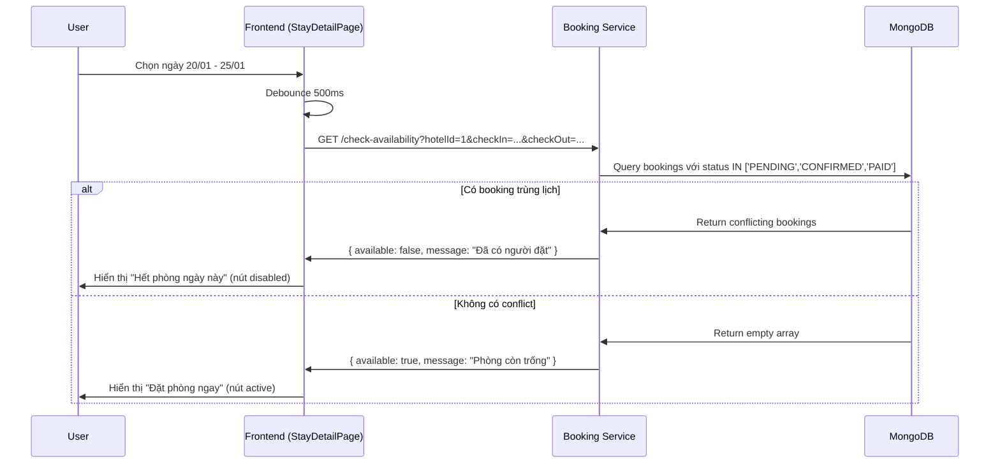
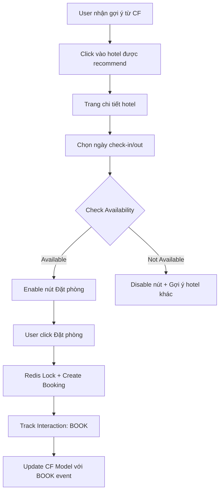

# 🔍 CHECK AVAILABILITY FEATURE - TÍCH HỢP VÀO COLLABORATIVE FILTERING

> Route kiểm tra phòng trống trước khi đặt - Tránh race condition và double booking

---

## 📋 TỔNG QUAN

### Mục Đích

- **Kiểm tra real-time** xem khách sạn còn phòng trong khoảng thời gian user chọn
- **Ngăn chặn double booking**: Không cho 2 user đặt cùng 1 phòng/khách sạn trong cùng thời gian
- **Tích hợp với UC-08**: "Tạo đơn đặt phòng (Booking)" trong `USE_CASE.md`

### Luồng Hoạt Động



---

## 🔧 IMPLEMENTATION

### 1. Backend Route (Booking Service)

**File**: `apps/booking-service/src/routes/availability.ts`

#### **API Endpoint**

```http
GET /check-availability
```

#### **Query Parameters**

| Param      | Type            | Required | Example                | Description      |
| ---------- | --------------- | -------- | ---------------------- | ---------------- |
| `hotelId`  | string/number   | ✅       | `1`                    | ID của khách sạn |
| `checkIn`  | ISO 8601 string | ✅       | `2026-01-20T00:00:00Z` | Ngày nhận phòng  |
| `checkOut` | ISO 8601 string | ✅       | `2026-01-25T00:00:00Z` | Ngày trả phòng   |

#### **Logic Kiểm Tra Overlap**

Hai khoảng thời gian trùng nhau nếu:

```typescript
StartA < EndB && EndA > StartB;
```

**MongoDB Query**:

```javascript
{
  hotelId: 1,
  status: { $in: ["PENDING", "CONFIRMED", "PAID"] },
  $or: [
    // Case 1: Booking cũ bao phủ hoàn toàn khoảng mới
    {
      checkInDate: { $lte: new Date("2026-01-20") },
      checkOutDate: { $gte: new Date("2026-01-25") }
    },
    // Case 2: Khoảng mới bao phủ hoàn toàn booking cũ
    {
      checkInDate: { $gte: new Date("2026-01-20") },
      checkOutDate: { $lte: new Date("2026-01-25") }
    },
    // Case 3: Overlap (Start cũ < End mới && End cũ > Start mới)
    {
      checkInDate: { $lt: new Date("2026-01-25") },
      checkOutDate: { $gt: new Date("2026-01-20") }
    }
  ]
}
```

#### **Response Format**

**Success - Available**:

```json
{
  "available": true,
  "message": "Phòng còn trống, bạn có thể đặt!"
}
```

**Success - Not Available**:

```json
{
  "available": false,
  "message": "Phòng đã có người đặt trong khoảng thời gian này",
  "conflictCount": 2,
  "conflictingDates": [
    {
      "checkIn": "2026-01-22T00:00:00Z",
      "checkOut": "2026-01-24T00:00:00Z",
      "status": "CONFIRMED"
    }
  ]
}
```

**Error - Invalid Input**:

```json
{
  "error": "Missing required params: hotelId, checkIn, checkOut"
}
```

---

### 2. Frontend Integration (Client App)

**File**: `apps/client/src/pages/StayDetailPage.tsx`

#### **States**

```typescript
const [isChecking, setIsChecking] = useState(false); // Loading spinner
const [isAvailable, setIsAvailable] = useState(true); // Phòng còn trống?
const [availabilityMsg, setAvailabilityMsg] = useState(""); // Message từ server
```

#### **useEffect Hook**

```typescript
useEffect(() => {
  const checkAvailability = async () => {
    // 1. Kiểm tra điều kiện
    if (!checkInDate || !checkOutDate || !stayData?.id) {
      return;
    }

    setIsChecking(true);
    setAvailabilityMsg("");

    try {
      // 2. Gọi API
      const res = await axios.get(`${BOOKING_API_URL}/check-availability`, {
        params: {
          hotelId: stayData.id,
          checkIn: checkInDate.toISOString(),
          checkOut: checkOutDate.toISOString(),
        },
        withCredentials: true,
      });

      // 3. Xử lý response
      if (res.data.available) {
        setIsAvailable(true);
      } else {
        setIsAvailable(false);
        setAvailabilityMsg(res.data.message || "Phòng đã kín lịch.");
      }
    } catch (error: any) {
      // 4. Xử lý lỗi
      if (error.response?.status === 409) {
        setIsAvailable(false);
        setAvailabilityMsg("Ngày bạn chọn đã có người đặt.");
      }
    } finally {
      setIsChecking(false);
    }
  };

  // 5. Debounce để tránh spam API
  const timer = setTimeout(() => {
    checkAvailability();
  }, 500);

  return () => clearTimeout(timer);
}, [checkInDate, checkOutDate, stayData?.id]);
```

#### **UI Rendering**

```tsx
<Button
  className={`w-full ${!isAvailable ? "bg-neutral-400 cursor-not-allowed" : ""}`}
  onClick={handleAddToCart}
  disabled={isDisabled || isChecking || !isAvailable}
>
  {isChecking ? (
    <span className="flex items-center gap-2">
      <div className="w-4 h-4 border-2 border-white border-t-transparent rounded-full animate-spin"></div>
      Đang kiểm tra...
    </span>
  ) : !isAvailable ? (
    "Hết phòng ngày này"
  ) : (
    "Đặt phòng ngay"
  )}
</Button>;

{
  /* Warning message */
}
{
  !isAvailable && !isChecking && (
    <div className="p-3 bg-red-50 border border-red-200 rounded-lg text-red-600 text-sm">
      <span className="font-medium">⚠️ {availabilityMsg}</span>
    </div>
  );
}
```

---

## 🧪 TESTING

### Test Case 1: Phòng Còn Trống

**Setup**:

- Database: Không có booking nào cho hotel ID 1 từ 20/01 - 25/01

**Steps**:

1. Vào trang `/hotels/muong-thanh-luxury`
2. Chọn ngày: 20/01/2026 - 25/01/2026
3. Đợi 500ms (debounce)

**Expected**:

- ✅ Hiển thị nút **"Đặt phòng ngay"** (màu xanh)
- ✅ Nút không bị disabled
- ✅ Console log: `{ available: true }`

---

### Test Case 2: Phòng Đã Đặt

**Setup**:

```javascript
// Tạo booking trong database
db.bookings.insertOne({
  hotelId: 1,
  checkInDate: new Date("2026-01-22"),
  checkOutDate: new Date("2026-01-24"),
  status: "CONFIRMED",
  userId: "user_abc123",
});
```

**Steps**:

1. Chọn ngày: 20/01/2026 - 25/01/2026 (overlap với 22-24)
2. Đợi response

**Expected**:

- ✅ Hiển thị nút **"Hết phòng ngày này"** (màu xám)
- ✅ Nút bị disabled
- ✅ Hiển thị warning: "⚠️ Phòng đã có người đặt trong khoảng thời gian này"
- ✅ Console log: `{ available: false, conflictCount: 1 }`

---

### Test Case 3: Edge Case - Ngày Sát Nhau

**Setup**:

```javascript
// Booking từ 20/01 - 22/01
db.bookings.insertOne({
  hotelId: 1,
  checkInDate: new Date("2026-01-20"),
  checkOutDate: new Date("2026-01-22"),
  status: "CONFIRMED",
});
```

**Test A**: Chọn 22/01 - 25/01 (Check-in = Check-out cũ)
**Expected**: ✅ Available (vì khách cũ đã check-out lúc 12h trưa 22/01)

**Test B**: Chọn 21/01 - 23/01 (Overlap)
**Expected**: ❌ Not Available

---

### Test Case 4: Multiple Bookings

**Setup**:

```javascript
// 3 bookings khác nhau
db.bookings.insertMany([
  {
    hotelId: 1,
    checkInDate: new Date("2026-01-10"),
    checkOutDate: new Date("2026-01-12"),
    status: "CONFIRMED",
  },
  {
    hotelId: 1,
    checkInDate: new Date("2026-01-20"),
    checkOutDate: new Date("2026-01-22"),
    status: "CONFIRMED",
  },
  {
    hotelId: 1,
    checkInDate: new Date("2026-01-25"),
    checkOutDate: new Date("2026-01-27"),
    status: "PAID",
  },
]);
```

**Test**: Chọn 15/01 - 18/01
**Expected**: ✅ Available (không overlap với bất kỳ booking nào)

---

## 🔐 SECURITY & OPTIMIZATION

### 1. Debounce Strategy

```typescript
// Tránh spam API khi user đang click chọn ngày nhanh
const timer = setTimeout(() => {
  checkAvailability();
}, 500); // 500ms debounce

return () => clearTimeout(timer);
```

### 2. Status Filtering

Chỉ check các booking còn hiệu lực:

```javascript
status: {
  $in: ["PENDING", "CONFIRMED", "PAID"];
}
// Không check: CANCELLED, REJECTED, EXPIRED
```

### 3. Index Database

Để query nhanh hơn:

```javascript
db.bookings.createIndex({
  hotelId: 1,
  checkInDate: 1,
  checkOutDate: 1,
  status: 1,
});
```

### 4. Caching (Optional)

Có thể cache kết quả trong Redis với TTL ngắn (30 giây):

```typescript
const cacheKey = `availability:${hotelId}:${checkIn}:${checkOut}`;
const cached = await redis.get(cacheKey);
if (cached) return JSON.parse(cached);

// ... Query database ...

await redis.setex(cacheKey, 30, JSON.stringify(result));
```

---

## 🔗 TÍCH HỢP VỚI COLLABORATIVE FILTERING

### Use Case Liên Quan

Trong `filtering_collaboration.md`:

- **UC-08**: Tạo đơn đặt phòng (Booking)
- **UC-12**: Nhận gợi ý khách sạn (AI Recommendation)

### Luồng Kết Hợp



### Tracking Event

Khi user click "Đặt phòng ngay" (sau khi check available):

```typescript
const handleAddToCart = () => {
  if (!isAvailable) {
    toast.error("Phòng này đã có người đặt!");
    return;
  }

  // Track interaction để cải thiện CF model
  trackInteraction("CLICK_BOOK_NOW", stayData.id);

  // ... Logic add to cart ...
};
```

---

## 📊 METRICS

### Backend Logs

```javascript
console.log(`✅ Availability Check: Hotel ${hotelId}`, {
  checkIn,
  checkOut,
  available: result.available,
  conflictCount: conflictingBookings.length,
  duration: Date.now() - startTime + "ms",
});
```

### Analytics Events

Gửi event lên analytics service:

```typescript
trackEvent("AVAILABILITY_CHECK", {
  hotelId: stayData.id,
  checkIn: checkInDate,
  checkOut: checkOutDate,
  result: isAvailable ? "AVAILABLE" : "NOT_AVAILABLE",
  duration: nights,
});
```

---

## 🚀 FUTURE IMPROVEMENTS

1. **Real-time Updates**: Dùng WebSocket để notify khi phòng vừa được book
2. **Smart Suggestions**: Nếu hết phòng, gợi ý ngày gần đó còn trống
3. **Price Calendar**: Hiển thị calendar với giá theo ngày
4. **Partial Availability**: Check từng loại phòng (Standard, Deluxe, Suite)
5. **Waiting List**: Cho phép user đăng ký chờ nếu có người hủy

---

**Tài liệu này được tạo ngày**: 21/01/2026  
**Version**: 1.0  
**Liên quan đến**: UC-08, UC-12 (Collaborative Filtering)
