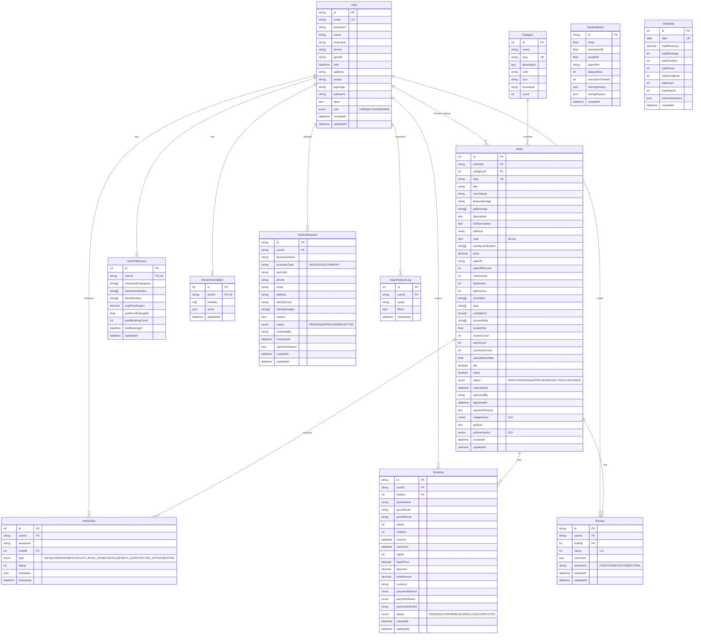
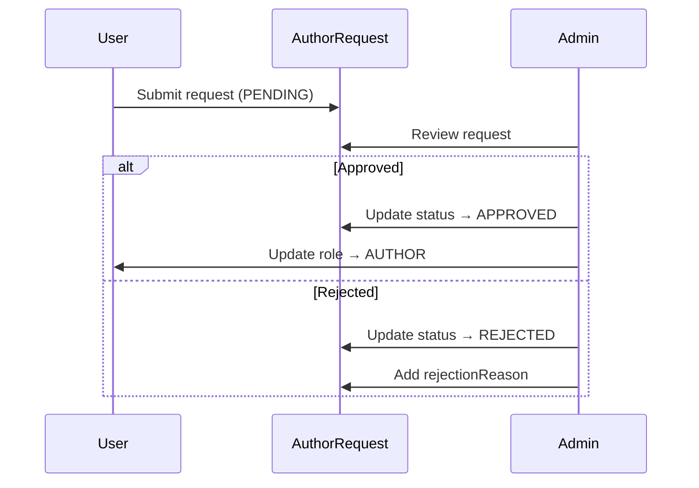
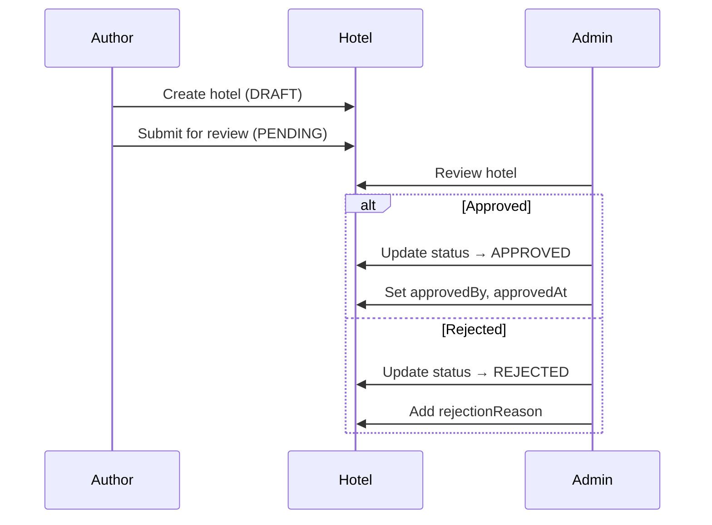
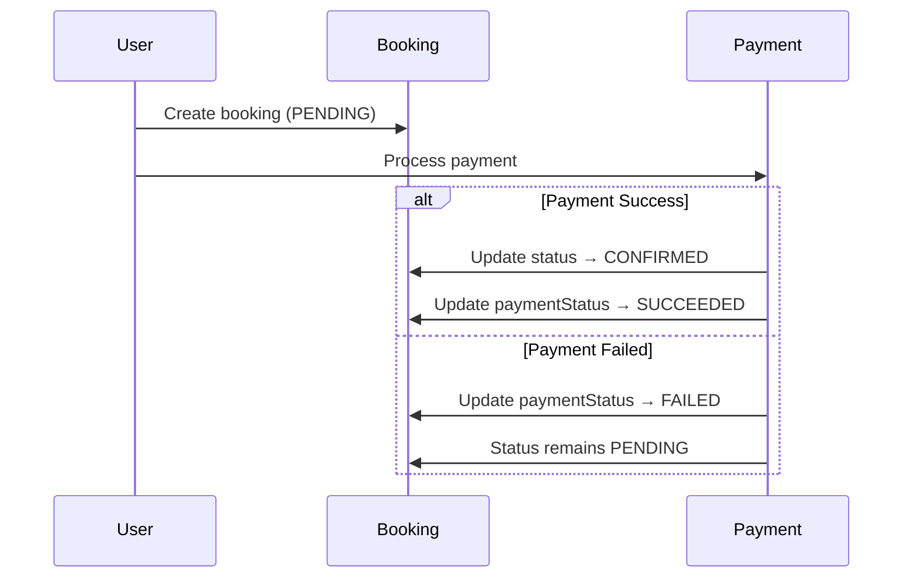

# 📊 ERD - STAZY Database Schema

> Entity Relationship Diagram cho hệ thống đặt phòng khách sạn STAZY

## 🗂️ Tổng quan

Hệ thống bao gồm **12 entities chính** với các quan hệ:

- **1-1**: User ↔ UserPreference, User ↔ Recommendation
- **1-N**: User → Hotels, User → Bookings, Hotel → Reviews, Category → Hotels
- **M-N**: User ↔ Hotel (thông qua Interaction, Booking, Review)

---

## 📐 ERD Diagram (Mermaid)



---

## 📋 Chi tiết quan hệ

### 1. User Relationships

| Quan hệ               | Entity           | Loại | Mô tả                                         |
| --------------------- | ---------------- | ---- | --------------------------------------------- |
| User → Hotel          | `hotels`         | 1-N  | Một user (author) có thể tạo nhiều khách sạn  |
| User → UserPreference | `preference`     | 1-1  | Mỗi user có 1 bảng sở thích                   |
| User → Recommendation | `recommendation` | 1-1  | Mỗi user có 1 bảng gợi ý cached               |
| User → AuthorRequest  | `authorRequests` | 1-N  | User có thể gửi nhiều request (nếu bị reject) |
| User → Interaction    | `interactions`   | 1-N  | User có nhiều tương tác                       |
| User → Booking        | `bookings`       | 1-N  | User có nhiều booking                         |
| User → Review         | `reviews`        | 1-N  | User viết nhiều review                        |
| User → SearchQueryLog | `searchLogs`     | 1-N  | User có nhiều lịch sử tìm kiếm                |

### 2. Hotel Relationships

| Quan hệ             | Entity         | Loại | Mô tả                       |
| ------------------- | -------------- | ---- | --------------------------- |
| Hotel → User        | `author`       | N-1  | Mỗi hotel thuộc về 1 author |
| Hotel → Category    | `category`     | N-1  | Mỗi hotel thuộc 1 category  |
| Hotel → Interaction | `interactions` | 1-N  | Hotel nhận nhiều tương tác  |
| Hotel → Booking     | `bookings`     | 1-N  | Hotel có nhiều booking      |
| Hotel → Review      | `reviews`      | 1-N  | Hotel có nhiều review       |

### 3. Other Relationships

| Quan hệ          | Entity   | Loại | Mô tả                      |
| ---------------- | -------- | ---- | -------------------------- |
| Category → Hotel | `hotels` | 1-N  | Category chứa nhiều hotels |
| Booking → User   | `user`   | N-1  | Booking thuộc về 1 user    |
| Booking → Hotel  | `hotel`  | N-1  | Booking cho 1 hotel        |
| Review → User    | `user`   | N-1  | Review do 1 user viết      |
| Review → Hotel   | `hotel`  | N-1  | Review cho 1 hotel         |

---

## 🔑 Keys & Indexes

### Primary Keys

- **UUID**: User, AuthorRequest, Booking, Review, SystemMetric
- **Auto Increment**: UserPreference, Hotel, Category, Interaction, Recommendation, SearchQueryLog, DailyStat

### Unique Constraints

- `User.email` - Email duy nhất
- `Hotel.slug` - Slug SEO friendly
- `Category.slug` - Category slug
- `UserPreference.userId` - 1-1 relationship
- `Recommendation.userId` - 1-1 relationship
- `DailyStat.date` - Mỗi ngày 1 record

### Indexes

```sql
-- User indexes (thông qua relations)
CREATE INDEX idx_hotels_authorId ON hotels(authorId);
CREATE INDEX idx_hotels_status ON hotels(status);
CREATE INDEX idx_hotels_authorId_status ON hotels(authorId, status);

-- Booking indexes
CREATE INDEX idx_bookings_userId ON bookings(userId);
CREATE INDEX idx_bookings_hotelId ON bookings(hotelId);

-- Interaction indexes
CREATE INDEX idx_interactions_userId_type ON interactions(userId, type);
CREATE INDEX idx_interactions_hotelId ON interactions(hotelId);

-- Review indexes
CREATE INDEX idx_reviews_hotelId ON reviews(hotelId);

-- AuthorRequest indexes
CREATE INDEX idx_author_requests_userId ON author_requests(userId);
CREATE INDEX idx_author_requests_status ON author_requests(status);
```

---

## 🎯 Enums

### Role

```prisma
enum Role {
  USER
  AUTHOR
  ADMIN
}
```

### HotelStatus

```prisma
enum HotelStatus {
  DRAFT       // Author đang soạn, chưa gửi
  PENDING     // Đang chờ Admin duyệt
  APPROVED    // Đã được duyệt, hiển thị công khai
  REJECTED    // Bị từ chối
  SUSPENDED   // Bị tạm ngưng (vi phạm chính sách)
}
```

### AuthorRequestStatus

```prisma
enum AuthorRequestStatus {
  PENDING
  APPROVED
  REJECTED
}
```

### BookingStatus

```prisma
enum BookingStatus {
  PENDING    // Đang giữ chỗ/chờ thanh toán
  CONFIRMED  // Đã thanh toán/Xác nhận
  CANCELLED  // Đã hủy
  COMPLETED  // Đã checkout xong
}
```

### PaymentMethod

```prisma
enum PaymentMethod {
  STRIPE
  PAYPAL
  VNPAY
  BANK_TRANSFER
  CASH_ON_CHECKIN
}
```

### PaymentStatus

```prisma
enum PaymentStatus {
  PENDING
  SUCCEEDED
  FAILED
  REFUNDED
}
```

### InteractionType

```prisma
enum InteractionType {
  VIEW
  LIKE
  SHARE
  BOOK
  CLICK_BOOK_NOW
  CANCEL
  SEARCH_QUERY
  FILTER_APPLIED
  RATING
}
```

### TripType

```prisma
enum TripType {
  BUSINESS
  FAMILY
  COUPLE
  SOLO
  GROUP
}
```

---

## 📊 Special Features

### 1. Vector Search (AI)

Hotel entity có 2 vector fields:

- `imageVector`: Vector(512) - Cho visual search bằng ảnh
- `policiesVector`: Vector(512) - Cho semantic search chính sách

```sql
-- PostgreSQL pgvector extension
CREATE EXTENSION IF NOT EXISTS vector;

-- Example search query
SELECT * FROM hotels
ORDER BY imageVector <-> '[0.1, 0.2, ...]'
LIMIT 10;
```

### 2. AI Recommendation System

- `Interaction` table lưu hành vi user
- `Recommendation` table cache kết quả gợi ý
- `SystemMetric` table đánh giá model performance

### 3. Analytics

- `DailyStat`: Thống kê theo ngày
- `SearchQueryLog`: Phân tích search behavior
- `Interaction`: Tracking user journey

---

## 🔄 Business Workflows

### 1. Author Approval Workflow



### 2. Hotel Approval Workflow



### 3. Booking Flow



---

## 📈 Database Statistics

| Entity         | Estimated Size | Growth Rate |
| -------------- | -------------- | ----------- |
| User           | ~100K          | Medium      |
| Hotel          | ~10K           | Low         |
| Booking        | ~500K          | High        |
| Interaction    | ~5M            | Very High   |
| Review         | ~100K          | Medium      |
| SearchQueryLog | ~1M            | High        |
| DailyStat      | ~365/year      | Fixed       |

---

**Tài liệu được tạo tự động từ schema.prisma - Cập nhật lần cuối: 21/01/2026**
