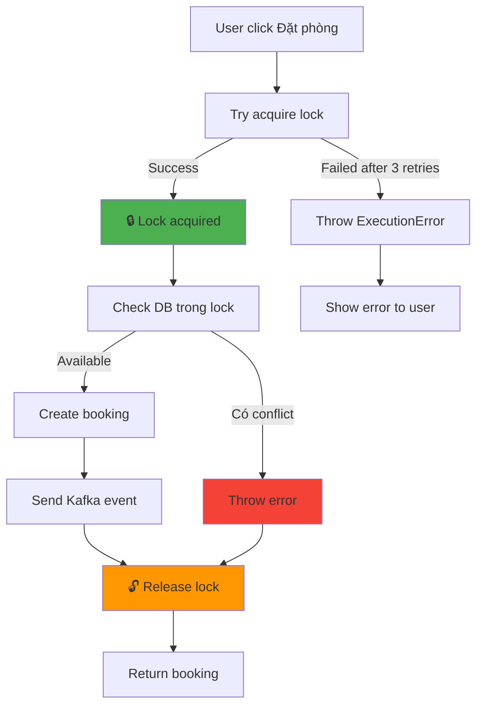
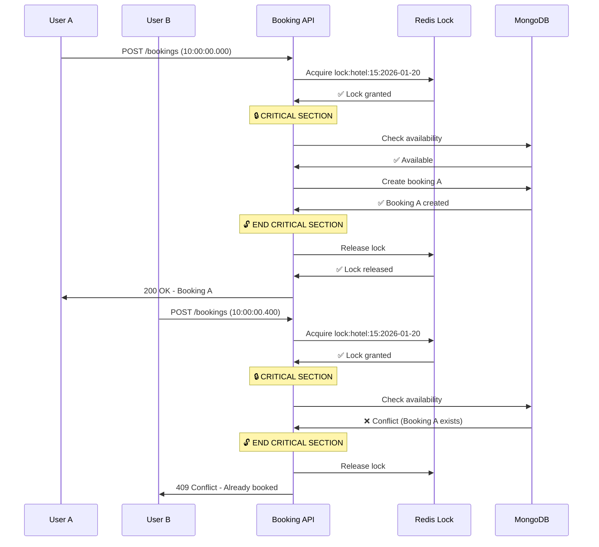
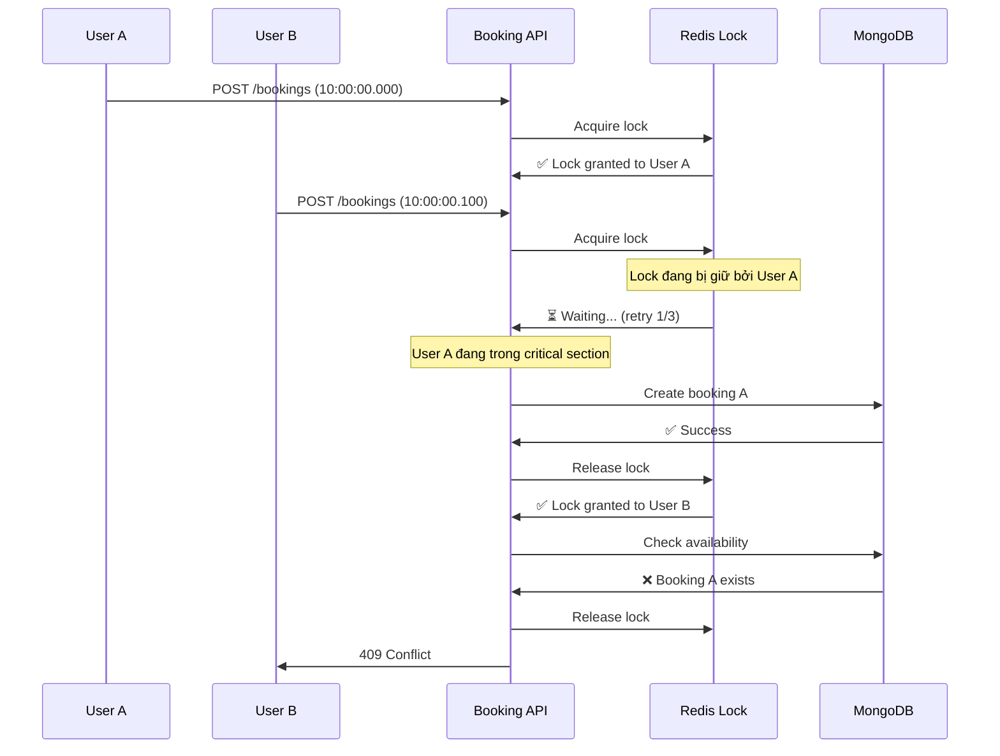

# 🔒 REDIS DISTRIBUTED LOCK - CHỐNG OVERBOOKING

> Giải pháp ngăn chặn Race Condition và Double Booking trong hệ thống đặt phòng phân tán

---

## 📋 MỤC LỤC

- [1. Vấn Đề: Overbooking](#1-vấn-đề-overbooking)
- [2. Giải Pháp: Redis Distributed Lock](#2-giải-pháp-redis-distributed-lock)
- [3. Implementation Chi Tiết](#3-implementation-chi-tiết)
- [4. So Sánh: Check Availability vs Create Booking](#4-so-sánh-check-availability-vs-create-booking)
- [5. Flow Diagram](#5-flow-diagram)
- [6. Testing Race Condition](#6-testing-race-condition)
- [7. Best Practices](#7-best-practices)

---

## 1. VẤN ĐỀ: OVERBOOKING

### 1.1. Kịch Bản Race Condition

```
Timeline:
─────────────────────────────────────────────────────────────
        User A                       User B
─────────────────────────────────────────────────────────────
10:00:00.000  Click "Đặt phòng"
10:00:00.100  Check DB: Available ✅
10:00:00.150                         Click "Đặt phòng"
10:00:00.200                         Check DB: Available ✅ (!!!)
10:00:00.300  Create Booking A ✅
10:00:00.400                         Create Booking B ✅ (!!!)
─────────────────────────────────────────────────────────────
KẾT QUẢ: 2 bookings cho cùng 1 phòng/khách sạn → OVERBOOKING ❌
```

### 1.2. Nguyên Nhân

**Không có cơ chế đồng bộ (synchronization)** giữa các request:

- ❌ MongoDB **KHÔNG HỖ TRỢ** row-level locking như MySQL
- ❌ Check availability và Create booking là **2 bước riêng biệt**
- ❌ Giữa 2 bước này, DB state có thể bị thay đổi bởi request khác

### 1.3. Tác Động

- 😡 User A và User B đều nhận email xác nhận
- 🤯 Khi đến khách sạn, chỉ có 1 phòng
- 💸 Hoàn tiền, mất uy tín, khách hàng chuyển qua đối thủ

---

## 2. GIẢI PHÁP: REDIS DISTRIBUTED LOCK

### 2.1. Khái Niệm

**Distributed Lock** là cơ chế đảm bảo:

- ✅ **Chỉ 1 process** được truy cập tài nguyên tại 1 thời điểm
- ✅ Hoạt động **cross-server** (nhiều container/instance)
- ✅ **Tự động release** lock khi hết TTL (tránh deadlock)

### 2.2. Tại Sao Dùng Redis?

| Tiêu Chí             | Redis         | Database Lock | In-Memory Lock     |
| -------------------- | ------------- | ------------- | ------------------ |
| **Tốc độ**           | ⚡ <1ms       | 🐢 10-50ms    | ⚡ <0.1ms          |
| **Cross-server**     | ✅            | ✅            | ❌ (chỉ 1 process) |
| **TTL Auto-release** | ✅            | ❌            | ❌                 |
| **Scalable**         | ✅            | 🔸 Trung bình | ❌                 |
| **Độ phức tạp**      | 🔸 Trung bình | 🔴 Cao        | 🟢 Thấp            |

**Lựa chọn**: Redis Distributed Lock là **best practice** cho microservices.

### 2.3. Thư Viện Sử Dụng

```bash
# Redlock - Thuật toán distributed lock chuẩn từ Redis
pnpm add redlock ioredis
```

**Redlock Algorithm** (tác giả: Salvatore Sanfilippo - creator of Redis):

- Acquire lock trên **majority nodes** (>50%)
- Auto-extend lock nếu operation kéo dài
- Guaranteed unlock với TTL

---

## 3. IMPLEMENTATION CHI TIẾT

### 3.1. Setup Redis Client

**File**: `apps/booking-service/src/utils/redis.ts`

```typescript
import Redis from "ioredis";
import Redlock from "redlock";

// 1. Kết nối Redis
const redisClient = new Redis({
  host: process.env.REDIS_HOST || "stazy-redis",
  port: Number(process.env.REDIS_PORT) || 6379,
});

// 2. Cấu hình Redlock
const redlock = new Redlock(
  [redisClient as any], // Type casting do mismatch ioredis v5 và redlock
  {
    driftFactor: 0.01, // Clock drift tolerance
    retryCount: 3, // Thử lại 3 lần nếu không lấy được lock
    retryDelay: 200, // Đợi 200ms giữa các lần retry
    retryJitter: 200, // Random delay để tránh thundering herd
  },
);

// 3. Error handling
redlock.on("clientError", (error) => {
  console.error("Redlock error:", error);
});

export { redisClient, redlock };
```

**Giải thích các tham số:**

| Tham số       | Giá trị | Ý nghĩa                                            |
| ------------- | ------- | -------------------------------------------------- |
| `driftFactor` | 0.01    | Chấp nhận 1% độ lệch đồng hồ giữa các server       |
| `retryCount`  | 3       | Thử lại 3 lần nếu lock đang bận                    |
| `retryDelay`  | 200ms   | Đợi 200ms trước mỗi lần retry                      |
| `retryJitter` | 200ms   | Random thêm 0-200ms để tránh tất cả retry cùng lúc |

---

### 3.2. Create Booking với Lock (Critical Section)

**File**: `apps/booking-service/src/utils/booking.ts`

```typescript
import { redlock } from "./redis";

export const createBooking = async (userId: string, bookingData: any) => {
  const { hotelId, checkIn, checkOut, totalAmount, ... } = bookingData;

  // 🔑 BƯỚC 1: Định nghĩa lock resource
  // Format: locks:hotel:{hotelId}:{checkInDate}
  const resource = `locks:hotel:${hotelId}:${checkIn}`;
  const ttl = 5000; // 5 giây (đủ để hoàn tất check + create)

  let lock;

  try {
    // 🔒 BƯỚC 2: Acquire Lock (BLOCKING)
    lock = await redlock.acquire([resource], ttl);
    console.log(`🔒 Đã khóa: ${resource}`);

    // ─────────────────────────────────────────────────────
    // 🛡️ CRITICAL SECTION - CHỈ 1 REQUEST ĐƯỢC VÀO ĐÂY
    // ─────────────────────────────────────────────────────

    // 🔍 BƯỚC 3: Double-check availability (trong lock)
    const conflict = await Booking.findOne({
      hotelId: Number(hotelId),
      status: { $in: ["CONFIRMED", "PENDING", "PAID"] },
      $or: [
        { checkIn: { $lt: new Date(checkOut), $gte: new Date(checkIn) } },
        { checkOut: { $gt: new Date(checkIn), $lte: new Date(checkOut) } },
      ],
    });

    if (conflict) {
      throw new Error("Rất tiếc, phòng này vừa có người đặt!");
    }

    // ✅ BƯỚC 4: Create booking (đã đảm bảo không có conflict)
    const newBooking = await Booking.create({
      bookingId: crypto.randomUUID(),
      userId,
      hotelId,
      checkIn: new Date(checkIn),
      checkOut: new Date(checkOut),
      totalPrice: totalAmount,
      status: "PENDING",
      nights,
      contactDetails,
      bookingSnapshot,
    });

    // 📤 BƯỚC 5: Gửi Kafka event
    await producer.send("booking-events", {
      event: "BOOKING_CREATED",
      bookingId: newBooking.bookingId,
    });

    return newBooking;

  } catch (error: any) {
    // ❌ XỬ LÝ LỖI
    if (error.name === "ExecutionError") {
      // Lock đang bị giữ bởi request khác
      throw new Error("Phòng đang được giữ bởi khách khác, vui lòng thử lại sau giây lát.");
    }
    throw error;

  } finally {
    // 🔓 BƯỚC 6: ALWAYS release lock (kể cả khi lỗi)
    if (lock) {
      await lock.unlock().catch((err) =>
        console.error("Lỗi nhả khóa Redis:", err)
      );
      console.log(`🔓 Đã mở khóa: ${resource}`);
    }
  }
};
```

**Giải thích luồng:**



---

### 3.3. Check Availability với Soft Lock (Read Operation)

**File**: `apps/booking-service/src/routes/availability.ts`

```typescript
import { redlock } from "../utils/redis";

fastify.get("/check-availability", async (request, reply) => {
  const { hotelId, checkIn, checkOut } = request.query;

  // ... validation ...

  try {
    // 🔑 Lock resource (giống với createBooking)
    const lockResource = `locks:hotel:${hotelIdNum}:${checkIn}`;
    const lockTTL = 1000; // 1 giây (ngắn hơn nhiều so với create)

    let lock;
    try {
      // ⚡ Attempt to acquire lock (NON-CRITICAL)
      lock = await redlock.acquire([lockResource], lockTTL);
      console.log(`🔍 [Availability] Acquired lock: ${lockResource}`);
    } catch (lockError) {
      // ⚠️ Không lấy được lock (đang có booking đang được tạo)
      console.warn(`Lock busy, proceeding with direct DB query`);
      // Vẫn cho phép check DB (ít rủi ro hơn create)
    }

    // 📊 Query DB (có hoặc không có lock đều OK)
    const conflictingBookings = await BookingModel.find({
      hotelId: hotelIdNum,
      status: { $in: ["PENDING", "CONFIRMED", "PAID"] },
      $or: [
        /* overlap logic */
      ],
    });

    // 🔓 Release lock if acquired
    if (lock) {
      await lock.unlock();
      console.log(`🔓 [Availability] Released lock`);
    }

    // ✅ Return result
    if (conflictingBookings.length > 0) {
      return reply.status(200).send({
        available: false,
        message: "Phòng đã có người đặt",
      });
    }

    return reply.status(200).send({
      available: true,
      message: "Phòng còn trống!",
    });
  } catch (error) {
    console.error("❌ Check availability error:", error);
    return reply.status(500).send({ error: "Internal server error" });
  }
});
```

**Tại sao Check Availability dùng "Soft Lock"?**

| Khía cạnh               | Check Availability | Create Booking          |
| ----------------------- | ------------------ | ----------------------- |
| **Tính chất**           | Read operation     | Write operation         |
| **Độ quan trọng**       | Low                | **CRITICAL**            |
| **Lock TTL**            | 1s (ngắn)          | 5s (dài)                |
| **Retry strategy**      | Best effort        | Must succeed            |
| **Khi không lock được** | ✅ Vẫn check DB    | ❌ Throw error          |
| **Mục đích lock**       | Đồng bộ với Create | **Ngăn race condition** |

---

## 4. SO SÁNH: CHECK AVAILABILITY VS CREATE BOOKING

### 4.1. Bảng So Sánh

| Tiêu chí                    | Check Availability        | Create Booking            |
| --------------------------- | ------------------------- | ------------------------- |
| **Endpoint**                | `GET /check-availability` | `POST /`                  |
| **Lock required?**          | Optional (soft lock)      | **REQUIRED** (hard lock)  |
| **Lock TTL**                | 1 giây                    | 5 giây                    |
| **Hành động khi lock fail** | Proceed anyway            | Throw error to user       |
| **Critical level**          | 🟡 Medium                 | 🔴 **HIGH**               |
| **Frequency**               | Mỗi khi user chọn ngày    | Chỉ khi click "Đặt phòng" |
| **Impact nếu race**         | Hiển thị sai UI           | **DOUBLE BOOKING**        |

### 4.2. Lock Key Strategy

Cả 2 functions đều dùng **CÙNG lock key format**:

```typescript
`locks:hotel:${hotelId}:${checkInDate}`;
```

**Ví dụ**:

- `locks:hotel:15:2026-01-20`
- `locks:hotel:23:2026-02-14`

**Tại sao dùng format này?**

- ✅ **Granular locking**: Chỉ lock hotel + ngày cụ thể
- ✅ **Không block toàn bộ hotel**: User A đặt ngày 20-22, User B vẫn đặt được 25-27
- ✅ **Tránh false positive**: Lock chính xác resource cần bảo vệ

---

## 5. FLOW DIAGRAM

### 5.1. Luồng Thành Công (Happy Path)



### 5.2. Luồng Race Condition (Được Ngăn Chặn)



---

## 6. TESTING RACE CONDITION

### 6.1. Test Script (Artillery Load Test)

```yaml
# test-race-condition.yml
config:
  target: "http://localhost:8001"
  phases:
    - duration: 1
      arrivalRate: 100 # 100 requests/giây
scenarios:
  - name: "Concurrent Booking"
    flow:
      - post:
          url: "/bookings"
          json:
            hotelId: 15
            checkIn: "2026-01-20"
            checkOut: "2026-01-22"
            contactDetails:
              fullName: "Load Test User"
              email: "test@example.com"
              phone: "0123456789"
```

**Chạy test**:

```bash
pnpm add -g artillery
artillery run test-race-condition.yml
```

### 6.2. Kết Quả Mong Đợi

**Với Redis Lock**:

```
✅ 1 request thành công (201 Created)
❌ 99 requests bị reject (409 Conflict hoặc Lock timeout)
Total bookings in DB: 1
```

**Không có Redis Lock**:

```
⚠️ ~50-80 requests thành công (201 Created) - OVERBOOKING!
Total bookings in DB: 50-80 (DISASTER)
```

### 6.3. Manual Test với cURL

**Terminal 1**:

```bash
curl -X POST http://localhost:8001/bookings \
  -H "Content-Type: application/json" \
  -d '{
    "hotelId": 15,
    "checkIn": "2026-01-20",
    "checkOut": "2026-01-22",
    "contactDetails": {
      "fullName": "User A",
      "email": "userA@test.com",
      "phone": "0123456789"
    }
  }'
```

**Terminal 2** (chạy ngay sau, trong vòng 1 giây):

```bash
curl -X POST http://localhost:8001/bookings \
  -H "Content-Type: application/json" \
  -d '{
    "hotelId": 15,
    "checkIn": "2026-01-20",
    "checkOut": "2026-01-22",
    "contactDetails": {
      "fullName": "User B",
      "email": "userB@test.com",
      "phone": "0987654321"
    }
  }'
```

**Expected**:

- ✅ Terminal 1: `201 Created`
- ❌ Terminal 2: `409 Conflict` hoặc `Lock timeout`

---

## 7. BEST PRACTICES

### 7.1. TTL Selection

| Use Case               | Recommended TTL | Lý do                                   |
| ---------------------- | --------------- | --------------------------------------- |
| **Create Booking**     | 5-10s           | Đủ cho: check DB + create + Kafka event |
| **Check Availability** | 1-2s            | Read operation nhanh                    |
| **Payment Processing** | 30-60s          | API bên thứ 3 có thể chậm               |
| **Batch Operations**   | 60-300s         | Process nhiều records                   |

**Công thức tính TTL**:

```
TTL = (Avg operation time) × 2 + (Network latency buffer)
```

### 7.2. Lock Granularity

❌ **TRÁNH**: Lock quá rộng

```typescript
// WRONG: Block toàn bộ hotel
const resource = `locks:hotel:${hotelId}`;
```

✅ **NÊN**: Lock chính xác resource

```typescript
// CORRECT: Chỉ block ngày cụ thể
const resource = `locks:hotel:${hotelId}:${checkInDate}`;
```

### 7.3. Error Handling

```typescript
try {
  lock = await redlock.acquire([resource], ttl);
  // ... critical section ...
} catch (error: any) {
  // Phân loại lỗi
  if (error.name === "ExecutionError") {
    // Lock timeout - User-friendly message
    throw new Error("Phòng đang được giữ, vui lòng thử lại sau 5 giây.");
  } else if (error.name === "ResourceLockedError") {
    // Lock đang bận - Retry logic
    throw new Error("Hệ thống đang xử lý, vui lòng đợi...");
  } else {
    // Unknown error - Log chi tiết
    logger.error("Redis lock error:", error);
    throw new Error("Lỗi hệ thống, vui lòng liên hệ support.");
  }
} finally {
  // ALWAYS cleanup
  if (lock) {
    await lock.unlock().catch((err) => logger.error("Unlock failed:", err));
  }
}
```

### 7.4. Monitoring & Alerting

**Metrics cần track**:

```typescript
// Prometheus metrics
const lockAcquisitionTime = new Histogram({
  name: "redis_lock_acquisition_seconds",
  help: "Time to acquire lock",
  buckets: [0.001, 0.01, 0.1, 1, 5],
});

const lockFailures = new Counter({
  name: "redis_lock_failures_total",
  help: "Total lock acquisition failures",
});
```

**Alerts**:

- 🚨 Lock acquisition time > 2s (đáng lẽ <100ms)
- 🚨 Lock failure rate > 5%
- 🚨 Redis connection errors

---

## 📊 TỔNG KẾT

### ✅ Ưu Điểm Redis Lock

1. **Ngăn chặn overbooking 100%** (với correct implementation)
2. **Cross-server compatible** (multi-instance deployment)
3. **Auto-release** với TTL (tránh deadlock)
4. **Low latency** (<1ms trong mạng nội bộ)
5. **Battle-tested** (dùng bởi Booking.com, Airbnb, Uber)

### 🎯 Khi Nào Dùng Redis Lock?

✅ **NÊN DÙNG**:

- Create booking (write operations)
- Payment processing
- Inventory management
- Voucher/coupon redemption

❌ **KHÔNG CẦN**:

- Read-only operations (view hotel, search)
- Analytics queries
- Logging/tracking events

### 🔗 Liên Quan Đến Collaborative Filtering

Redis Lock đảm bảo:

- ✅ **Interaction tracking chính xác** (không duplicate BOOK events)
- ✅ **CF model training với clean data** (không có ghost bookings)
- ✅ **User experience tốt** (không bao giờ bị overbooking sau khi nhận gợi ý)

**Use Case Flow**:

```
CF Recommend Hotel → User click → Check Availability (soft lock)
→ User confirm → Create Booking (HARD LOCK) → Track BOOK event
→ Retrain CF model with accurate data
```

---

**Tài liệu này được tạo ngày**: 21/01/2026  
**Version**: 1.0  
**Liên quan đến**: UC-08 (Tạo Booking), UC-12 (CF Recommendation)  
**Reference**: Redlock Algorithm - https://redis.io/docs/manual/patterns/distributed-locks/
