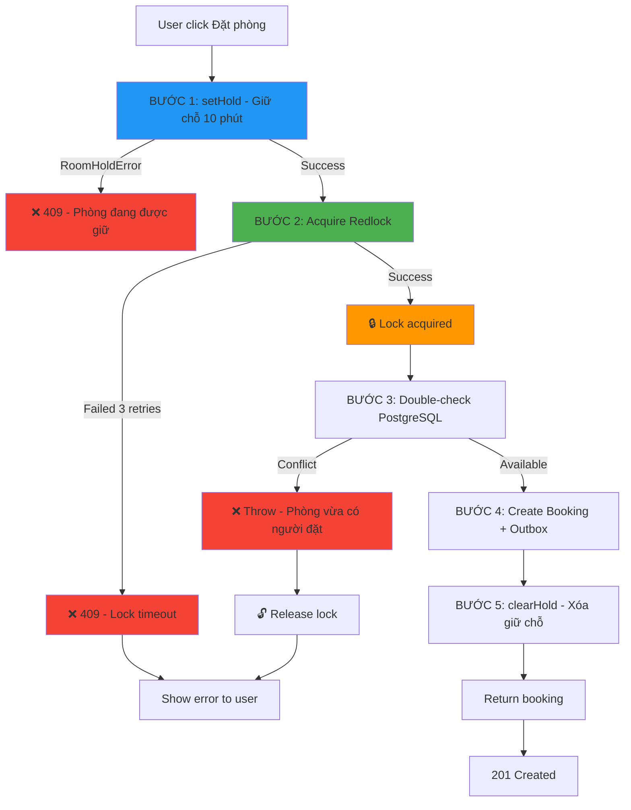
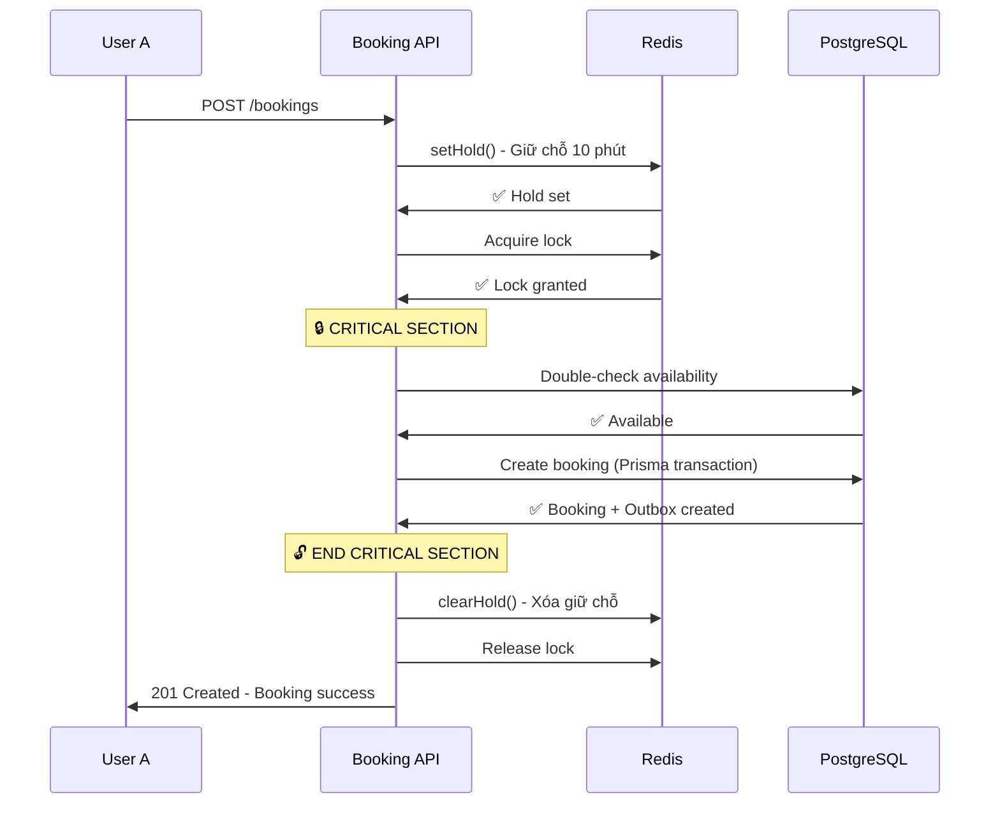
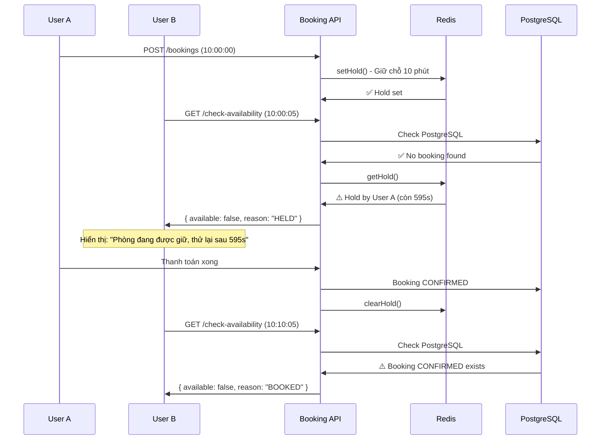
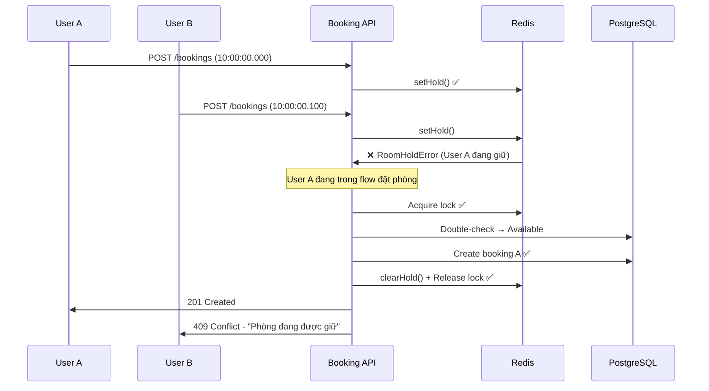

# REDIS DISTRIBUTED LOCK + HOLD - CHỐNG OVERBOOKING

> Giải pháp ngăn chặn Race Condition và Double Booking trong hệ thống đặt phòng phân tán
> Sử dụng **PostgreSQL** (thay MongoDB) + **Redis Hold** (giữ chỗ 10 phút) + **Redlock** (Double-check Locking)

---

## 📋 MỤC LỤC

- [1. Tổng Quan Kiến Trúc](#1-tổng-quan-kiến-trúc)
- [2. Vấn Đề: Overbooking](#2-vấn-đề-overbooking)
- [3. Giải Pháp: 2 Lớp Bảo Vệ](#3-giải-pháp-2-lớp-bảo-vệ)
- [4. Implementation Chi Tiết](#4-implementation-chi-tiết)
- [5. API /check-availability (Read-Only)](#5-api-check-availability-read-only)
- [6. Flow Diagram](#6-flow-diagram)
- [7. So Sánh: Check Availability vs Create Booking](#7-so-sánh-check-availability-vs-create-booking)
- [8. Testing Race Condition](#8-testing-race-condition)
- [9. Best Practices](#9-best-practices)

---

## 1. TỔNG QUAN KIẾN TRÚC

### 1.1. Stack Công Nghệ

| Component         | Công Nghệ           | Vai trò                              |
| ----------------- | ------------------- | ------------------------------------ |
| **Database**      | PostgreSQL (Prisma) | Source of Truth - lưu booking        |
| **Cache/Lock**    | Redis + Redlock     | Distributed Lock + Temporary Hold    |
| **Framework**     | Fastify             | HTTP API                             |
| **Message Queue** | BullMQ + Outbox     | Async events (booking-created, etc.) |

### 1.2. Hai Cơ Chế Bảo Vệ

```
┌─────────────────────────────────────────────────────────────┐
│                    BOOKING FLOW                              │
│                                                              │
│  User A nhấn "Đặt phòng"                                    │
│         │                                                    │
│         ▼                                                    │
│  ┌──────────────┐    ┌──────────────────┐                   │
│  │  LỚP 1:      │    │  LỚP 2:          │                   │
│  │  Redis HOLD   │───▶│  Redis LOCK       │───▶ PostgreSQL   │
│  │  (10 phút)    │    │  (Double-check)   │    (Create)      │
│  └──────────────┘    └──────────────────┘                   │
│         │                                                    │
│         ▼                                                    │
│  User B check availability                                   │
│         │                                                    │
│         ▼                                                    │
│  ┌──────────────┐    ┌──────────────────┐                   │
│  │  PostgreSQL   │    │  Redis HOLD       │                   │
│  │  (Check DB)   │───▶│  (Check hold)     │───▶ Result       │
│  └──────────────┘    └──────────────────┘                   │
└─────────────────────────────────────────────────────────────┘
```

---

## 2. VẤN ĐỀ: OVERBOOKING

### 2.1. Kịch Bản Race Condition (Không có bảo vệ)

```
Timeline:
─────────────────────────────────────────────────────────────
        User A                       User B
─────────────────────────────────────────────────────────────
10:00:00.000  Click "Đặt phòng"
10:00:00.100  Check DB: Available ✅
10:00:00.150                         Click "Đặt phòng"
10:00:00.200                         Check DB: Available ✅ (!!!)
10:00:00.300  Create Booking A ✅
10:00:00.400                         Create Booking B ✅ (!!!)
─────────────────────────────────────────────────────────────
KẾT QUẢ: 2 bookings cho cùng 1 phòng → OVERBOOKING ❌
```

### 2.2. Nguyên Nhân

- ❌ **Check availability và Create booking** là 2 bước riêng biệt (TOCTOU)
- ❌ Giữa 2 bước này, DB state có thể bị thay đổi bởi request khác
- ❌ Không có cơ chế "giữ chỗ" tạm thời

### 2.3. Tác Động

- 😡 Cả 2 user đều nhận email xác nhận
- 🤯 Khi đến khách sạn, chỉ có 1 phòng
- 💸 Hoàn tiền, mất uy tín

---

## 3. GIẢI PHÁP: 2 LỚP BẢO VỆ

### 3.1. LỚP 1: Redis Hold (Giữ Chỗ 10 Phút)

**Mục đích**: Ngăn user khác đặt phòng trong khi user A đang trong quá trình đặt.

```
Key:   holds:hotel:{hotelId}:checkIn:{checkIn}:checkOut:{checkOut}
Value: { userId, userName, createdAt, expiresAt }
TTL:   600 giây (10 phút)
```

**Cách hoạt động**:

| Thời điểm | User A (đang đặt)                | User B (check availability)       |
| --------- | -------------------------------- | --------------------------------- |
| T+0s      | `setHold()` → giữ chỗ 10 phút    | -                                 |
| T+1s      | Đang thanh toán...               | `getHold()` → "Đang được giữ" ❌  |
| T+60s     | Thanh toán xong → `clearHold()`  | `getHold()` → null → Available ✅ |
| _Hoặc_    | _Timeout 10 phút_ → Redis tự xóa | `getHold()` → null → Available ✅ |

### 3.2. LỚP 2: Redis Lock (Double-Check Locking)

**Mục đích**: Ngăn 2 request cùng lúc chui qua lớp Hold và cùng tạo booking.

```
Key:   locks:hotel:{hotelId}:{checkIn}:{checkOut}
TTL:   10 giây (đủ cho toàn bộ flow)
Retry: 3 lần, mỗi lần cách 200ms + jitter 200ms
```

**Thuật toán Redlock** (Salvatore Sanfilippo - creator of Redis):

- Acquire lock trên **majority nodes** (>50%)
- Auto-release khi hết TTL
- Retry với jitter để tránh thundering herd

### 3.3. Tại Sao Cần Cả 2 Lớp?

| Kịch bản                         | Chỉ Lock                  | Chỉ Hold             | **Cả 2** |
| -------------------------------- | ------------------------- | -------------------- | -------- |
| User A đặt, B check availability | B không biết A đang đặt   | ✅ B thấy "đang giữ" | ✅       |
| A và B nhấn "Đặt" cùng lúc       | ✅ Chỉ 1 người được       | ⚠️ Race condition    | ✅       |
| A abandon (không thanh toán)     | Lock hết 10s → B đặt được | ✅ Hold hết 10 phút  | ✅       |
| Network partition                | ✅ TTL auto-release       | ✅ TTL auto-release  | ✅       |

---

## 4. IMPLEMENTATION CHI TIẾT

### 4.1. Setup Redis Client

**File**: `apps/booking-service/src/utils/redis.ts`

```typescript
import Redis from "ioredis";
import Redlock from "redlock";

// 1. Kết nối Redis
const redisClient = new Redis({
  host: process.env.REDIS_HOST || "stazy-redis",
  port: Number(process.env.REDIS_PORT) || 6379,
});

// 2. Cấu hình Redlock
const redlock = new Redlock([redisClient as any], {
  driftFactor: 0.01, // Clock drift tolerance
  retryCount: 3, // Thử lại 3 lần nếu lock bận
  retryDelay: 200, // Đợi 200ms giữa các lần retry
  retryJitter: 200, // Random 0-200ms để tránh thundering herd
});

redlock.on("clientError", (error) => {
  console.error("Redlock error:", error);
});

export { redisClient, redlock };
```

### 4.2. Redis Hold Utility

**File**: `apps/booking-service/src/utils/redis-hold.ts`

```typescript
import { redisClient } from "./redis";

const HOLD_TTL_SECONDS = 600; // 10 phút

interface HoldInfo {
  userId: string;
  userName: string;
  createdAt: string;
  expiresAt: string;
}

// Tạo key Redis cho hold
function buildHoldKey(hotelId: number, checkIn: string | Date, checkOut: string | Date): string {
  const checkInStr = checkIn instanceof Date ? checkIn.toISOString().split("T")[0] : checkIn;
  const checkOutStr = checkOut instanceof Date ? checkOut.toISOString().split("T")[0] : checkOut;
  return `holds:hotel:${hotelId}:checkIn:${checkInStr}:checkOut:${checkOutStr}`;
}

// Đặt hold - Giữ chỗ 10 phút
export async function setHold(
  hotelId: number, checkIn: string | Date, checkOut: string | Date,
  userId: string, userName: string
): Promise<{ isExisting: boolean; expiresAt: Date }> {
  const key = buildHoldKey(hotelId, checkIn, checkOut);
  const existingHoldRaw = await redisClient.get(key);

  if (existingHoldRaw) {
    const existingHold: HoldInfo = JSON.parse(existingHoldRaw);

    // Hold của chính user → gia hạn
    if (existingHold.userId === userId) {
      await redisClient.set(key, JSON.stringify({...}), "EX", HOLD_TTL_SECONDS);
      return { isExisting: true, expiresAt };
    }

    // Hold của user khác → throw error
    const ttl = await redisClient.ttl(key);
    if (ttl > 0) {
      throw new RoomHoldError(
        `Phòng đang được giữ chỗ bởi ${existingHold.userName}`,
        existingHold.userId, existingHold.userName, holdExpiresAt,
      );
    }
  }

  // Tạo hold mới
  await redisClient.set(key, JSON.stringify(holdData), "EX", HOLD_TTL_SECONDS);
  return { isExisting: false, expiresAt };
}

// Kiểm tra hold (READ-ONLY, cho /check-availability)
export async function getHold(hotelId: number, checkIn: Date, checkOut: Date): Promise<HoldInfo | null> {
  const key = buildHoldKey(hotelId, checkIn, checkOut);
  const holdRaw = await redisClient.get(key);
  if (!holdRaw) return null;

  const ttl = await redisClient.ttl(key);
  if (ttl <= 0) return null;

  return { ...JSON.parse(holdRaw), expiresAt: new Date(Date.now() + ttl * 1000).toISOString() };
}

// Xóa hold sau khi đặt thành công
export async function clearHold(hotelId: number, checkIn: Date, checkOut: Date): Promise<void> {
  await redisClient.del(buildHoldKey(hotelId, checkIn, checkOut));
}

// Custom Error class
export class RoomHoldError extends Error {
  public heldByUserId: string;
  public heldByUserName: string;
  public holdExpiresAt: Date;
  // ... constructor
}
```

### 4.3. Create Booking với 2 Lớp Bảo Vệ

**File**: `apps/booking-service/src/utils/booking.ts`

```typescript
import { redlock } from "./redis";
import { setHold, clearHold, RoomHoldError } from "./redis-hold";
import { prisma } from "@repo/product-db";

export const createBooking = async (userId: string, bookingData: any) => {
  const { hotelId, checkIn, checkOut, ... } = bookingData;

  const resource = `locks:hotel:${hotelId}:${checkInStr}:${checkOutStr}`;
  const ttl = 10000; // 10 giây
  let lock;

  try {
    // ═══════════════════════════════════════════════
    //  BƯỚC 1: SET HOLD (Giữ chỗ 10 phút trên Redis)
    // ═══════════════════════════════════════════════
    // User A bắt đầu đặt → giữ chỗ ngay
    // User B check → thấy "đang được giữ"
    await setHold(hotelId, checkInStr, checkOutStr, userId, userName);

    // ═══════════════════════════════════════════════
    //  BƯỚC 2: ACQUIRE REDIS LOCK (Double-check Locking)
    // ═══════════════════════════════════════════════
    // Chỉ cho 1 request vào critical section
    lock = await redlock.acquire([resource], ttl);

    // ═══════════════════════════════════════════════
    //  BƯỚC 3: DOUBLE-CHECK TRONG POSTGRESQL
    // ═══════════════════════════════════════════════
    // Kiểm tra lại DB (trong lock) - tránh race condition
    const conflict = await prisma.booking.findFirst({
      where: {
        hotelId: Number(hotelId),
        status: { in: ["CONFIRMED", "PENDING"] },
        checkIn: { lt: new Date(checkOut) },
        checkOut: { gt: new Date(checkIn) },
      },
    });
    if (conflict) throw new Error("Phòng vừa có người đặt!");

    // ═══════════════════════════════════════════════
    //  BƯỚC 4: CREATE BOOKING TRONG POSTGRESQL
    // ═══════════════════════════════════════════════
    const newBooking = await prisma.$transaction(async (tx) => {
      const booking = await tx.booking.create({ data: { ... } });
      await tx.outboxMessage.create({ data: { ... } }); // Outbox pattern
      return booking;
    });

    // ═══════════════════════════════════════════════
    //  BƯỚC 5: CLEAR HOLD (Xóa giữ chỗ)
    // ═══════════════════════════════════════════════
    await clearHold(hotelId, checkInStr, checkOutStr);

    return newBooking;

  } catch (error) {
    if (error instanceof RoomHoldError) throw error; // RoomHold → 409
    if (error.name === "ExecutionError") throw new Error("Lock timeout"); // Redlock → 409
    throw error;
  } finally {
    if (lock) await lock.unlock().catch(console.error); // Always release
  }
};
```

**Giải thích luồng:**


```mermaid
graph TD
    A[User click Đặt phòng] --> B[ BƯỚC 1: setHold - Giữ chỗ 10 phút]
    B -->|RoomHoldError| Z1[❌ 409 - Phòng đang được giữ]
    B -->|Success| C[ BƯỚC 2: Acquire Redlock]

    C -->|Failed 3 retries| Z2[❌ 409 - Lock timeout]
    C -->|Success| D[🔒 Lock acquired]

    D --> E[ BƯỚC 3: Double-check PostgreSQL]
    E -->|Conflict| F[❌ Throw - Phòng vừa có người đặt]
    E -->|Available| G[ BƯỚC 4: Create Booking + Outbox]

    G --> H[ BƯỚC 5: clearHold - Xóa giữ chỗ]
    H --> I[ Return booking]

    F --> J[🔓 Release lock]
    Z2 --> K[Show error to user]
    I --> L[201 Created]
    J --> K

    style B fill:#2196F3
    style C fill:#4CAF50
    style D fill:#FF9800
    style F fill:#f44336
    style Z1 fill:#f44336
    style Z2 fill:#f44336
```

---

## 5. API /check-availability (READ-ONLY)

### 5.1. Chiến Lược Kiểm Tra 2 Lớp

**File**: `apps/booking-service/src/routes/availability.ts`

```typescript
import { prisma } from "@repo/product-db";
import { getHold } from "../utils/redis-hold";

fastify.get("/check-availability", async (request, reply) => {
  const { hotelId, checkIn, checkOut } = request.query;

  // ─────────────────────────────────────────────────
  //  LỚP 1: KIỂM TRA POSTGRESQL (Source of Truth)
  // ─────────────────────────────────────────────────
  const conflictingBooking = await prisma.booking.findFirst({
    where: {
      hotelId: hotelIdNum,
      status: { in: ["PENDING", "CONFIRMED"] },
      checkIn: { lt: checkOutDate }, // Overlap logic
      checkOut: { gt: checkInDate },
    },
  });

  if (conflictingBooking) {
    return {
      available: false,
      reason: "BOOKED",
      message: "Phòng đã có người đặt trong khoảng thời gian này.",
    };
  }

  // ─────────────────────────────────────────────────
  //  LỚP 2: KIỂM TRA REDIS HOLD (Temporary Reservation)
  // ─────────────────────────────────────────────────
  const activeHold = await getHold(hotelIdNum, checkInDate, checkOutDate);

  if (activeHold) {
    return {
      available: false,
      reason: "HELD",
      message: `Phòng đang được giữ chỗ. Thử lại sau ${remainingSeconds}s.`,
      holdInfo: { heldBy: activeHold.userName, expiresAt, remainingSeconds },
    };
  }

  // ─────────────────────────────────────────────────
  //  AVAILABLE - Không có booking, không có hold
  // ─────────────────────────────────────────────────
  return { available: true, message: "Phòng còn trống, bạn có thể đặt!" };
});
```

### 5.2. Response Format

**Phòng trống**:

```json
{
  "available": true,
  "message": "Phòng còn trống, bạn có thể đặt!"
}
```

**Phòng đã có booking trong DB**:

```json
{
  "available": false,
  "reason": "BOOKED",
  "message": "Phòng đã có người đặt trong khoảng thời gian này.",
  "conflictDetails": {
    "status": "CONFIRMED",
    "checkIn": "2026-01-20T00:00:00.000Z",
    "checkOut": "2026-01-25T00:00:00.000Z"
  }
}
```

**Phòng đang được giữ chỗ (Redis Hold)**:

```json
{
  "available": false,
  "reason": "HELD",
  "message": "Phòng đang được giữ chỗ bởi khách khác. Thử lại sau 480 giây.",
  "holdInfo": {
    "heldBy": "Nguyễn Văn A",
    "expiresAt": "2026-01-20T10:10:00.000Z",
    "remainingSeconds": 480
  }
}
```

### 5.3. Tại Sao /check-availability KHÔNG CẦN Lock?

| Khía cạnh           | Check Availability  | Create Booking            |
| ------------------- | ------------------- | ------------------------- |
| **Tính chất**       | 📖 Read-only        | ✏️ Write                  |
| **Lock cần?**       | ❌ Không cần        | ✅ **REQUIRED**           |
| **Tại sao?**        | Không ghi data      | Ngăn race condition       |
| **Race condition?** | Không (chỉ đọc)     | Có (TOCTOU vulnerability) |
| **Redis dùng?**     | getHold() (chỉ đọc) | setHold() + redlock (ghi) |

**Nguyên tắc**: Race condition chỉ xảy ra khi **ghi data**. API đọc không có race condition.

---

## 6. FLOW DIAGRAM

### 6.1. Luồng Thành Công (Happy Path)


```mermaid
sequenceDiagram
    participant U1 as User A
    participant API as Booking API
    participant Redis as Redis
    participant DB as PostgreSQL

    U1->>API: POST /bookings
    API->>Redis: setHold() - Giữ chỗ 10 phút
    Redis->>API: ✅ Hold set

    API->>Redis: Acquire lock
    Redis->>API: ✅ Lock granted

    Note over API: 🔒 CRITICAL SECTION
    API->>DB: Double-check availability
    DB->>API: ✅ Available
    API->>DB: Create booking (Prisma transaction)
    DB->>API: ✅ Booking + Outbox created
    Note over API: 🔓 END CRITICAL SECTION

    API->>Redis: clearHold() - Xóa giữ chỗ
    API->>Redis: Release lock
    API->>U1: 201 Created - Booking success
```

### 6.2. Luồng User B Thấy "Đang Được Giữ"


```mermaid
sequenceDiagram
    participant U1 as User A
    participant U2 as User B
    participant API as Booking API
    participant Redis as Redis
    participant DB as PostgreSQL

    U1->>API: POST /bookings (10:00:00)
    API->>Redis: setHold() - Giữ chỗ 10 phút
    Redis->>API: ✅ Hold set

    U2->>API: GET /check-availability (10:00:05)
    API->>DB: Check PostgreSQL
    DB->>API: ✅ No booking found
    API->>Redis: getHold()
    Redis->>API: ⚠️ Hold by User A (còn 595s)
    API->>U2: { available: false, reason: "HELD" }

    Note over U2: Hiển thị: "Phòng đang được giữ, thử lại sau 595s"

    U1->>API: Thanh toán xong
    API->>DB: Booking CONFIRMED
    API->>Redis: clearHold()

    U2->>API: GET /check-availability (10:10:05)
    API->>DB: Check PostgreSQL
    DB->>API: ⚠️ Booking CONFIRMED exists
    API->>U2: { available: false, reason: "BOOKED" }
```

### 6.3. Luồng Race Condition (Được Ngăn Chặn)


```mermaid
sequenceDiagram
    participant U1 as User A
    participant U2 as User B
    participant API as Booking API
    participant Redis as Redis
    participant DB as PostgreSQL

    U1->>API: POST /bookings (10:00:00.000)
    API->>Redis: setHold() ✅

    U2->>API: POST /bookings (10:00:00.100)
    API->>Redis: setHold()
    Redis->>API: ❌ RoomHoldError (User A đang giữ)

    Note over API: User A đang trong flow đặt phòng
    API->>Redis: Acquire lock ✅
    API->>DB: Double-check → Available
    API->>DB: Create booking A ✅
    API->>Redis: clearHold() + Release lock ✅

    API->>U1: 201 Created
    API->>U2: 409 Conflict - "Phòng đang được giữ"
```

---

## 7. SO SÁNH: CHECK AVAILABILITY VS CREATE BOOKING

| Tiêu chí            | Check Availability           | Create Booking             |
| ------------------- | ---------------------------- | -------------------------- |
| **Endpoint**        | `GET /check-availability`    | `POST /bookings`           |
| **Tính chất**       | 📖 Read-only                 | ✏️ Write (Critical)        |
| **Database**        | PostgreSQL (Prisma)          | PostgreSQL (Prisma)        |
| **Redis Lock?**     | ❌ Không cần                 | ✅ **REQUIRED** (Redlock)  |
| **Redis Hold?**     | 📖 getHold() (chỉ đọc)       | ✏️ setHold() + clearHold() |
| **Lock TTL**        | N/A                          | 10 giây                    |
| **Hold TTL**        | N/A                          | 10 phút                    |
| **Khi có hold**     | Hiển thị "đang giữ" cho user | Throw RoomHoldError → 409  |
| **Khi lock fail**   | N/A                          | Throw ExecutionError → 409 |
| **Critical level**  | 🟡 Medium                    | 🔴 **HIGH**                |
| **Frequency**       | Mỗi khi user chọn ngày       | Chỉ khi click "Đặt phòng"  |
| **Impact nếu race** | Hiển thị sai UI (tạm thời)   | **DOUBLE BOOKING** ❌      |

---

## 8. TESTING RACE CONDITION

### 8.1. Manual Test với cURL

**Test 1: User A giữ chỗ, User B check availability**

```bash
# Terminal 1: User A bắt đầu đặt phòng (setHold)
curl -X POST http://localhost:8001/bookings \
  -H "Content-Type: application/json" \
  -H "Authorization: Bearer TOKEN_USER_A" \
  -d '{
    "hotelId": 15,
    "checkIn": "2026-01-20",
    "checkOut": "2026-01-22",
    "contactDetails": {
      "fullName": "User A",
      "email": "userA@test.com",
      "phone": "0123456789"
    }
  }'

# Terminal 2: User B check availability (trong khi A đang đặt)
curl "http://localhost:8001/check-availability?hotelId=15&checkIn=2026-01-20&checkOut=2026-01-22"

# Expected:
# {
#   "available": false,
#   "reason": "HELD",
#   "message": "Phòng đang được giữ chỗ bởi User A. Thử lại sau 595 giây.",
#   "holdInfo": { "heldBy": "User A", "remainingSeconds": 595 }
# }
```

**Test 2: Hai user nhấn "Đặt" cùng lúc**

```bash
# Chạy đồng thời 2 terminal
# Terminal 1:
curl -X POST http://localhost:8001/bookings \
  -H "Authorization: Bearer TOKEN_A" \
  -d '{"hotelId": 15, "checkIn": "2026-01-20", "checkOut": "2026-01-22", "contactDetails": {"fullName": "A", "email": "a@test.com", "phone": "0111"}}'

# Terminal 2 (chạy ngay sau):
curl -X POST http://localhost:8001/bookings \
  -H "Authorization: Bearer TOKEN_B" \
  -d '{"hotelId": 15, "checkIn": "2026-01-20", "checkOut": "2026-01-22", "contactDetails": {"fullName": "B", "email": "b@test.com", "phone": "0222"}}'

# Expected:
# Terminal 1: 201 Created ✅
# Terminal 2: 409 Conflict - "Phòng đang được giữ bởi A" ❌
```

### 8.2. Artillery Load Test

```yaml
# test-race-condition.yml
config:
  target: "http://localhost:8001"
  phases:
    - duration: 1
      arrivalRate: 50
scenarios:
  - name: "Concurrent Booking"
    flow:
      - post:
          url: "/bookings"
          json:
            hotelId: 15
            checkIn: "2026-01-20"
            checkOut: "2026-01-22"
            contactDetails:
              fullName: "Load Test"
              email: "test@example.com"
              phone: "0123456789"
```

**Kết quả mong đợi**:

```
✅ 1 request thành công (201 Created)
❌ 49 requests bị reject (409 Conflict - RoomHoldError)
Total bookings in DB: 1
```

### 8.3. Kiểm Tra Redis Hold Trực Tiếp

```bash
# Xem tất cả hold keys đang active
redis-cli KEYS "holds:hotel:*"

# Xem hold cụ thể
redis-cli GET "holds:hotel:15:checkIn:2026-01-20:checkOut:2026-01-22"

# Xem TTL còn lại
redis-cli TTL "holds:hotel:15:checkIn:2026-01-20:checkOut:2026-01-22"

# Xóa hold thủ công (nếu cần test)
redis-cli DEL "holds:hotel:15:checkIn:2026-01-20:checkOut:2026-01-22"
```

---

## 9. BEST PRACTICES

### 9.1. TTL Selection

| Use Case         | TTL        | Lý do                                     |
| ---------------- | ---------- | ----------------------------------------- |
| **Redis Hold**   | 10 phút    | Đủ cho user thanh toán (5-8 phút TB)      |
| **Redis Lock**   | 10 giây    | Đủ cho: setHold + check + create + outbox |
| **Payment Lock** | 30-60 giây | API bên thứ 3 có thể chậm                 |

### 9.2. Lock Key Strategy

```typescript
// ✅ Hold Key - Chi tiết (checkIn + checkOut)
`holds:hotel:${hotelId}:checkIn:${checkInDate}:checkOut:${checkOutDate}`
// Ví dụ: holds:hotel:15:checkIn:2026-01-20:checkOut:2026-01-22

// ✅ Lock Key - Chi tiết (checkIn + checkOut)
`locks:hotel:${hotelId}:${checkInDate}:${checkOutDate}`
// Ví dụ: locks:hotel:15:2026-01-20:2026-01-22

// ❌ TRÁNH: Lock quá rộng (block toàn bộ hotel)
`locks:hotel:${hotelId}`; // BAD!
```

### 9.3. Error Handling

```typescript
// Ưu tiên bắt lỗi từ trong ra ngoài:
try {
  await setHold(...);          // Có thể throw RoomHoldError
  lock = await redlock.acquire(...);  // Có thể throw ExecutionError
  await prisma.booking.create(...);   // Có thể throw PrismaError
  await clearHold(...);
} catch (error) {
  if (error instanceof RoomHoldError) {
    // Phòng đang được giữ → 409 Conflict + thông tin hold
    return reply.status(409).send({
      message: error.message,
      reason: "HELD",
      heldBy: error.heldByUserName,
      holdExpiresAt: error.holdExpiresAt,
      remainingSeconds: Math.floor((error.holdExpiresAt - Date.now()) / 1000),
    });
  }

  if (error.name === "ExecutionError") {
    // Redlock timeout → 409 Conflict
    return reply.status(409).send({
      message: "Phòng đang được giữ bởi khách khác",
      reason: "LOCK_TIMEOUT",
    });
  }

  // Unknown error → 500
  return reply.status(500).send({ message: "Lỗi hệ thống" });
}
```

### 9.4. Monitoring & Alerting

**Metrics cần track**:

- `redis_hold_set_total` - Số lần set hold
- `redis_hold_conflict_total` - Số lần user bị reject do hold
- `redis_lock_acquisition_seconds` - Thời gian acquire lock
- `redis_lock_failures_total` - Số lần lock timeout

**Alerts**:

- 🚨 Hold conflict rate > 10% (có thể cần tăng số phòng)
- 🚨 Lock acquisition time > 2s
- 🚨 Redis connection errors

---

## 📊 TỔNG KẾT

### ✅ Tại Sao Cần /check-availability?

**CÓ, CHẮC CHẮN CẦN.** Nhưng vai trò thay đổi:

| Trước (MongoDB)                 | Sau (PostgreSQL + Redis)                      |
| ------------------------------- | --------------------------------------------- |
| Check availability có soft lock | **Read-only** (không cần lock)                |
| Chỉ check MongoDB               | Check **PostgreSQL + Redis Hold**             |
| Không biết ai đang đặt          | **Thông báo "đang được giữ"** cho user khác   |
| Dùng MongoDB `Booking.find()`   | Dùng Prisma `findFirst()` + Redis `getHold()` |

### 🎯 Tổng Kết 2 Lớp Bảo Vệ

```
┌─────────────────────────────────────────────────────────────┐
│                                                             │
│  LỚP 1: Redis HOLD (10 phút)                               │
│  → User A bắt đầu đặt → giữ chỗ ngay                      │
│  → User B check → thấy "đang được giữ" + thời gian còn lại │
│  → Sau 10 phút, hold tự hết → ai cũng đặt được             │
│                                                             │
│  LỚP 2: Redis LOCK (Double-check Locking)                  │
│  → Nếu A và B cùng nhấn "Đặt" → chỉ 1 người vào được      │
│  → Trong lock: double-check PostgreSQL trước khi create     │
│  → Ngăn race condition ở tầng write                         │
│                                                             │
│  KẾT QUẢ: KHÔNG BAO GIỜ OVERBOOKING ✅                     │
│                                                             │
└─────────────────────────────────────────────────────────────┘
```

---

**Tài liệu này được tạo ngày**: 21/01/2026
**Cập nhật**: 08/05/2026 - Migrated từ MongoDB sang PostgreSQL, thêm Redis Hold
**Version**: 2.0
**Liên quan đến**: UC-08 (Tạo Booking), UC-12 (CF Recommendation)
**Reference**: [Redlock Algorithm](https://redis.io/docs/manual/patterns/distributed-locks/)
