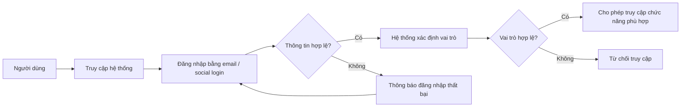
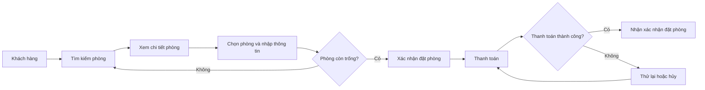
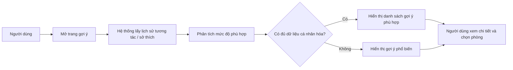
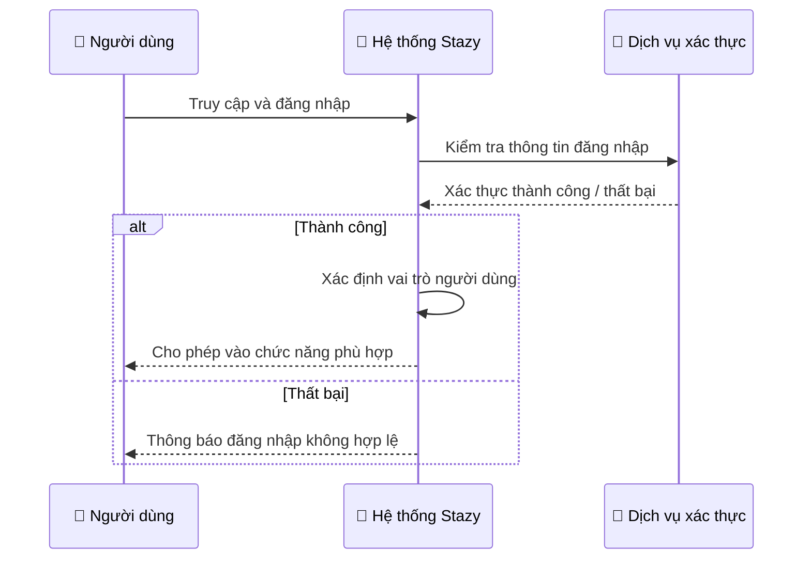
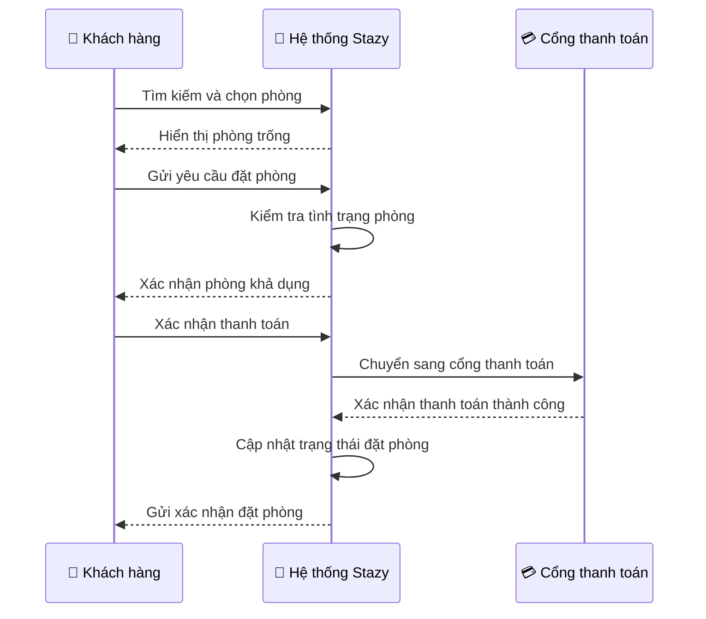
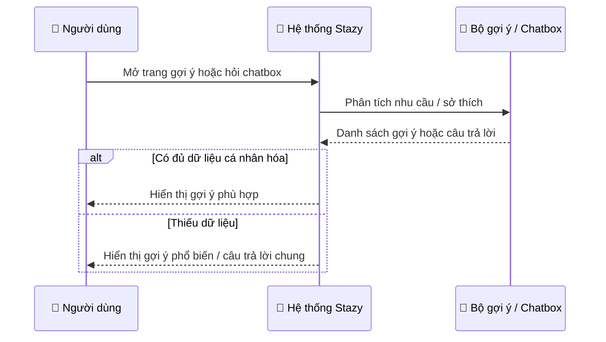
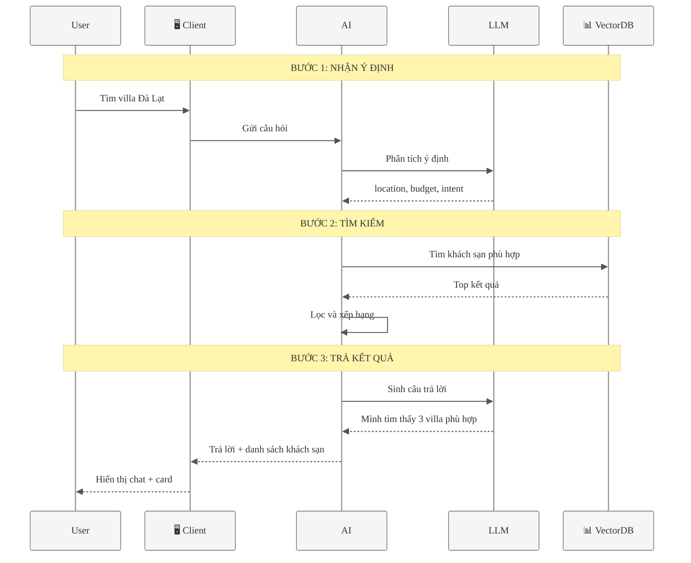

## 3.1.2. Sơ đồ hoạt động (Activity Diagram) — Business View

Mục này mô tả quy trình nghiệp vụ ở mức tổng quát, chỉ dùng các tác nhân và chức năng chính. Không nêu `service`, `port`, `database` hay chi tiết kỹ thuật. Với Chapter 3, nên chọn 3 use case quan trọng nhất để tránh quá dài.

### Use case 1: Đăng nhập và phân quyền

**Ý nghĩa:** sơ đồ này dùng để mô tả luồng xác thực cơ bản và kiểm tra quyền của người dùng trước khi vào các chức năng như đặt phòng, quản lý khách sạn hoặc quản trị.

### Use case 2: Đặt phòng và thanh toán

**Ý nghĩa:** đây là luồng nghiệp vụ quan trọng nhất của hệ thống khách sạn, thể hiện rõ các bước từ tìm kiếm đến thanh toán thành công.

### Use case 3: Xem gợi ý khách sạn cá nhân hóa

**Ý nghĩa:** đây là sơ đồ phù hợp để mô tả luồng gợi ý theo CF/CBF ở mức nghiệp vụ. Nếu muốn dùng chatbox thay cho use case này, có thể đổi thành luồng “Người dùng nhập câu hỏi → hệ thống hiểu ý định → trả lời/gợi ý khách sạn”.

---

## 3.1.3. Sơ đồ trình tự (Sequence Diagram) — Business View

Mục này mô tả thứ tự tương tác giữa người dùng và hệ thống ở mức tổng quát. Chỉ dùng các đối tượng lớn như `User`, `System`, `Payment Gateway`, `Recommendation Engine`, `Chat Assistant`.

### Use case 1: Đăng nhập và phân quyền

**Mục đích:** thể hiện rõ trình tự xác thực, kiểm tra quyền và phản hồi kết quả cho người dùng.

### Use case 2: Đặt phòng và thanh toán

**Mục đích:** đây là sequence tiêu biểu nhất cho nghiệp vụ booking, đủ để đưa vào phần phân tích mà không đi sâu vào kiến trúc kỹ thuật.

### Use case 3: Gợi ý khách sạn cá nhân hóa / Chatbox hỗ trợ

**Mục đích:** sơ đồ này dùng được cho cả luồng CF/CBF và luồng chatbox. Ở mức 3.1, không cần tách chi tiết thuật toán CF, mà chỉ cần mô tả hệ thống tiếp nhận nhu cầu và trả kết quả phù hợp.

### Use case 3 (phiên bản tối ưu cho draw.io): Chatbox hỗ trợ tìm kiếm / gợi ý

Nếu chữ vẫn bị nhỏ khi dán vào draw.io, nguyên nhân thường là sơ đồ sequence có quá nhiều participant và quá nhiều chữ trong mỗi message. Bản dưới đây đã rút gọn participant, tăng cỡ chữ, tăng khoảng cách và giảm độ dài message để dễ đọc hơn khi render trong draw.io. Sơ đồ này vẫn chỉnh thủ công được sau khi dán vào.

**Cách chỉnh thủ công trong draw.io:** sau khi paste sơ đồ, bạn có thể kéo thả các khối participant, chỉnh tên participant, đổi vị trí các note, và thay phần text của message mà không làm mất cấu trúc logic chính.

**Lưu ý thực tế:** nếu sau khi dán mà draw.io vẫn render quá nhỏ, nên dùng sơ đồ này thay cho bản nhiều participant ở trên, vì số lượng đối tượng ít hơn sẽ phóng chữ lớn hơn rõ rệt trên canvas.

---

## Gợi ý chọn use case cho Chapter 3

- Nếu muốn bám sát nghiệp vụ cốt lõi, chọn 3 use case: **đăng nhập**, **đặt phòng**, **gợi ý khách sạn**.
- Nếu muốn nhấn mạnh AI/assistant, có thể thay use case 3 bằng **chatbox hỗ trợ tìm kiếm**.
- Các nội dung như **CF, CBF, A/B testing, phân tích dữ liệu** nên để ở phần 3.4.4 vì đây là thiết kế kỹ thuật hoặc phân tích hệ thống mở rộng.

---

## Kết luận ngắn

Ở 3.1.2, bạn dùng **activity diagram** để mô tả luồng nghiệp vụ tổng quát. Ở 3.1.3, bạn dùng **sequence diagram** mức business để mô tả thứ tự tương tác giữa người dùng và hệ thống. Các ví dụ về **chatbox** hay **CF** hoàn toàn có thể chuyển thành sơ đồ 3.1, nhưng chỉ nên mô tả ở mức “người dùng hỏi / hệ thống phân tích / hệ thống trả gợi ý”, không đi vào service hay thuật toán chi tiết.
