# Hướng dẫn cấu trúc Chapter 3 — Phân biệt 3.1.x vs 3.4.x

## Vấn đề

Bạn có 2 vị trí chứa sơ đồ tương tự nhau:

- **3.1.2** Sơ đồ hoạt động (Activity Diagram)
- **3.1.3** Sơ đồ trình tự (Sequence Diagram)
- **3.4.4** Các luồng hoạt động chính (Main Activity Flows)

## Nguyên tắc phân biệt

### Mức trừu tượng khác nhau:

| Section             | Mức trừu tượng             | Góc nhìn                 | Mục đích                                  | Chi tiết kỹ thuật                        |
| ------------------- | -------------------------- | ------------------------ | ----------------------------------------- | ---------------------------------------- |
| **3.1.x** Phân tích | **CAO** (Business Level)   | Người dùng / nghiệp vụ   | Phân tích "hệ thống phải làm gì"          | KHÔNG có tên service, port, DB           |
| **3.4.x** Thiết kế  | **THẤP** (Technical Level) | Kiến trúc sư / developer | Thiết kế "hệ thống hoạt động như thế nào" | CÓ tên service, port, DB, message format |

---

## 3.1.2. Sơ đồ hoạt động (Activity Diagram) — Business Level

**Nội dung:** Flowchart đơn giản mô tả quy trình nghiệp vụ từ góc nhìn người dùng. Chỉ có Actor và chức năng, KHÔNG có tên service hay database.

**Ví dụ — Luồng đặt phòng (Business View):**

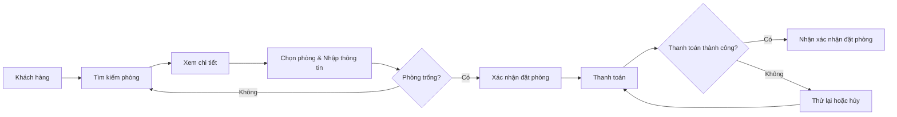

**Ví dụ — Luồng đăng tin khách sạn (Business View):**

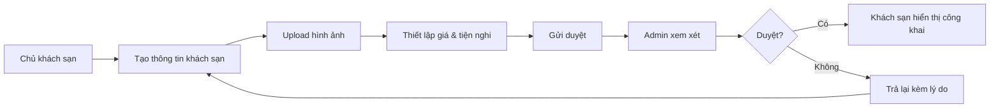

**Số lượng:** 4-6 sơ đồ cho các quy trình nghiệp vụ chính (Tìm kiếm, Đặt phòng, Đăng tin, Đánh giá, Chat, Thanh toán).

### Hình 3.3: Luồng xử lý nghiệp vụ đặt phòng thông minh qua AI và thanh toán trực tuyến qua Stripe

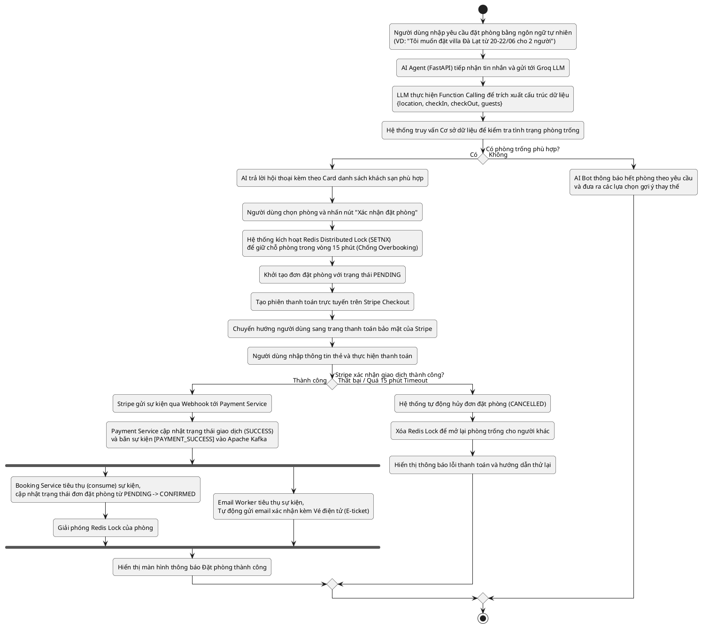

### Hình 3.4: Luồng xử lý thu thập tương tác người dùng và tái huấn luyện mô hình gợi ý

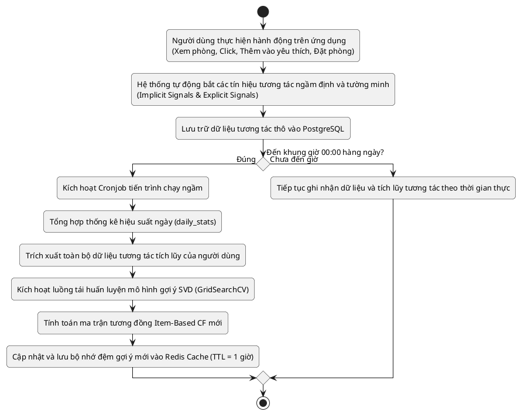

### Hình 3.5: Luồng nghiệp vụ đăng ký đối tác và đăng tin kiểm duyệt khách sạn

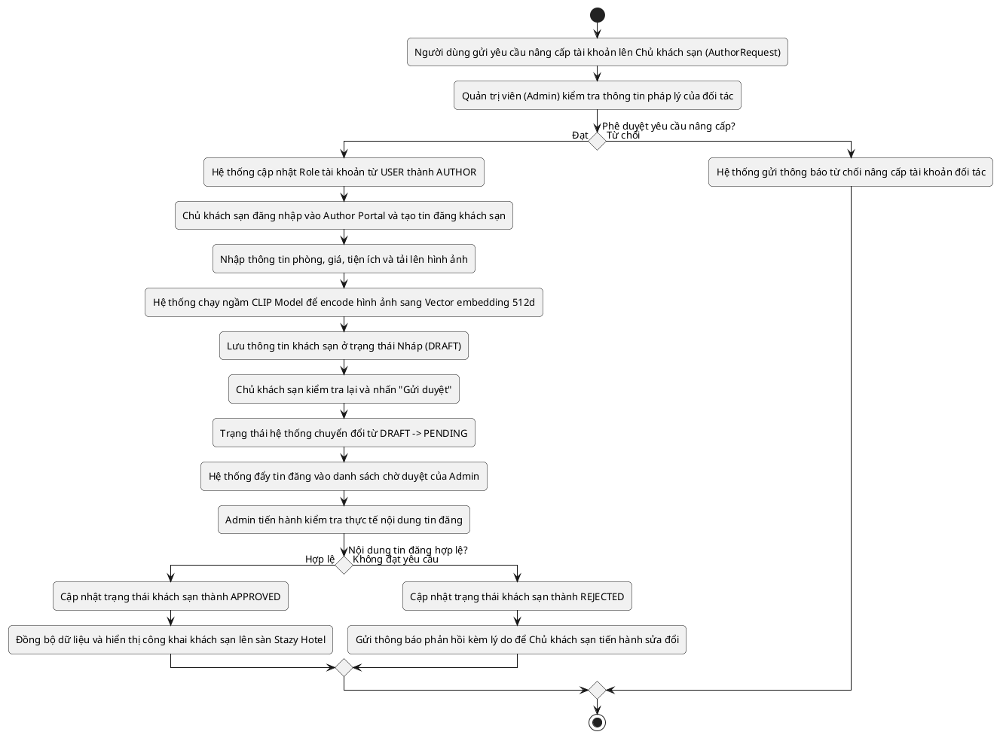

---

## 3.1.3. Sơ đồ trình tự (Sequence Diagram) — Business Level

**Nội dung:** Sequence diagram đơn giản chỉ có Actor và "Hệ thống" (1 khối), KHÔNG tách riêng từng service.

**Ví dụ — Luồng đặt phòng (Business View):**

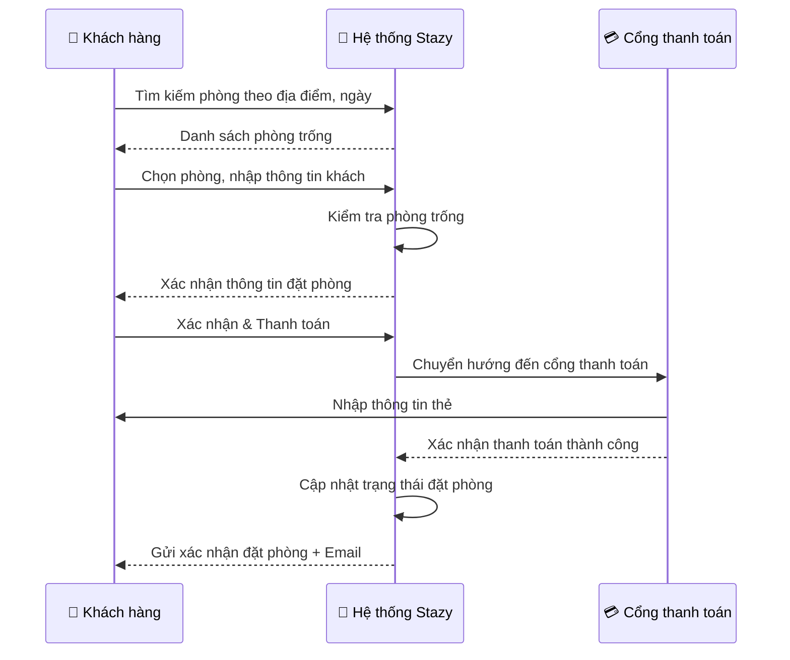

**Số lượng:** 4-6 sơ đồ cho các quy trình chính.

---

## 3.4.4. Các luồng hoạt động chính — Technical Design Level

**Nội dung:** Sequence diagram CHI TIẾT với tên cụ thể từng service, port, database, message format, middleware. Đây là phần THIẾT KẾ kỹ thuật.

**Ví dụ — Luồng đặt phòng (Technical View):**

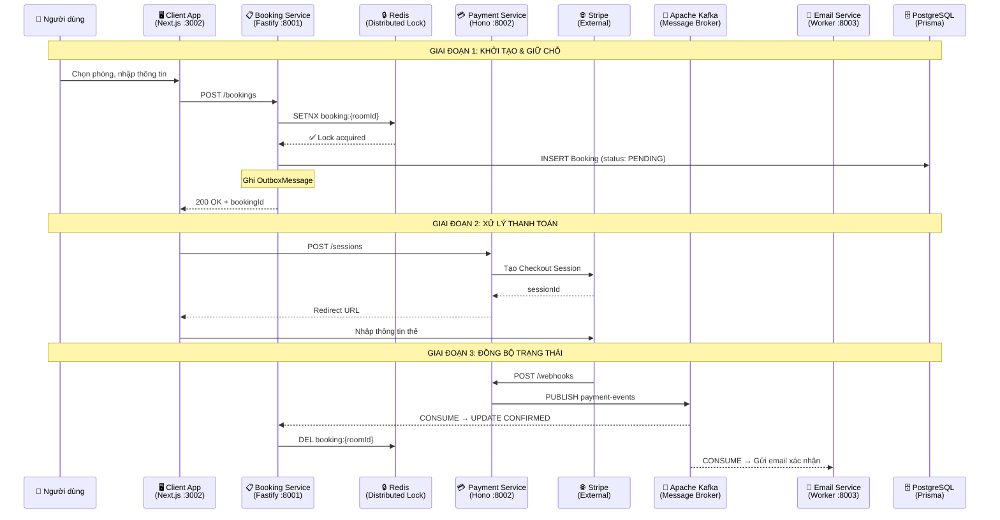

**Số lượng:** 6-8 sơ đồ cho tất cả luồng kỹ thuật chính.

### 3.4.4.4. Thiết kế luồng gợi ý khách sạn đa chiến lược (Multi-Strategy Recommendation Flow)

Hệ thống Stazy Hotel triển khai hệ thống gợi ý đa chiến lược trong file `src/recommend.py` của Search Service, hỗ trợ 5 chiến lược với cơ chế fallback tự động khi gặp cold-start. Quy trình gợi ý diễn ra realtime khi người dùng truy cập trang "Gợi ý cho bạn".

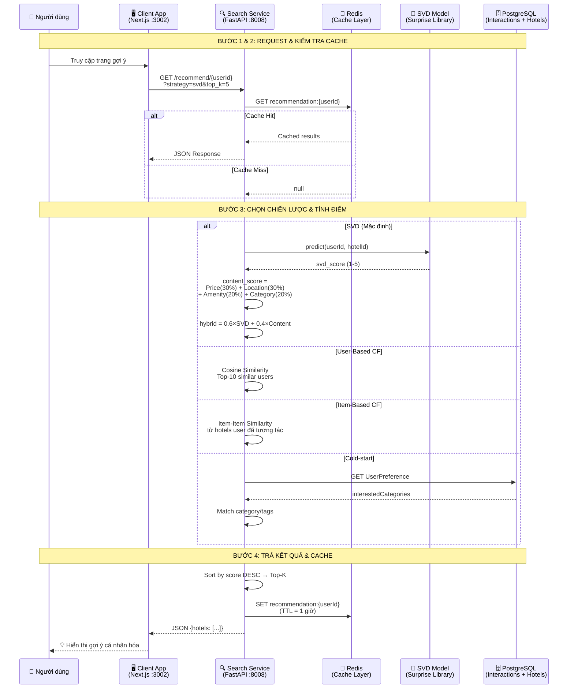

**Bảng chiến lược gợi ý:**

| Chiến lược     | Thuật toán                     | Trọng số                 | Fallback            |
| -------------- | ------------------------------ | ------------------------ | ------------------- |
| SVD (mặc định) | Matrix Factorization + Content | SVD 60%, Content 40%     | → Content → Popular |
| User-Based CF  | Cosine Similarity (K=10)       | Weighted aggregation     | → Content → Popular |
| Item-Based CF  | Item-Item Similarity           | Σ(sim × rating)          | → Content → Popular |
| Content-Based  | Category/Tag matching          | Score = Σ(match weights) | → Popular           |
| Popular        | reviewStar × reviewCount       | —                        | —                   |

**Phân tích Collaborative Filtering (Đánh giá Offline):**

Hệ thống đánh giá riêng biệt cho 2 loại feedback bằng `evaluate.py`:

- **System A (Implicit CF):** User-Based CF (Cosine Similarity, K=5) trên temporal split (60/20/20). Metrics: Precision@K, Recall@K, NDCG@K. So sánh với Baseline (Top Popular Items).
- **System B (Explicit CF):** User-Based CF (Pearson Correlation, Mean-Centering, K=10). Metrics: RMSE, MAE. So sánh với Baseline (User Mean).

**Huấn luyện SVD (`train_svd.py`):** GridSearchCV trên 24 tổ hợp × 3-fold CV → Train SVD Optimized + Baseline → 5-Fold CV → Save `recsys_model.pkl` + `svd_training_report.json` + `system_metrics` DB.

---

### 3.4.4.5. Thiết kế luồng Content-Based Filtering & Vector Search

Dựa trên sở thích tường minh (Explicit Preferences) và vector embeddings, hệ thống mở rộng khả năng gợi ý bằng Content-Based Filtering kết hợp với Vector Search.

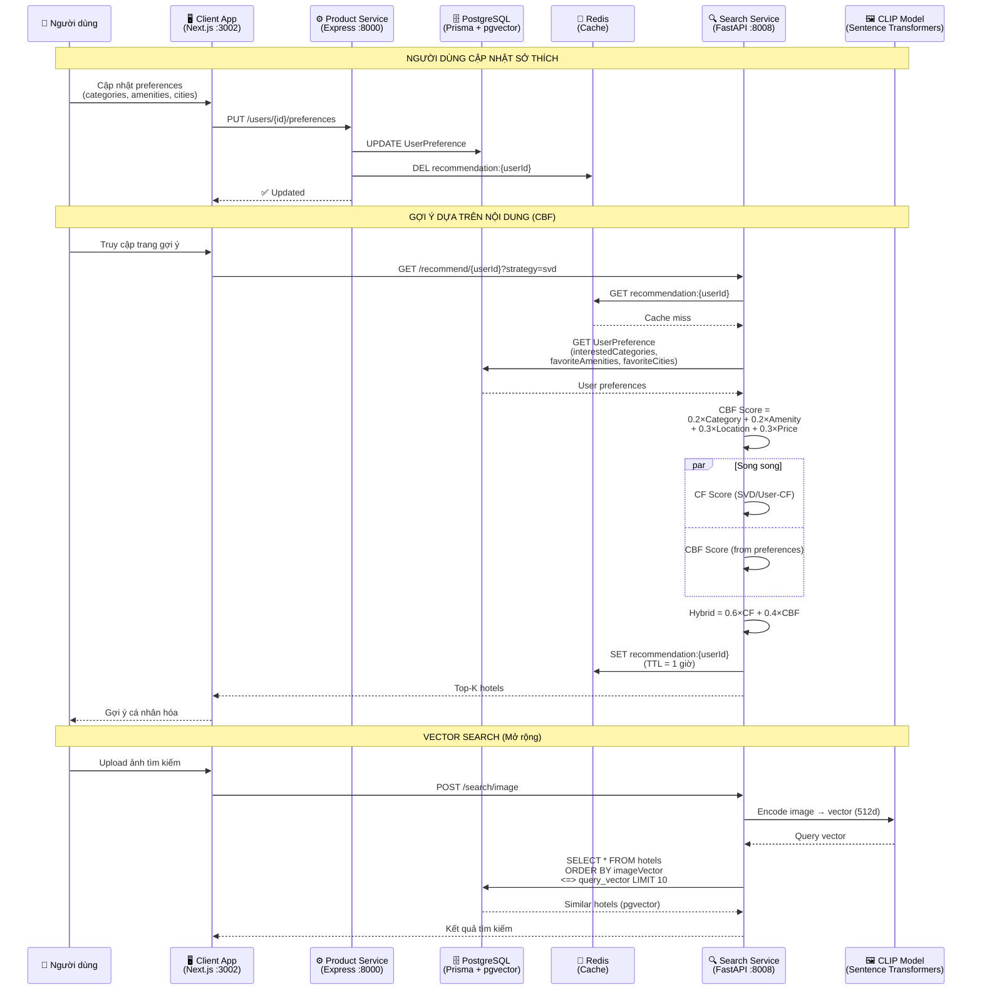

**Kiến trúc CBF dựa trên Explicit Preferences:**

| Thành phần      | Trọng số | Nguồn dữ liệu                         | Mô tả                                                |
| --------------- | -------- | ------------------------------------- | ---------------------------------------------------- |
| Category Match  | 20%      | `UserPreference.interestedCategories` | Khách sạn thuộc category user chọn trong onboarding  |
| Amenity Overlap | 20%      | `UserPreference.favoriteAmenities`    | Tỷ lệ tiện nghi trùng khớp giữa user và hotel        |
| Location Match  | 30%      | `UserPreference.favoriteCities`       | Khách sạn ở thành phố user quan tâm                  |
| Price Proximity | 30%      | `UserPreference.avgPriceExpect`       | Khoảng cách giá giữa user expectation và hotel price |

**Vector-Based Content Filtering:**

- **Offline Pipeline:** CLIP model encode hình ảnh → `imageVector` (512d), mô tả → `policiesVector` (512d), lưu vào PostgreSQL với pgvector extension.
- **Online Pipeline:** Cosine Similarity giữa query vector và hotel vectors. Kết hợp với metadata matching.
- **Hybrid Scoring:** `Final = 0.5 × VectorSimilarity + 0.3 × MetadataMatch + 0.2 × Popularity`.

---

### 3.4.4.6. Thiết kế luồng phân tích dữ liệu và báo cáo (Data Analytics & BI Agent)

Hệ thống triển khai BI Agent sử dụng Groq LLM để phân tích dữ liệu kinh doanh tự động, kết hợp với Admin Dashboard để giám sát hiệu suất hệ thống.

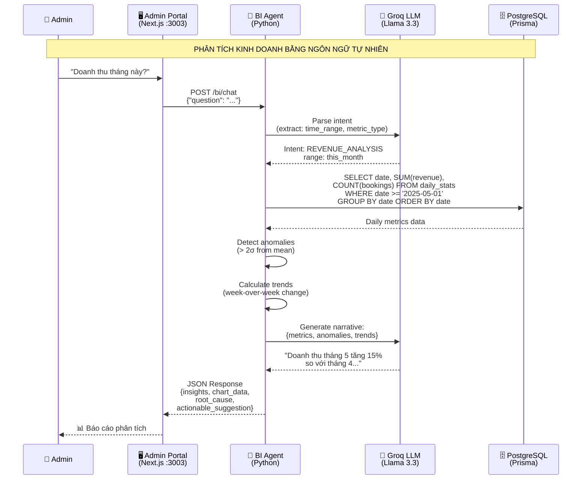

**Luồng giám sát hiệu suất hệ thống:**

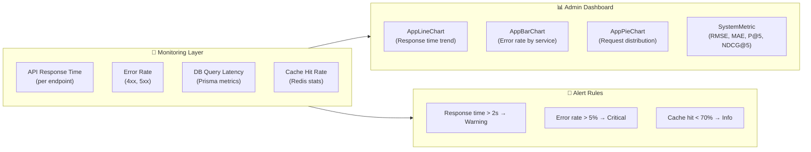

**BI Agent Architecture:**

- **Intent Parser (Groq LLM):** Phân tích câu hỏi tự nhiên → trích xuất intent (REVENUE_ANALYSIS, HOTEL_PERFORMANCE, USER_BEHAVIOR...).
- **SQL Generator:** Tạo truy vấn PostgreSQL tương ứng với intent.
- **Data Analyzer:** Tổng hợp dữ liệu, phát hiện bất thường (> 2σ), tính xu hướng (week-over-week).
- **Narrative Generator (Groq LLM):** Sinh báo cáo tiếng Việt với `insights`, `root_cause`, `actionable_suggestion`.
- **Dashboard Charts:** AppBarChart, AppLineChart, AppPieChart, AppAreaChart hiển thị dữ liệu realtime từ `daily_stats` table.

---

### 3.4.4.7. Thiết kế luồng đặt phòng và thanh toán bằng Chatbot AI (AI Booking Flow)

Bên cạnh luồng đặt phòng truyền thống (3.4.4.2), hệ thống cho phép người dùng đặt phòng trực tiếp thông qua AI Chatbot. Khi người dùng trò chuyện với AI và表达 ý định đặt phòng (Intent = BOOK), AI Agent sẽ tự động tạo link thanh toán và chuyển hướng người dùng đến cổng thanh toán.

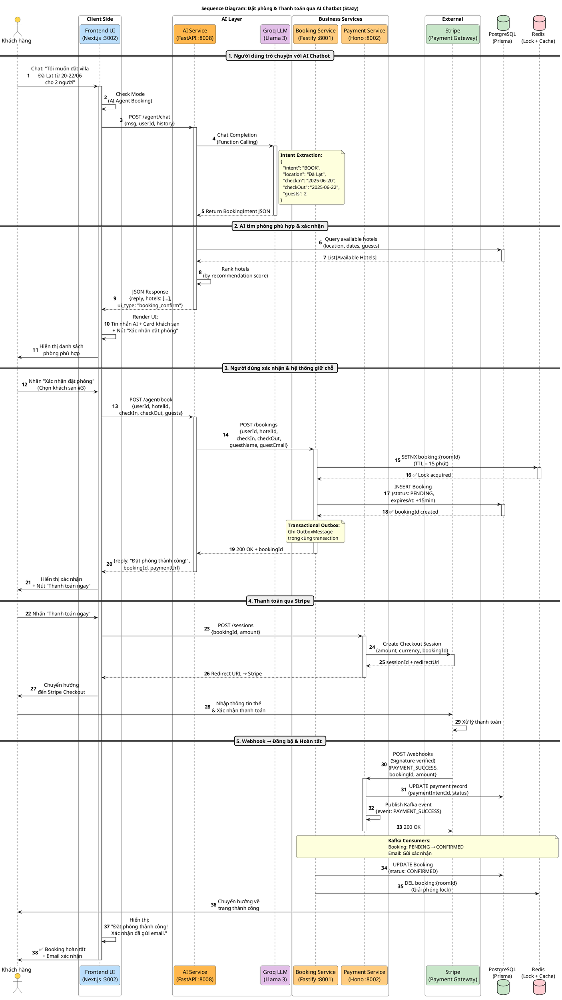

**Mô tả luồng đặt phòng qua AI Chatbot:**

| Bước           | Mô tả                                                                                                                                                            | Service xử lý                           |
| -------------- | ---------------------------------------------------------------------------------------------------------------------------------------------------------------- | --------------------------------------- |
| 1. Chat với AI | Người dùng nhắn tin cho AI Chatbot với ý định đặt phòng. AI sử dụng Groq LLM Function Calling để trích xuất BookingIntent (location, checkIn, checkOut, guests). | AI Service (FastAPI :8008) + Groq LLM   |
| 2. Tìm phòng   | AI truy vấn PostgreSQL để tìm phòng available theo tiêu chí, sắp xếp theo recommendation score. Trả về danh sách + UI card cho frontend.                         | AI Service + PostgreSQL                 |
| 3. Giữ chỗ     | User xác nhận đặt phòng → AI gọi Booking Service → Redis distributed lock (TTL 15 phút) → INSERT Booking (PENDING) + OutboxMessage.                              | Booking Service (Fastify :8001) + Redis |
| 4. Thanh toán  | Tạo Stripe Checkout Session → Redirect user đến Stripe → Nhập thông tin thẻ → Xác nhận.                                                                          | Payment Service (Hono :8002) + Stripe   |
| 5. Đồng bộ     | Stripe webhook → Payment Service verify signature → Kafka publish → Booking CONFIRMED + Email xác nhận + Giải phóng Redis lock.                                  | Payment + Kafka + Booking + Email       |

**So sánh 2 luồng đặt phòng:**

| Tiêu chí     | Luồng truyền thống (3.4.4.2)               | Luồng AI Chatbot (3.4.4.7)               |
| ------------ | ------------------------------------------ | ---------------------------------------- |
| Entry point  | Trang chi tiết khách sạn → Nút "Đặt phòng" | Chat với AI → AI phát hiện Intent BOOK   |
| Tìm phòng    | User tự browse và chọn                     | AI tự động tìm theo ngôn ngữ tự nhiên    |
| Xác nhận     | Form đặt phòng truyền thống                | AI hỏi lại → User xác nhận qua chat UI   |
| Thanh toán   | Redirect đến Stripe (giống nhau)           | Redirect đến Stripe (giống nhau)         |
| Backend flow | Giống nhau (Redis Lock + Outbox + Kafka)   | Giống nhau (Redis Lock + Outbox + Kafka) |
| UX advantage | Chủ động, kiểm soát chi tiết               | Tiện lợi, tự nhiên, nhanh chóng          |

---

### 3.4.4.8. Thiết kế luồng tìm kiếm bằng hình ảnh tương đồng (Vector Image Search Flow)

Hệ thống Stazy Hotel hỗ trợ người dùng tìm kiếm khách sạn bằng hình ảnh. Người dùng tải lên một ảnh mẫu (VD: phòng ngủ phong cách Scandinavian), hệ thống sử dụng CLIP model (OpenAI) để encode ảnh thành vector 512 chiều, sau đó so sánh cosine similarity với toàn bộ hotel image vectors đã được precompute trong PostgreSQL (pgvector extension) để trả về danh sách khách sạn có phong cách thiết kế tương tự.

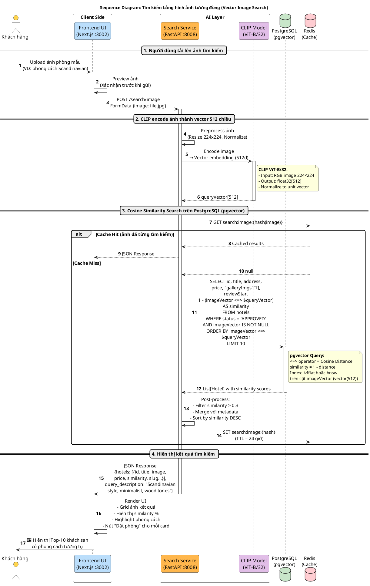

**Luồng Offline: Precompute Hotel Image Vectors**

Trước khi có thể tìm kiếm, hệ thống cần encode toàn bộ hình ảnh khách sạn thành vectors. Quy trình này chạy offline (batch):

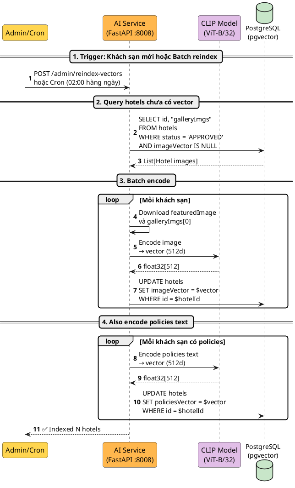

**Mô tả chi tiết:**

| Thành phần                       | Công nghệ                      | Vai trò                                                |
| -------------------------------- | ------------------------------ | ------------------------------------------------------ |
| CLIP Model (ViT-B/32)            | Sentence Transformers (Python) | Encode ảnh/text thành vector 512 chiều                 |
| pgvector Extension               | PostgreSQL Extension           | Lưu vector và thực hiện cosine similarity search       |
| Cosine Distance Operator (`<=>`) | pgvector                       | Tính khoảng cách giữa query vector và hotel vectors    |
| IVFFlat / HNSW Index             | pgvector                       | Index trên vector column để tăng tốc truy vấn O(log n) |
| Redis Cache                      | Redis                          | Cache kết quả tìm kiếm theo hash ảnh (TTL=24h)         |

**Chi phí tính toán:**

| Operation                           | Thời gian            | Tần suất                         |
| ----------------------------------- | -------------------- | -------------------------------- |
| CLIP encode 1 ảnh                   | ~50ms                | Mỗi lần user upload              |
| pgvector cosine search (10K hotels) | ~10-50ms (với index) | Mỗi lần tìm kiếm                 |
| Precompute 1 hotel vector           | ~50ms                | Batch offline (khi có hotel mới) |
| Total latency (user perspective)    | ~100-200ms           | realtime                         |

---

## Bảng so sánh tóm tắt

| Tiêu chí           | 3.1.2/3.1.3 (Phân tích)           | 3.4.4 (Thiết kế)                                    |
| ------------------ | --------------------------------- | --------------------------------------------------- |
| **Mục đích**       | Hiểu nghiệp vụ                    | Triển khai kỹ thuật                                 |
| **Người đọc**      | Giảng viên, người không chuyên    | Developer, kiến trúc sư                             |
| **Tên thành phần** | "Hệ thống", "Khách hàng", "Admin" | "Booking Service (Fastify :8001)", "Redis", "Kafka" |
| **Database**       | Không提到                         | PostgreSQL (Prisma), Redis                          |
| **Message format** | Không提到                         | {"event": "PAYMENT_SUCCESS", "bookingId": "..."}    |
| **Middleware**     | Không提到                         | authMiddleware.ts, shouldBeAdmin                    |
| **Số sơ đồ**       | 4-6 (mỗi loại)                    | 6-8 (tổng)                                          |

---

## Đề xuất cấu trúc Chapter 3

```
3.1. Phân tích thực nghiệm
    3.1.1. Actors & Use Cases          ← update-3-1.md (UC-01 → UC-43)
    3.1.2. Sơ đồ hoạt động            ← 4-6 flowchart đơn giản (Business Level)
    3.1.3. Sơ đồ trình tự             ← 4-6 sequence diagram đơn giản (Business Level)

3.2. Đặc tả yêu cầu hệ thống         ← 3-2.md (FR-01 → FR-28 + NFR)

3.3. Thiết kế cơ sở dữ liệu          ← DBML, ERD

3.4. Thiết kế kiến trúc tổng thể
    3.4.1. Kiến trúc Microservices     ← Tổng quan hệ thống
    3.4.2. Công nghệ sử dụng           ← Tech stack
    3.4.3. Thiết kế Database           ← Schema chi tiết
    3.4.4. Các luồng hoạt động chính   ← 6-8 sequence/flowchart chi tiết (Technical Level)
        3.4.4.1. Xác thực & Phân quyền (Clerk + JWT + RBAC)
        3.4.4.2. Đặt phòng & Thanh toán (Saga + Outbox + Kafka)
        3.4.4.3. AI Chat & Tìm kiếm (RAG + Function Calling)
        3.4.4.4. Gợi ý khách sạn đa chiến lược (Multi-Strategy Recommendation + CF Analysis)
        3.4.4.5. Content-Based Filtering & Vector Search (Explicit Preferences + CLIP)
        3.4.4.6. Phân tích dữ liệu và báo cáo (BI Agent + Dashboard)
        3.4.4.7. Đặt phòng & Thanh toán qua AI Chatbot (AI Booking Flow)
        3.4.4.8. Tìm kiếm bằng hình ảnh tương đồng (Vector Image Search)
    3.4.5. Thiết kế giao diện          ← UI/UX
```
