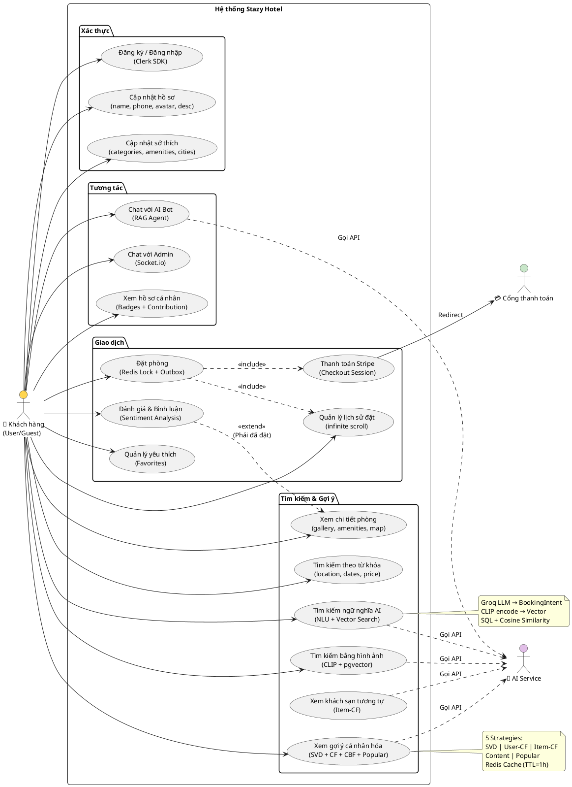
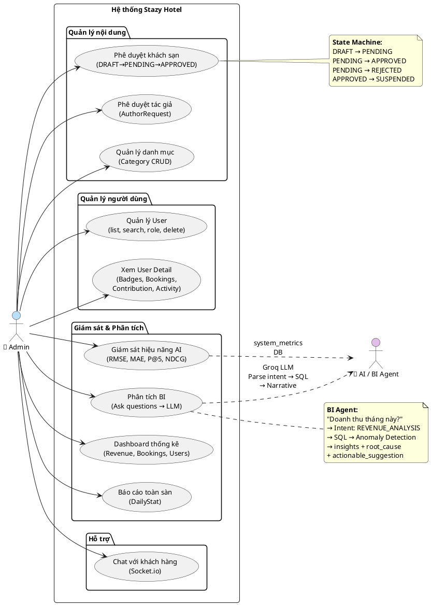
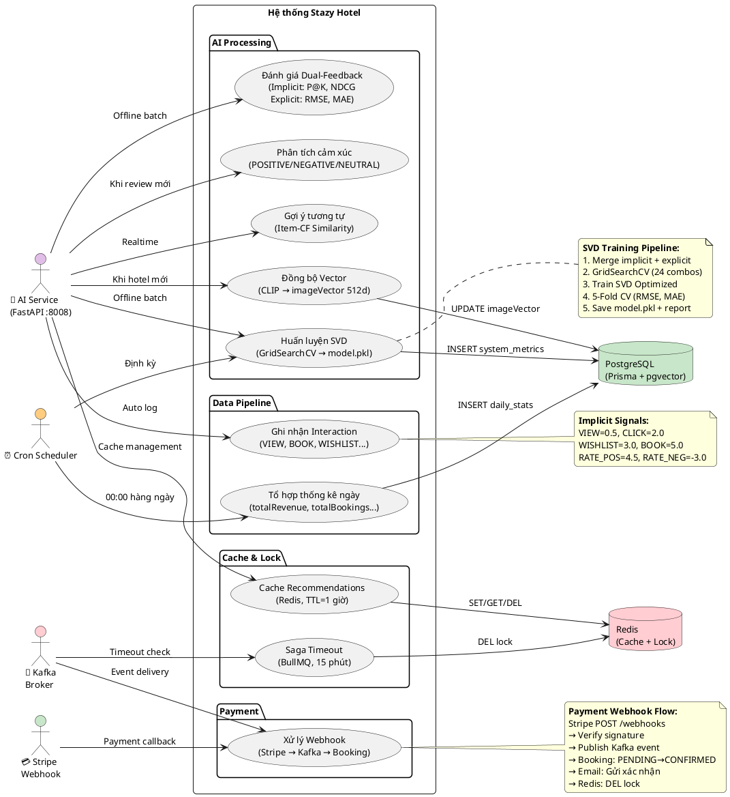

# Sơ đồ Use Case — Hệ thống Stazy Hotel

## Sơ đồ Use Case tổng quát (PlantUML)

```plantuml
@startuml
left to right direction
skinparam packageStyle rectangle
skinparam defaultFontName Arial
skinparam defaultFontSize 13
skinparam actorFontSize 14
skinparam usecaseFontSize 12
skinparam rectangleFontSize 14
skinparam packageFontSize 13
skinparam shadowing false
skinparam roundcorner 10
skinparam backgroundColor #FFFFFF

' ===== ACTORS với icon người =====
actor "👤\nKhách hàng\n(User/Guest)" as User #FFD54F
actor "🏨\nChủ khách sạn\n(Author)" as Author #FFCC80
actor "👮\nQuản trị viên\n(Admin)" as Admin #BBDEFB
actor "🤖\nHệ thống AI\n(AI Service)" as AISystem #E1BEE7
actor "💳\nCổng thanh toán\n(Stripe/VNPAY)" as PaymentGateway #C8E6C9

rectangle "Hệ thống Stazy Hotel" {

    ' ===== NHÓM KHÁCH HÀNG =====
    package "Nhóm Khách Hàng" #FFF9C4 {
        usecase "UC-01\nĐăng ký / Đăng nhập\n(Clerk)" as UC01
        usecase "UC-02\nCập nhật hồ sơ" as UC02
        usecase "UC-03\nTìm kiếm khách sạn" as UC03
        usecase "UC-04\nTìm kiếm ngữ nghĩa (AI)\n(NLU + Vector)" as UC04
        usecase "UC-05\nXem chi tiết phòng" as UC05
        usecase "UC-06\nTìm kiếm bằng hình ảnh\n(CLIP + pgvector)" as UC06
        usecase "UC-07\nXem gợi ý cá nhân hóa\n(5 Strategies)" as UC07
        usecase "UC-08\nĐặt phòng (Booking)\n(Redis Lock)" as UC08
        usecase "UC-09\nThanh toán trực tuyến\n(Stripe)" as UC09
        usecase "UC-10\nQuản lý lịch sử đặt" as UC10
        usecase "UC-11\nĐánh giá & Bình luận\n(Sentiment AI)" as UC11
        usecase "UC-12\nChat với AI Bot\n(RAG Agent)" as UC12
        usecase "UC-13\nChat hỗ trợ Admin\n(Socket.io)" as UC13
        usecase "UC-14\nQuản lý yêu thích\n(Favorites)" as UC14
        usecase "UC-15\nXem hồ sơ cá nhân\n(Badges + Charts)" as UC15
    }

    ' ===== NHÓM CHỦ KHÁCH SẠN =====
    package "Nhóm Chủ Khách Sạn (Author)" #FFE0B2 {
        usecase "UC-16\nĐăng ký đối tác\n(AuthorRequest)" as UC16
        usecase "UC-17\nĐăng tin khách sạn\n(DRAFT)" as UC17
        usecase "UC-18\nGửi duyệt khách sạn\n(DRAFT→PENDING)" as UC18
        usecase "UC-19\nQuản lý phòng & Giá" as UC19
        usecase "UC-20\nQuản lý đơn đặt phòng" as UC20
        usecase "UC-21\nPhản hồi đánh giá" as UC21
    }

    ' ===== NHÓM QUẢN TRỊ =====
    package "Nhóm Quản Trị (Admin)" #E3F2FD {
        usecase "UC-22\nPhê duyệt khách sạn\n(State Machine)" as UC22
        usecase "UC-23\nPhê duyệt tác giả\n(AuthorRequest)" as UC23
        usecase "UC-24\nQuản lý người dùng\n(Role: USER/AUTHOR/ADMIN)" as UC24
        usecase "UC-25\nXem hồ sơ User Detail\n(Badges + Contribution)" as UC25
        usecase "UC-26\nQuản lý danh mục\n(Category)" as UC26
        usecase "UC-27\nGiám sát hiệu năng AI\n(RMSE, P@5, NDCG@5)" as UC27
        usecase "UC-28\nPhân tích kinh doanh\n(BI Agent - Groq LLM)" as UC28
        usecase "UC-29\nDashboard thống kê\n(Revenue, Bookings)" as UC29
        usecase "UC-30\nBáo cáo toàn sàn\n(DailyStat)" as UC30
        usecase "UC-31\nHỗ trợ khách hàng\n(Socket.io)" as UC31
    }

    ' ===== NHÓM HỆ THỐNG =====
    package "Nhóm Hệ Thống (Background)" #F3E5F5 {
        usecase "UC-32\nĐồng bộ Vector\n(CLIP → pgvector)" as UC32
        usecase "UC-33\nHuấn luyện SVD\n(GridSearchCV)" as UC33
        usecase "UC-34\nĐánh giá Dual-Feedback\n(Implicit + Explicit)" as UC34
        usecase "UC-35\nTổ hợp thống kê ngày\n(Cron 00:00)" as UC35
        usecase "UC-36\nPhân tích cảm xúc\n(Sentiment)" as UC36
        usecase "UC-37\nGợi ý khách sạn tương tự\n(Item-CF)" as UC37
        usecase "UC-38\nCache Recommendations\n(Redis TTL=1h)" as UC38
        usecase "UC-39\nXử lý thanh toán Webhook\n(Stripe → Kafka)" as UC39
        usecase "UC-40\nSaga Timeout\n(BullMQ 15min)" as UC40
        usecase "UC-41\nGhi nhận Interaction\n(VIEW, BOOK, RATE...)" as UC41
    }
}

' ===== KHÁCH HÀNG CONNECTIONS =====
User --> UC01
User --> UC02
User --> UC03
User --> UC04
User --> UC05
User --> UC06
User --> UC07
User --> UC08
User --> UC10
User --> UC11
User --> UC12
User --> UC13
User --> UC14
User --> UC15

' ===== AUTHOR CONNECTIONS =====
Author --> UC16
Author --> UC17
Author --> UC18
Author --> UC19
Author --> UC20
Author --> UC21

' ===== ADMIN CONNECTIONS =====
Admin --> UC22
Admin --> UC23
Admin --> UC24
Admin --> UC25
Admin --> UC26
Admin --> UC27
Admin --> UC28
Admin --> UC29
Admin --> UC30
Admin --> UC31

' ===== SYSTEM CONNECTIONS =====
AISystem --> UC32 : "Khi có hotel mới"
AISystem --> UC33 : "Offline batch"
AISystem --> UC34 : "Offline batch"
AISystem --> UC35 : "Cronjob 00:00"
AISystem --> UC36 : "Khi có review mới"
AISystem --> UC37 : "Realtime"
AISystem --> UC38 : "Cache management"
AISystem --> UC41 : "Auto log"

' ===== PAYMENT GATEWAY =====
PaymentGateway --> UC39 : "Webhook callback"

' ===== DEPENDENCIES (<<include>> & <<extend>>) =====
UC08 ..> UC09 : <<include>>\n(Booking → Payment)
UC08 ..> UC40 : <<extend>>\n(Timeout → Cancel)
UC09 --> PaymentGateway : "Gọi API thanh toán"
UC17 ..> UC18 : <<include>>\n(DRAFT → Submit)
UC07 ..> UC38 : <<include>>\n(Cache check)
UC04 ..> UC32 : <<extend>>\n(Need vectors)
UC06 ..> UC32 : <<extend>>\n(Need vectors)
UC11 ..> UC36 : <<include>>\n(Auto sentiment)
UC39 ..> UC08 : <<extend>>\n(Webhook → Confirm)
UC13 ..> UC31 : <<include>>\n(User ↔ Admin chat)

' ===== NOTES =====
note right of UC04
  **AI Semantic Search:**
  Groq LLM Function Calling
  + CLIP Vector Search
  + SQL Hybrid Filter
end note

note right of UC06
  **Visual Search:**
  CLIP ViT-B/32 encode
  → pgvector Cosine Similarity
end note

note right of UC12
  **RAG Agent:**
  Groq LLM + Hybrid Search
  + Structured JSON Output
end note

note right of UC28
  **BI Agent:**
  Groq LLM (Llama 3.3)
  → SQL → Anomaly Detection
  → Narrative Generation
end note

note right of UC33
  **SVD Training:**
  Implicit + Explicit Merge
  → GridSearchCV (24 combos)
  → 5-Fold CV → Save model
end note

note bottom of UC08
  **Redis Distributed Lock:**
  SETNX booking:{roomId}
  TTL = 15 phút
  + Transactional Outbox
end note

@enduml
```

---

## Sơ đồ Use Case nhóm Khách hàng (Chi tiết)

---

## Sơ đồ Use Case nhóm Quản trị (Chi tiết)

---

## Sơ đồ Use Case nhóm Hệ thống (Background Jobs)

