# Thiết kế cơ sở dữ liệu (Database Design)

> Hệ thống đặt phòng trực tuyến **Stazy** - Schema PostgreSQL (Prisma ORM)

---

## 3.5. Thiết kế tổng quan cơ sở dữ liệu

Hệ thống Stazy sử dụng chiến lược **Database-per-service** với cơ sở dữ liệu chính là **PostgreSQL**, được quản lý bởi **Prisma ORM**. Hệ thống sử dụng extension `pgvector` để hỗ trợ tìm kiếm vector (Visual Search, Semantic Search) ngay trên cùng một cơ sở dữ liệu PostgreSQL, thay vì tách riêng MongoDB như thiết kế ban đầu.

**Lý do hợp nhất PostgreSQL:**

- Giảm độ phức tạp运维: chỉ quản lý 1 loại CSDL thay vì 2 (PostgreSQL + MongoDB)
- Prisma ORM hỗ trợ mạnh mẽ PostgreSQL với các tính năng: JSON fields, Array fields, Enum, Vector extension
- Dữ liệu Booking được lưu trực tiếp trong PostgreSQL với kiểu `JSON` để giữ nguyên cấu trúc linh hoạt (tương đương MongoDB document)
- Transaction consistency: tất cả trong 1 CSDL, dễ dàng đảm bảo tính toàn vẹn dữ liệu

### Hình 3.12: Thiết kế tổng quát cơ sở dữ liệu

Hệ thống bao gồm **16 bảng** chính, chia thành 5 nhóm dịch vụ logic:

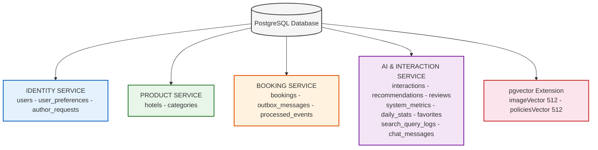

---

### Hình 3.13: Service quản lý người dùng và sở thích (IDENTITY SERVICE)

**Các bảng liên quan:** `users`, `user_preferences`, `author_requests`

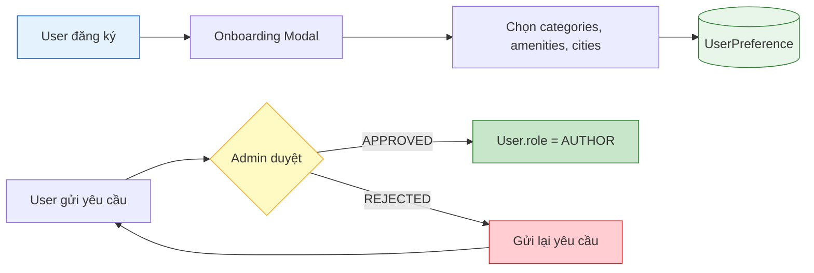

---

### Hình 3.14: Service quản lý khách sạn, danh mục (PRODUCT SERVICE)

**Các bảng liên quan:** `hotels`, `categories`

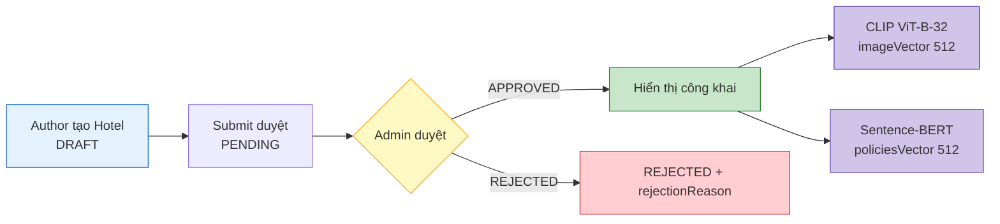

---

### Hình 3.15: Service quản lý đặt phòng (BOOKING SERVICE)

**Các bảng liên quan:** `bookings`, `outbox_messages`, `processed_events`

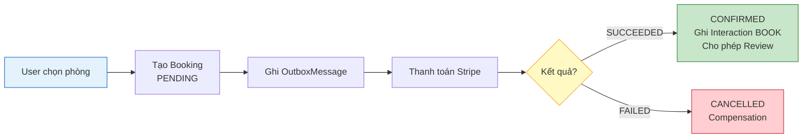

---

### Hình 3.16: Service quản lý thanh toán (PAYMENT SERVICE)

**Các bảng liên quan:** `bookings` (payment fields)

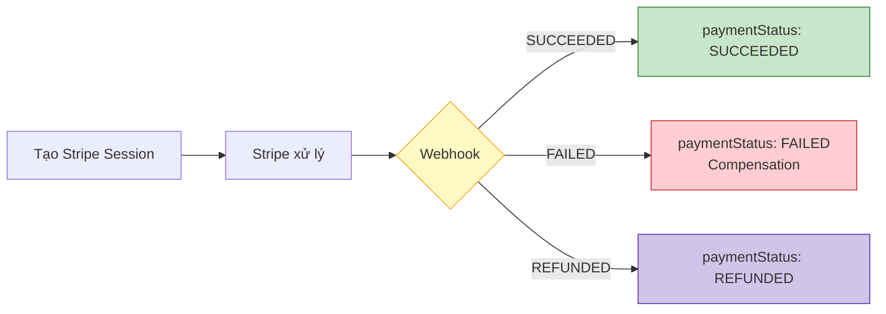

---

### Hình 3.17: Service tương tác và AI (AI & INTERACTION SERVICE)

Đây là **hệ thống cốt lõi** của đề tài, bao gồm tất cả các luồng AI. Hệ thống hiện có **6 luồng AI chính**, mỗi luồng có sự tương tác qua lại giữa nhiều bảng:

---

#### **Luồng 1: Content-Based Filtering (Gợi ý theo sở thích)**

**Bảng tương tác:** `users` → `user_preferences` → `hotels` → `categories`

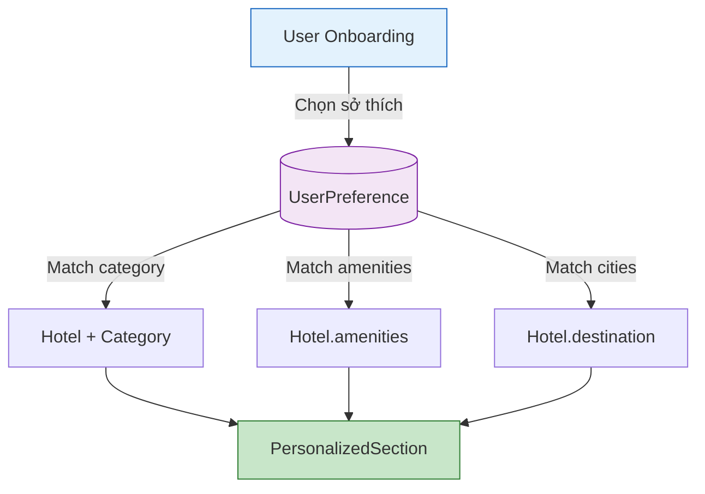

**Mục đích:** Gợi ý dựa trên sở thích tường minh (Explicit Preferences) mà user đã chọn khi onboarding.

**Khi nào hoạt động:**

- ✅ Guest user → Hiển thị khách sạn phổ biến (sắp xếp theo `reviewStar`)
- ✅ User đã login nhưng chưa onboarding → Hiển thị khách sạn phổ biến
- ✅ User đã chọn sở thích → Lọc theo `interestedCategories`, `favoriteAmenities`, `favoriteCities`

---

#### **Luồng 2: Collaborative Filtering - SVD (Gợi ý dựa trên hành vi)**

**Bảng tương tác:** `users` → `interactions` → `hotels` → `recommendations` → `system_metrics`

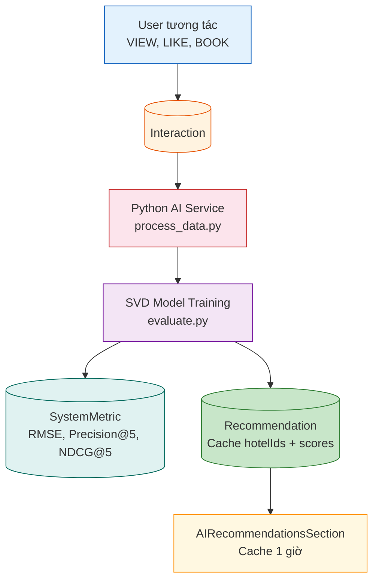

**Mục đích:** Gợi ý dựa trên hành vi của user tương tự (User-based Collaborative Filtering). Sử dụng thuật toán SVD (Singular Value Decomposition) để phân rã ma trận User-Item.

**Khi nào hoạt động:**

- ❌ Guest user → Không hiển thị
- ❌ User chưa có interactions → Không hiển thị
- ✅ User có ≥ 10 interactions → Hiển thị AI recommendations
- ✅ Cache hết hạn (> 1 giờ) → Gọi lại AI Service

**Thuật toán:** SVD Matrix Factorization với 5 chiến lược: SVD, User-CF, Item-CF, Content-based, Popular (fallback)

---

#### **Luồng 3: Sentiment Analysis - NLP (Phân tích cảm xúc đánh giá)**

**Bảng tương tác:** `users` → `reviews` → `hotels`

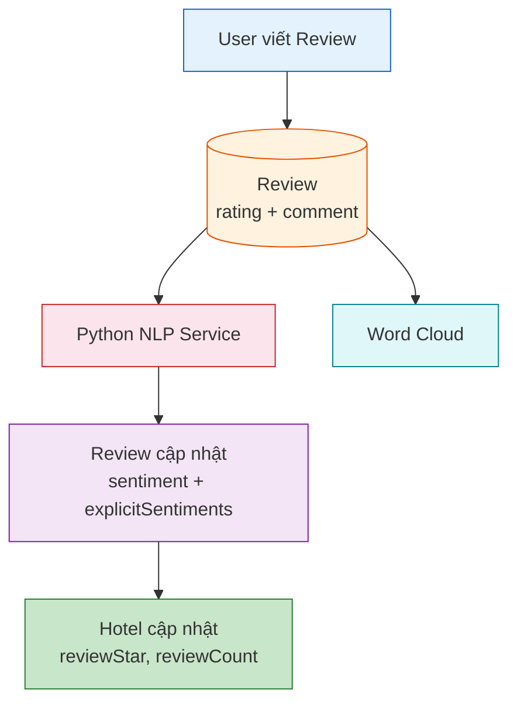

**Mục đích:** Tự động phân tích cảm xúc (Aspect-based Sentiment Analysis) từ nội dung đánh giá văn bản. Dữ liệu sentiment được sử dụng cho Hybrid Model (kết hợp CF + Content-based).

**Quy trình:**

1. User tạo Review (liên kết với Booking qua `bookingId`)
2. Background job gọi Python NLP Service phân tích `comment`
3. Cập nhật `Review.sentiment`, `Review.explicitSentiments`, `Review.nlpProcessed`
4. Dữ liệu `comment` raw text cũng được dùng cho Word Cloud visualization

---

#### **Luồng 4: Visual Search & Semantic Search (Tìm kiếm hình ảnh & ngữ nghĩa)**

**Bảng tương tác:** `hotels` (vector fields) → `search_query_logs` → `interactions`

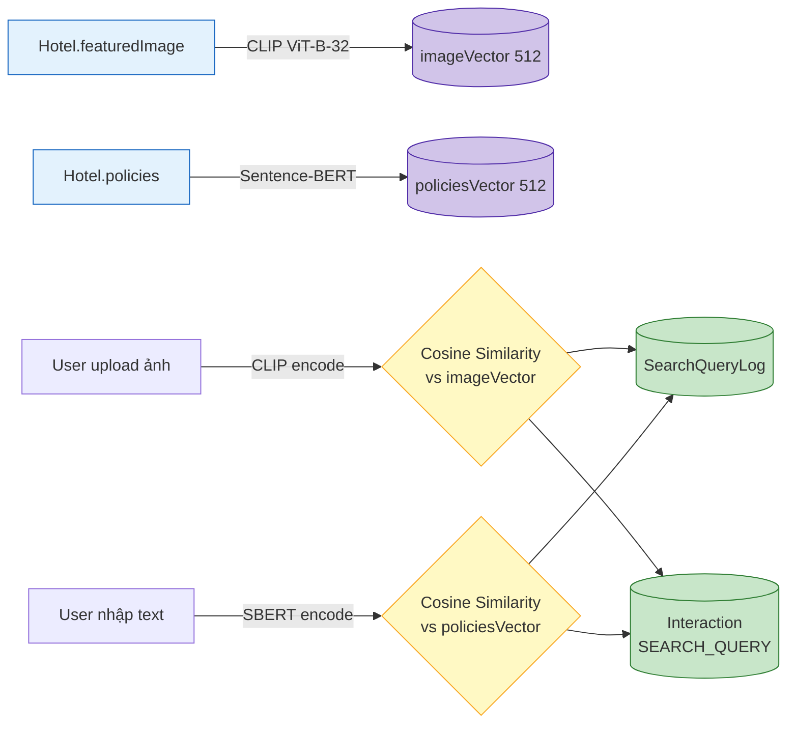

**Mục đích:** Tìm kiếm khách sạn bằng hình ảnh (Visual Search) và tìm kiếm ngữ nghĩa (Semantic Search) sử dụng pgvector extension trên PostgreSQL.

**Công nghệ:**

- **Visual Search:** CLIP ViT-B-32 model → vector 512 chiều → cosine similarity trên `Hotel.imageVector`
- **Semantic Search:** Sentence-BERT → vector 512 chiều → cosine similarity trên `Hotel.policiesVector`
- **Storage:** PostgreSQL pgvector extension (tất cả trong cùng 1 CSDL)

---

#### **Luồng 5: Daily Analytics & AI Metrics (Thống kê & đánh giá mô hình)**

**Bảng tương tác:** `interactions` → `daily_stats` → `system_metrics`

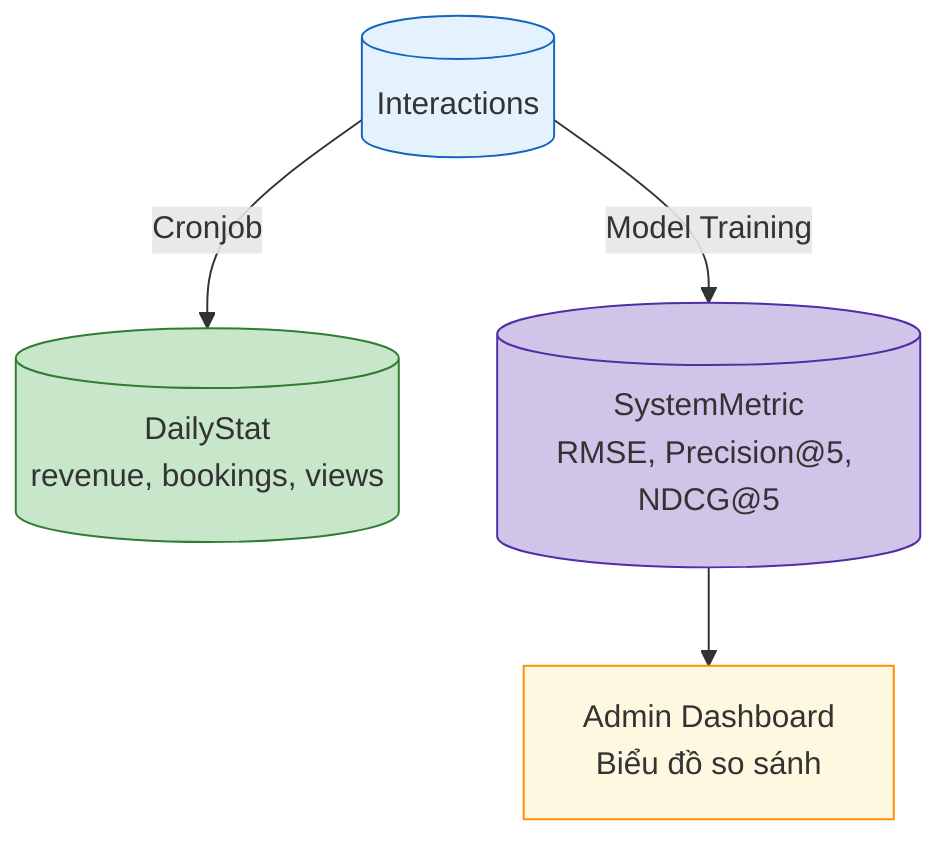

**Mục đích:** Theo dõi hiệu suất kinh doanh (daily stats) và đánh giá chất lượng mô hình AI (system metrics) theo thời gian thực.

**Luồng hoạt động:**

1. Mỗi interaction được ghi vào `Interaction` table
2. Cronjob hàng ngày tổng hợp → `DailyStat`
3. Sau mỗi lần train AI model → ghi `SystemMetric` với các chỉ số RMSE, Precision@5, Recall@5, NDCG@5
4. Admin Dashboard hiển thị biểu đồ so sánh model vs baseline

---

#### **Luồng 6: Chat Support & Favorites (Hỗ trợ & Yêu thích)**

**Bảng tương tác:** `chat_messages`, `favorites` → `users` → `hotels`

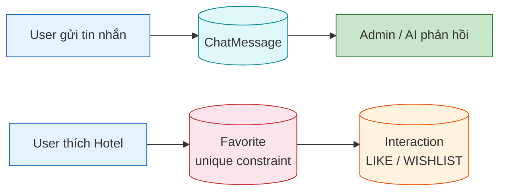

**Mục đích:**

- **Chat:** Hỗ trợ khách hàng trực tuyến, Admin và AI đều có thể trả lời
- **Favorites:** Danh sách yêu thích, mỗi user chỉ thích 1 khách sạn 1 lần (unique constraint)

---

### Tổng quan 6 luồng AI và bảng tương tác

| STT | Luồng AI                      | Bảng chính                        | Bảng liên quan                      | Thuật toán/Công nghệ                    |
| --- | ----------------------------- | --------------------------------- | ----------------------------------- | --------------------------------------- |
| 1   | Content-Based Filtering       | `user_preferences`, `hotels`      | `users`, `categories`               | Category matching, Amenities filtering  |
| 2   | Collaborative Filtering (SVD) | `interactions`, `recommendations` | `users`, `hotels`, `system_metrics` | SVD Matrix Factorization, Dual-feedback |
| 3   | Sentiment Analysis (NLP)      | `reviews`                         | `users`, `hotels`                   | Aspect-based Sentiment, Word Cloud      |
| 4   | Visual & Semantic Search      | `hotels` (vector fields)          | `search_query_logs`, `interactions` | CLIP ViT-B-32, Sentence-BERT, pgvector  |
| 5   | Daily Analytics & AI Metrics  | `daily_stats`, `system_metrics`   | `interactions`                      | Aggregation, Model evaluation           |
| 6   | Chat Support & Favorites      | `chat_messages`, `favorites`      | `users`, `hotels`                   | Real-time messaging                     |

---

## Bảng 3.13 Thiết kế bảng Users (`users`)

| STT     | Tên thuộc tính                | Kiểu dữ liệu               | Ý nghĩa & Mô tả                                                                                                |
| ------- | ----------------------------- | -------------------------- | -------------------------------------------------------------------------------------------------------------- |
| **I**   | **Định danh & Hệ thống**      |                            |                                                                                                                |
| 1       | id                            | String (UUID)              | Khóa chính (PK). Mã định danh duy nhất (UUID), dùng để liên kết với tất cả các bảng khác (Booking, Review...). |
| 2       | email                         | String (Unique)            | Địa chỉ email duy nhất. Dùng để định danh người dùng trong hệ thống.                                           |
| 3       | password                      | String (Nullable)          | Mật khẩu đã mã hóa. Có thể Null nếu người dùng đăng nhập bằng Google/Facebook qua Clerk.                       |
| 4       | role                          | Enum (USER, AUTHOR, ADMIN) | Vai trò trong hệ thống. Mặc định là USER. AUTHOR có quyền đăng khách sạn. ADMIN có quyền quản trị.             |
| 5       | createdAt                     | DateTime                   | Thời điểm tạo tài khoản.                                                                                       |
| 6       | updatedAt                     | DateTime                   | Thời điểm cập nhật thông tin lần cuối.                                                                         |
| **II**  | **Thông tin Hồ sơ (Profile)** |                            |                                                                                                                |
| 7       | name                          | String                     | Họ và tên đầy đủ (hiển thị trên hóa đơn/vé).                                                                   |
| 8       | nickname                      | String (Nullable)          | Tên hiển thị ngắn gọn hoặc biệt danh.                                                                          |
| 9       | phone                         | String (Nullable)          | Số điện thoại liên lạc (cần thiết cho Booking).                                                                |
| 10      | gender                        | String (Nullable)          | Giới tính.                                                                                                     |
| 11      | dob                           | DateTime (Nullable)        | Ngày sinh (Date of Birth).                                                                                     |
| 12      | address                       | String (Nullable)          | Địa chỉ thường trú của người dùng.                                                                             |
| **III** | **Truyền thông & Tiểu sử**    |                            |                                                                                                                |
| 13      | avatar                        | String (Nullable)          | Đường dẫn ảnh đại diện (Lưu trên Cloudinary/S3).                                                               |
| 14      | bgImage                       | String (Nullable)          | Đường dẫn ảnh bìa trang cá nhân.                                                                               |
| 15      | jobName                       | String (Nullable)          | Nghề nghiệp (giúp tăng độ tin cậy cho Host).                                                                   |
| 16      | desc                          | Text (Nullable)            | Giới thiệu bản thân (Bio). Kiểu dữ liệu Text cho phép nhập nội dung dài.                                       |
| **IV**  | **Quan hệ (Relations)**       |                            |                                                                                                                |
| 17      | hotels                        | Hotel[]                    | Danh sách khách sạn do user này làm chủ (nếu là AUTHOR).                                                       |
| 18      | interactions                  | Interaction[]              | Các tương tác của user (xem, thích, đánh giá...).                                                              |
| 19      | bookings                      | Booking[]                  | Các đơn đặt phòng của user.                                                                                    |
| 20      | reviews                       | Review[]                   | Các đánh giá của user.                                                                                         |
| 21      | authorRequests                | AuthorRequest[]            | Các yêu cầu đăng ký làm tác giả (có thể gửi lại nếu bị từ chối).                                               |
| 22      | preference                    | UserPreference?            | Sở thích người dùng (quan hệ 1-1).                                                                             |
| 23      | recommendation                | Recommendation?            | Gợi ý cá nhân hóa (quan hệ 1-1).                                                                               |
| 24      | searchLogs                    | SearchQueryLog[]           | Nhật ký tìm kiếm.                                                                                              |
| 25      | favorites                     | Favorite[]                 | Danh sách yêu thích (wishlist).                                                                                |

---

## Bảng 3.14 Thiết kế bảng Author_Requests (`author_requests`)

| STT     | Tên thuộc tính                   | Kiểu dữ liệu                       | Ý nghĩa & Mô tả                                                        |
| ------- | -------------------------------- | ---------------------------------- | ---------------------------------------------------------------------- |
| **I**   | **Định danh**                    |                                    |                                                                        |
| 1       | id                               | String (UUID)                      | Khóa chính (PK). Mã định danh duy nhất của yêu cầu.                    |
| 2       | userId                           | String                             | Khóa ngoại (FK) liên kết đến bảng Users. Người gửi yêu cầu.            |
| **II**  | **Thông tin đăng ký kinh doanh** |                                    |                                                                        |
| 3       | businessName                     | String                             | Tên doanh nghiệp/cá nhân kinh doanh.                                   |
| 4       | businessType                     | String                             | Loại hình kinh doanh: "INDIVIDUAL" (Cá nhân) hoặc "COMPANY" (Công ty). |
| 5       | taxCode                          | String (Nullable)                  | Mã số thuế (bắt buộc nếu là công ty).                                  |
| 6       | phone                            | String                             | Số điện thoại liên hệ kinh doanh.                                      |
| 7       | email                            | String                             | Email liên hệ kinh doanh.                                              |
| 8       | address                          | String                             | Địa chỉ kinh doanh/đăng ký.                                            |
| 9       | identityCard                     | String                             | Số CMND/CCCD của người đăng ký.                                        |
| 10      | identityImages                   | String[]                           | Danh sách ảnh CMND/CCCD và giấy phép kinh doanh (mảng URL).            |
| **III** | **Lý do & Trạng thái**           |                                    |                                                                        |
| 11      | reason                           | Text (Nullable)                    | Lý do muốn trở thành tác giả (Author).                                 |
| 12      | status                           | Enum (PENDING, APPROVED, REJECTED) | Trạng thái xử lý yêu cầu. Mặc định là PENDING.                         |
| 13      | reviewedBy                       | String (Nullable)                  | ID của Admin xử lý yêu cầu.                                            |
| 14      | reviewedAt                       | DateTime (Nullable)                | Thời điểm Admin xử lý yêu cầu.                                         |
| 15      | rejectionReason                  | Text (Nullable)                    | Lý do từ chối (nếu bị reject).                                         |
| 16      | createdAt                        | DateTime                           | Thời điểm tạo yêu cầu.                                                 |
| 17      | updatedAt                        | DateTime                           | Thời điểm cập nhật lần cuối.                                           |

---

## Bảng 3.15 Thiết kế bảng Hotels (`hotels`)

| STT      | Tên thuộc tính            | Kiểu dữ liệu                                         | Ý nghĩa & Mô tả                                                              |
| -------- | ------------------------- | ---------------------------------------------------- | ---------------------------------------------------------------------------- |
| **I**    | **Định danh & Quan hệ**   |                                                      |                                                                              |
| 1        | id                        | Int (Auto-increment)                                 | Khóa chính (PK). Mã định danh tự tăng của khách sạn.                         |
| 2        | authorId                  | String                                               | Khóa ngoại (FK) liên kết đến bảng Users. Chủ sở hữu khách sạn.               |
| 3        | categoryId                | Int                                                  | Khóa ngoại (FK) liên kết đến bảng Categories. Loại hình lưu trú.             |
| **II**   | **Thông tin cơ bản**      |                                                      |                                                                              |
| 4        | slug                      | String (Unique)                                      | Đường dẫn URL thân thiện (VD: "khach-san-muong-thanh").                      |
| 5        | title                     | String                                               | Tên khách sạn hiển thị.                                                      |
| 6        | roomName                  | String                                               | Tên phòng mặc định. Mặc định là "Standard Room".                             |
| 7        | featuredImage             | String                                               | URL hình ảnh đại diện của khách sạn.                                         |
| 8        | galleryImgs               | String[]                                             | Danh sách URL hình ảnh gallery (mảng).                                       |
| 9        | description               | Text                                                 | Mô tả ngắn gọn về khách sạn.                                                 |
| 10       | fullDescription           | Text (Nullable)                                      | Mô tả chi tiết đầy đủ (HTML/Markdown).                                       |
| **III**  | **Vị trí & Bản đồ**       |                                                      |                                                                              |
| 11       | address                   | String                                               | Địa chỉ chi tiết của khách sạn.                                              |
| 12       | destination               | String                                               | Mã điểm đến (VD: "nha_trang", "da_nang"). Hỗ trợ gợi ý theo địa điểm.        |
| 13       | map                       | JSON                                                 | Tọa độ bản đồ: `{ lat: ..., lng: ... }`.                                     |
| 14       | nearbyLandmarks           | String[]                                             | Danh sách địa danh lân cận (VD: ["cho_dem", "vinpearl"]).                    |
| **IV**   | **Giá & Phòng**           |                                                      |                                                                              |
| 15       | price                     | Decimal (12,2)                                       | Giá phòng mỗi đêm (VNĐ).                                                     |
| 16       | saleOff                   | String (Nullable)                                    | Mô tả khuyến mãi (VD: "-30% Hè").                                            |
| 17       | saleOffPercent            | Int                                                  | Phần trăm giảm giá. Mặc định là 0.                                           |
| 18       | maxGuests                 | Int                                                  | Số lượng khách tối đa.                                                       |
| 19       | bedrooms                  | Int                                                  | Số phòng ngủ.                                                                |
| 20       | bathrooms                 | Int                                                  | Số phòng tắm.                                                                |
| **V**    | **Thuộc tính & Ngữ cảnh** |                                                      |                                                                              |
| 21       | amenities                 | String[]                                             | Danh sách tiện nghi (VD: ["pool", "gym", "wifi"]).                           |
| 22       | tags                      | String[]                                             | Thẻ gắn nhãn (VD: ["romantic", "pet-friendly", "business"]).                 |
| 23       | suitableFor               | TripType[]                                           | Mảng enum phù hợp cho loại chuyến đi: BUSINESS, FAMILY, COUPLE, SOLO, GROUP. |
| 24       | accessibility             | String[]                                             | Tiện nghi hỗ trợ người khuyết tật (VD: ["wheelchair", "elevator"]).          |
| **VI**   | **Thống kê**              |                                                      |                                                                              |
| 25       | reviewStar                | Float                                                | Điểm đánh giá trung bình (0-5 sao). Mặc định là 0.                           |
| 26       | reviewCount               | Int                                                  | Tổng số đánh giá. Mặc định là 0.                                             |
| 27       | viewCount                 | Int                                                  | Lượt xem. Mặc định là 0.                                                     |
| 28       | commentCount              | Int                                                  | Số bình luận. Mặc định là 0.                                                 |
| 29       | cancellationRate          | Float                                                | Tỷ lệ hủy (0.0 → 1.0). Mặc định là 0.0.                                      |
| **VII**  | **Cờ & Trạng thái**       |                                                      |                                                                              |
| 30       | like                      | Boolean                                              | Cờ tạm thời đánh dấu yêu thích. Mặc định là false.                           |
| 31       | isAds                     | Boolean                                              | Đánh dấu là quảng cáo. Mặc định là false.                                    |
| 32       | status                    | Enum (DRAFT, PENDING, APPROVED, REJECTED, SUSPENDED) | Trạng thái duyệt. Mặc định là DRAFT.                                         |
| 33       | submittedAt               | DateTime (Nullable)                                  | Thời điểm gửi yêu cầu duyệt.                                                 |
| 34       | approvedBy                | String (Nullable)                                    | ID của Admin duyệt khách sạn.                                                |
| 35       | approvedAt                | DateTime (Nullable)                                  | Thời điểm duyệt.                                                             |
| 36       | rejectionReason           | Text (Nullable)                                      | Lý do từ chối (nếu bị reject).                                               |
| **VIII** | **AI / Vector**           |                                                      |                                                                              |
| 37       | imageVector               | vector(512) (Nullable)                               | Vector embedding cho tìm kiếm hình ảnh (Visual Search).                      |
| 38       | policies                  | Text (Nullable)                                      | Chính sách đặt phòng (hủy, đổi trả...).                                      |
| 39       | policiesVector            | vector(512) (Nullable)                               | Vector embedding cho tìm kiếm ngữ nghĩa chính sách.                          |
| **IX**   | **Thời gian**             |                                                      |                                                                              |
| 40       | createdAt                 | DateTime                                             | Thời điểm tạo khách sạn.                                                     |
| 41       | updatedAt                 | DateTime                                             | Thời điểm cập nhật lần cuối.                                                 |

---

## Bảng 3.16 Thiết kế bảng Categories (`categories`)

| STT | Tên thuộc tính | Kiểu dữ liệu         | Ý nghĩa & Mô tả                                                |
| --- | -------------- | -------------------- | -------------------------------------------------------------- |
| 1   | id             | Int (Auto-increment) | Khóa chính (PK). Mã định danh tự tăng.                         |
| 2   | name           | String               | Tên loại hình lưu trú (VD: "Khách sạn", "Resort", "Homestay"). |
| 3   | slug           | String (Unique)      | Đường dẫn URL thân thiện (VD: "khach-san").                    |
| 4   | description    | Text (Nullable)      | Mô tả chi tiết về loại hình.                                   |
| 5   | color          | String (Nullable)    | Mã màu hiển thị (VD: "#FF5733").                               |
| 6   | icon           | String (Nullable)    | Tên hoặc URL icon đại diện.                                    |
| 7   | thumbnail      | String (Nullable)    | URL hình ảnh thumbnail của danh mục.                           |
| 8   | count          | Int                  | Số lượng khách sạn thuộc danh mục. Mặc định là 0.              |

---

## Bảng 3.17 Thiết kế bảng Interactions (`interactions`)

| STT | Tên thuộc tính | Kiểu dữ liệu           | Ý nghĩa & Mô tả                                                                                                                                                                  |
| --- | -------------- | ---------------------- | -------------------------------------------------------------------------------------------------------------------------------------------------------------------------------- |
| 1   | id             | Int (Auto-increment)   | Khóa chính (PK). Mã định danh tự tăng.                                                                                                                                           |
| 2   | userId         | String                 | Khóa ngoại (FK) liên kết đến bảng Users. Người thực hiện tương tác.                                                                                                              |
| 3   | sessionId      | String (Nullable)      | Mã phiên làm việc (để theo dõi hành vi trong 1 phiên).                                                                                                                           |
| 4   | hotelId        | Int (Nullable)         | Khóa ngoại (FK) liên kết đến bảng Hotels. Khách sạn được tương tác.                                                                                                              |
| 5   | type           | Enum (InteractionType) | Loại tương tác. Mặc định là VIEW. Bao gồm: VIEW, LIKE, SHARE, ADD_TO_WISHLIST, BOOK, CLICK_BOOK_NOW, CANCEL, SEARCH_QUERY, FILTER_APPLIED, RATING, RATE_POSITIVE, RATE_NEGATIVE. |
| 6   | rating         | Int (Nullable)         | Số sao đánh giá (lưu khi type = RATING). Dùng cho hàm `_avg()` của Prisma.                                                                                                       |
| 7   | metadata       | JSON (Nullable)        | Dữ liệu bổ sung linh hoạt (VD: thông tin tìm kiếm, filter áp dụng...).                                                                                                           |
| 8   | timestamp      | DateTime               | Thời điểm xảy ra tương tác. Mặc định là now().                                                                                                                                   |

---

## Bảng 3.18 Thiết kế bảng User_Preferences (`user_preferences`)

| STT     | Tên thuộc tính                         | Kiểu dữ liệu              | Ý nghĩa & Mô tả                                                |
| ------- | -------------------------------------- | ------------------------- | -------------------------------------------------------------- |
| **I**   | **Định danh**                          |                           |                                                                |
| 1       | id                                     | Int (Auto-increment)      | Khóa chính (PK). Mã định danh tự tăng.                         |
| 2       | userId                                 | String (Unique)           | Khóa ngoại (FK) liên kết đến bảng Users. Quan hệ 1-1 với User. |
| **II**  | **Sở thích tường minh (Explicit)**     |                           |                                                                |
| 3       | interestedCategories                   | String[]                  | Danh mục quan tâm (VD: ["khach-san", "resort"]).               |
| 4       | favoriteAmenities                      | String[]                  | Tiện nghi yêu thích (VD: ["pool", "gym", "sea_view"]).         |
| 5       | favoriteCities                         | String[]                  | Thành phố yêu thích (VD: ["nha_trang", "da_nang"]).            |
| **III** | **Hành vi & AI suy luận (Behavioral)** |                           |                                                                |
| 6       | avgPriceExpect                         | Decimal (12,2) (Nullable) | Mức giá trung bình user hay xem/đặt (AI tính toán từ lịch sử). |
| 7       | preferredRatingMin                     | Float (Nullable)          | Điểm đánh giá tối thiểu ưa thích (VD: Chỉ thích rating > 4.0). |
| **IV**  | **Thống kê**                           |                           |                                                                |
| 8       | pastBookingCount                       | Int                       | Số lần đặt phòng trong quá khứ. Mặc định là 0.                 |
| 9       | lastBookingAt                          | DateTime (Nullable)       | Thời điểm đặt phòng gần nhất.                                  |
| 10      | updatedAt                              | DateTime                  | Thời điểm cập nhật lần cuối.                                   |

---

## Bảng 3.19 Thiết kế bảng Reviews (`reviews`)

| STT     | Tên thuộc tính                    | Kiểu dữ liệu                                  | Ý nghĩa & Mô tả                                                             |
| ------- | --------------------------------- | --------------------------------------------- | --------------------------------------------------------------------------- |
| **I**   | **Định danh**                     |                                               |                                                                             |
| 1       | id                                | String (UUID)                                 | Khóa chính (PK). Mã định danh duy nhất.                                     |
| 2       | bookingId                         | String (Unique)                               | Khóa ngoại ràng buộc 1-1 với Booking. Mỗi booking chỉ được đánh giá 1 lần.  |
| 3       | userId                            | String                                        | Khóa ngoại (FK) liên kết đến bảng Users. Người đánh giá.                    |
| 4       | hotelId                           | Int                                           | Khóa ngoại (FK) liên kết đến bảng Hotels. Khách sạn được đánh giá.          |
| **II**  | **Nội dung đánh giá**             |                                               |                                                                             |
| 5       | rating                            | Int                                           | Số sao đánh giá (1-5). Dữ liệu cốt lõi cho Collaborative Filtering.         |
| 6       | comment                           | Text (Nullable)                               | Nội dung bình luận văn bản. Nguồn raw text cho Word Cloud (Python xử lý).   |
| **III** | **Phân tích cảm xúc (Sentiment)** |                                               |                                                                             |
| 7       | sentiment                         | Enum (POSITIVE, NEGATIVE, NEUTRAL) (Nullable) | Đánh giá cảm xúc chung của bài review.                                      |
| 8       | explicitSentiments                | JSON (Nullable)                               | Trọng số chi tiết theo khía cạnh cho Hybrid Model (Aspect-based sentiment). |
| 9       | nlpProcessed                      | Boolean                                       | Cờ đánh dấu đã được AI phân tích cảm xúc chưa. Mặc định là false.           |
| **IV**  | **Thời gian**                     |                                               |                                                                             |
| 10      | createdAt                         | DateTime                                      | Thời điểm tạo đánh giá.                                                     |
| 11      | updatedAt                         | DateTime                                      | Thời điểm cập nhật lần cuối.                                                |

---

## Bảng 3.20 Thiết kế bảng System_Metrics (`system_metrics`)

| STT     | Tên thuộc tính                 | Kiểu dữ liệu     | Ý nghĩa & Mô tả                                                                         |
| ------- | ------------------------------ | ---------------- | --------------------------------------------------------------------------------------- |
| **I**   | **Định danh**                  |                  |                                                                                         |
| 1       | id                             | String (UUID)    | Khóa chính (PK). Mã định danh duy nhất.                                                 |
| **II**  | **Chỉ số đánh giá mô hình AI** |                  |                                                                                         |
| 2       | rmse                           | Float            | Root Mean Square Error - Độ lỗi gốc trung bình bình phương.                             |
| 3       | mae                            | Float            | Mean Absolute Error - Lỗi tuyệt đối trung bình. Mặc định là 0.                          |
| 4       | precisionAt5                   | Float            | Độ chính xác trong Top 5 gợi ý (Precision@5).                                           |
| 5       | recallAt5                      | Float            | Độ bao phủ trong Top 5 gợi ý (Recall@5).                                                |
| 6       | ndcgAt5                        | Float            | Normalized Discounted Cumulative Gain @5 - Đo lường chất lượng xếp hạng. Mặc định là 0. |
| **III** | **Baseline (So sánh)**         |                  |                                                                                         |
| 7       | baselineRmse                   | Float (Nullable) | RMSE của mô hình baseline (User Mean). Mặc định là 0.                                   |
| 8       | baselineMae                    | Float (Nullable) | MAE của mô hình baseline. Mặc định là 0.                                                |
| 9       | baselinePrecision              | Float (Nullable) | Precision của baseline (Top Popular). Mặc định là 0.                                    |
| 10      | baselineRecall                 | Float (Nullable) | Recall của baseline (Top Popular). Mặc định là 0.                                       |
| 11      | baselineNdcg                   | Float (Nullable) | NDCG của baseline. Mặc định là 0.                                                       |
| **IV**  | **Metadata**                   |                  |                                                                                         |
| 12      | algorithm                      | String           | Tên thuật toán sử dụng (VD: "SVD", "KNN", "NeuralCF"). Mặc định là "SVD".               |
| 13      | datasetSize                    | Int (Nullable)   | Số lượng dòng dữ liệu khi huấn luyện.                                                   |
| 14      | executionTimeMs                | Int (Nullable)   | Thời gian chạy model (ms) để so sánh hiệu năng.                                         |
| 15      | trainingHistory                | JSON (Nullable)  | Lịch sử huấn luyện: `[{ "k": 10, "rmse": 0.85 }, ...]`.                                 |
| 16      | tuningParams                   | JSON (Nullable)  | Tham số tuning: `[{ "param": 10, "metric": 0.8 }, ...]`.                                |
| 17      | createdAt                      | DateTime         | Thời điểm ghi nhận metric.                                                              |

---

## Bảng 3.21 Thiết kế bảng Bookings (`bookings`)

| STT     | Tên thuộc tính                   | Kiểu dữ liệu                                                 | Ý nghĩa & Mô tả                                                                           |
| ------- | -------------------------------- | ------------------------------------------------------------ | ----------------------------------------------------------------------------------------- |
| **I**   | **Định danh & Quan hệ**          |                                                              |                                                                                           |
| 1       | id                               | String (UUID)                                                | Khóa chính (PK). Mã định danh duy nhất của đơn đặt phòng.                                 |
| 2       | bookingId                        | String (Nullable)                                            | Mã đặt phòng nghiệp vụ (Business ID). Dùng cho dữ liệu migration hoặc liên kết外部.       |
| 3       | userId                           | String                                                       | Khóa ngoại (FK) liên kết đến bảng Users. Người đặt phòng.                                 |
| 4       | hotelId                          | Int                                                          | Khóa ngoại (FK) liên kết đến bảng Hotels. Khách sạn được đặt.                             |
| **II**  | **Thông tin khách (Guest Info)** |                                                              |                                                                                           |
| 5       | guestName                        | String                                                       | Họ tên khách (snapshot tại thời điểm đặt).                                                |
| 6       | guestEmail                       | String                                                       | Email khách.                                                                              |
| 7       | guestPhone                       | String                                                       | Số điện thoại khách.                                                                      |
| 8       | adults                           | Int                                                          | Số người lớn. Mặc định là 1.                                                              |
| 9       | children                         | Int                                                          | Số trẻ em. Mặc định là 0.                                                                 |
| **III** | **Snapshot & Liên hệ**           |                                                              |                                                                                           |
| 10      | bookingSnapshot                  | JSON (Nullable)                                              | Lưu trữ thông tin khách sạn & phòng tại thời điểm đặt (phòng khi giá/thông tin thay đổi). |
| 11      | contactDetails                   | JSON (Nullable)                                              | Chi tiết liên hệ dạng JSON linh hoạt (tên, email, ghi chú đặc biệt...).                   |
| **IV**  | **Lịch trình**                   |                                                              |                                                                                           |
| 12      | checkIn                          | DateTime                                                     | Ngày nhận phòng.                                                                          |
| 13      | checkOut                         | DateTime                                                     | Ngày trả phòng.                                                                           |
| 14      | nights                           | Int                                                          | Số đêm lưu trú (tính từ checkIn và checkOut).                                             |
| **V**   | **Thanh toán**                   |                                                              |                                                                                           |
| 15      | basePrice                        | Decimal (12,2)                                               | Giá gốc mỗi đêm (VNĐ).                                                                    |
| 16      | discount                         | Decimal (12,2)                                               | Số tiền giảm giá. Mặc định là 0.                                                          |
| 17      | totalAmount                      | Decimal (12,2)                                               | Tổng tiền thanh toán.                                                                     |
| 18      | currency                         | String                                                       | Đơn vị tiền tệ. Mặc định là "VND".                                                        |
| 19      | paymentMethod                    | Enum (STRIPE, PAYPAL, VNPAY, BANK_TRANSFER, CASH_ON_CHECKIN) | Phương thức thanh toán. Mặc định là STRIPE.                                               |
| 20      | paymentStatus                    | Enum (PENDING, SUCCEEDED, FAILED, REFUNDED)                  | Trạng thái thanh toán. Mặc định là PENDING.                                               |
| 21      | paymentIntentId                  | String (Nullable)                                            | Stripe Payment Intent ID.                                                                 |
| 22      | stripeSessionId                  | String (Nullable)                                            | Stripe Checkout Session ID.                                                               |
| 23      | paymentFailureReason             | Text (Nullable)                                              | Lý do thanh toán thất bại (dùng cho compensating transaction).                            |
| **VI**  | **Trạng thái**                   |                                                              |                                                                                           |
| 24      | status                           | Enum (PENDING, CONFIRMED, CANCELLED, COMPLETED)              | Trạng thái đơn hàng. Mặc định là PENDING.                                                 |
| 25      | createdAt                        | DateTime                                                     | Thời điểm tạo đơn.                                                                        |
| 26      | updatedAt                        | DateTime                                                     | Thời điểm cập nhật lần cuối.                                                              |

---

## Bảng 3.22 Thiết kế bảng Outbox_Messages (`outbox_messages`)

| STT | Tên thuộc tính | Kiểu dữ liệu                             | Ý nghĩa & Mô tả                                            |
| --- | -------------- | ---------------------------------------- | ---------------------------------------------------------- |
| 1   | id             | String (UUID)                            | Khóa chính (PK). Mã định danh duy nhất.                    |
| 2   | dedupKey       | String (Unique)                          | Khóa chống trùng lặp (deduplication key).                  |
| 3   | aggregateType  | String                                   | Loại tổng hợp (VD: "Booking", "Payment").                  |
| 4   | aggregateId    | String                                   | ID của thực thể tổng hợp liên quan.                        |
| 5   | eventType      | String                                   | Loại sự kiện (VD: "BOOKING_CREATED", "PAYMENT_SUCCEEDED"). |
| 6   | topic          | String                                   | Topic Kafka/MQ để gửi message đến.                         |
| 7   | payload        | JSON                                     | Nội dung message (dữ liệu sự kiện).                        |
| 8   | status         | Enum (PENDING, PROCESSING, SENT, FAILED) | Trạng thái xử lý message. Mặc định là PENDING.             |
| 9   | attempts       | Int                                      | Số lần thử gửi lại. Mặc định là 0.                         |
| 10  | availableAt    | DateTime                                 | Thời điểm message sẵn sàng để xử lý (hỗ trợ delay/retry).  |
| 11  | processedAt    | DateTime (Nullable)                      | Thời điểm xử lý thành công.                                |
| 12  | lastError      | Text (Nullable)                          | Thông báo lỗi lần gửi thất bại gần nhất.                   |
| 13  | createdAt      | DateTime                                 | Thời điểm tạo message.                                     |
| 14  | updatedAt      | DateTime                                 | Thời điểm cập nhật lần cuối.                               |

---

## Bảng 3.23 Thiết kế bảng Processed_Events (`processed_events`)

| STT | Tên thuộc tính | Kiểu dữ liệu | Ý nghĩa & Mô tả                                     |
| --- | -------------- | ------------ | --------------------------------------------------- |
| 1   | eventId        | String       | Khóa chính (PK). ID sự kiện đã xử lý (idempotency). |
| 2   | topic          | String       | Topic Kafka/MQ mà sự kiện đến từ.                   |
| 3   | createdAt      | DateTime     | Thời điểm ghi nhận đã xử lý.                        |

---

## Bảng 3.24 Thiết kế bảng Recommendations (`recommendations`)

| STT | Tên thuộc tính | Kiểu dữ liệu         | Ý nghĩa & Mô tả                                                                  |
| --- | -------------- | -------------------- | -------------------------------------------------------------------------------- |
| 1   | id             | Int (Auto-increment) | Khóa chính (PK). Mã định danh tự tăng.                                           |
| 2   | userId         | String (Unique)      | Khóa ngoại (FK) liên kết đến bảng Users. Quan hệ 1-1 với User.                   |
| 3   | hotelIds       | Int[]                | Danh sách ID khách sạn được gợi ý (mảng Int).                                    |
| 4   | score          | JSON (Nullable)      | Điểm phù hợp: `{ "hotel_1": 0.98, "hotel_2": 0.85 }`. Giải thích mức độ phù hợp. |
| 5   | updatedAt      | DateTime             | Thời điểm cập nhật gợi ý lần cuối.                                               |

---

## Bảng 3.25 Thiết kế bảng Search_Query_Logs (`search_query_logs`)

| STT | Tên thuộc tính | Kiểu dữ liệu         | Ý nghĩa & Mô tả                                                   |
| --- | -------------- | -------------------- | ----------------------------------------------------------------- |
| 1   | id             | Int (Auto-increment) | Khóa chính (PK). Mã định danh tự tăng.                            |
| 2   | userId         | String (Nullable)    | Khóa ngoại (FK) liên kết đến bảng Users. Null nếu khách vãng lai. |
| 3   | query          | String               | Từ khóa tìm kiếm của người dùng.                                  |
| 4   | filters        | JSON (Nullable)      | Các bộ lọc đã áp dụng (giá, địa điểm, tiện nghi...).              |
| 5   | timestamp      | DateTime             | Thời điểm thực hiện tìm kiếm.                                     |

---

## Bảng 3.26 Thiết kế bảng Favorites (`favorites`)

| STT | Tên thuộc tính | Kiểu dữ liệu         | Ý nghĩa & Mô tả                                                     |
| --- | -------------- | -------------------- | ------------------------------------------------------------------- |
| 1   | id             | Int (Auto-increment) | Khóa chính (PK). Mã định danh tự tăng.                              |
| 2   | userId         | String               | Khóa ngoại (FK) liên kết đến bảng Users. Người yêu thích.           |
| 3   | hotelId        | Int                  | Khóa ngoại (FK) liên kết đến bảng Hotels. Khách sạn được yêu thích. |
| 4   | createdAt      | DateTime             | Thời điểm thêm vào danh sách yêu thích.                             |

> **Ràng buộc:** `@@unique([userId, hotelId])` - Mỗi user chỉ có thể thích một khách sạn một lần.

---

## Bảng 3.27 Thiết kế bảng Chat_Messages (`chat_messages`)

| STT | Tên thuộc tính | Kiểu dữ liệu           | Ý nghĩa & Mô tả                                            |
| --- | -------------- | ---------------------- | ---------------------------------------------------------- |
| 1   | id             | String (UUID)          | Khóa chính (PK). Mã định danh duy nhất.                    |
| 2   | userId         | String                 | ID người dùng trong cuộc trò chuyện.                       |
| 3   | sender         | Enum (USER, ADMIN, AI) | Vai trò người gửi tin nhắn.                                |
| 4   | text           | String (Nullable)      | Nội dung văn bản tin nhắn.                                 |
| 5   | images         | String[]               | Danh sách URL hình ảnh đính kèm (mảng).                    |
| 6   | isRead         | Boolean                | Trạng thái đã đọc. Mặc định là false.                      |
| 7   | metadata       | JSON (Nullable)        | Dữ liệu bổ sung (VD: `{ hotels, bookingLink, userName }`). |
| 8   | createdAt      | DateTime               | Thời điểm gửi tin nhắn.                                    |
| 9   | updatedAt      | DateTime               | Thời điểm cập nhật lần cuối.                               |

---

## Bảng 3.28 Thiết kế bảng Daily_Stats (`daily_stats`)

| STT     | Tên thuộc tính                                 | Kiểu dữ liệu         | Ý nghĩa & Mô tả                                                          |
| ------- | ---------------------------------------------- | -------------------- | ------------------------------------------------------------------------ |
| **I**   | **Định danh**                                  |                      |                                                                          |
| 1       | id                                             | Int (Auto-increment) | Khóa chính (PK). Mã định danh tự tăng.                                   |
| 2       | date                                           | Date (Unique)        | Ngày thống kê (duy nhất cho mỗi ngày).                                   |
| **II**  | **Chỉ số Kinh doanh cốt lõi (Business Core)**  |                      |                                                                          |
| 3       | totalRevenue                                   | Decimal (12,2)       | Tổng doanh thu trong ngày (VNĐ). Mặc định là 0.                          |
| 4       | totalBookings                                  | Int                  | Số booking thành công trong ngày. Mặc định là 0.                         |
| 5       | totalCancels                                   | Int                  | Số booking bị hủy trong ngày (chỉ số quan trọng). Mặc định là 0.         |
| **III** | **Chỉ số Phễu chuyển đổi (Conversion Funnel)** |                      |                                                                          |
| 6       | totalViews                                     | Int                  | Tổng lượt xem trang chi tiết (Bước 1 phễu). Mặc định là 0.               |
| 7       | totalClickBook                                 | Int                  | Tổng lượt nhấn nút "Đặt ngay" - Intent cao (Bước 2 phễu). Mặc định là 0. |
| **IV**  | **Chỉ số Tương tác (Engagement)**              |                      |                                                                          |
| 8       | totalLikes                                     | Int                  | Tổng lượt thích trong ngày. Mặc định là 0.                               |
| 9       | totalSearch                                    | Int                  | Tổng lượt tìm kiếm trong ngày. Mặc định là 0.                            |
| **V**   | **Dữ liệu bổ sung**                            |                      |                                                                          |
| 10      | miscInteractions                               | JSON (Nullable)      | Các loại tương tác phụ (VD: `{ "share": 5, "comment": 12 }`).            |
| 11      | createdAt                                      | DateTime             | Thời điểm tạo bản ghi thống kê.                                          |

---

## Tổng quan các quan hệ (Relationships)

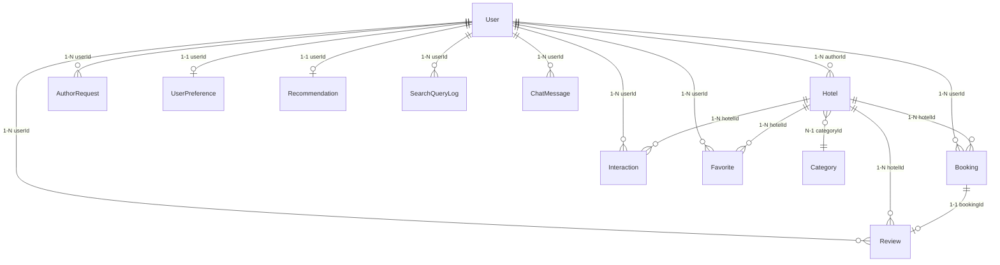

## Tổng hợp Enum

| Enum                | Giá trị                                                                                                                              | Bảng sử dụng  |
| ------------------- | ------------------------------------------------------------------------------------------------------------------------------------ | ------------- |
| Role                | USER, AUTHOR, ADMIN                                                                                                                  | User          |
| HotelStatus         | DRAFT, PENDING, APPROVED, REJECTED, SUSPENDED                                                                                        | Hotel         |
| TripType            | BUSINESS, FAMILY, COUPLE, SOLO, GROUP                                                                                                | Hotel         |
| BookingStatus       | PENDING, CONFIRMED, CANCELLED, COMPLETED                                                                                             | Booking       |
| PaymentMethod       | STRIPE, PAYPAL, VNPAY, BANK_TRANSFER, CASH_ON_CHECKIN                                                                                | Booking       |
| PaymentStatus       | PENDING, SUCCEEDED, FAILED, REFUNDED                                                                                                 | Booking       |
| OutboxStatus        | PENDING, PROCESSING, SENT, FAILED                                                                                                    | OutboxMessage |
| InteractionType     | VIEW, LIKE, SHARE, ADD_TO_WISHLIST, BOOK, CLICK_BOOK_NOW, CANCEL, SEARCH_QUERY, FILTER_APPLIED, RATING, RATE_POSITIVE, RATE_NEGATIVE | Interaction   |
| ReviewSentiment     | POSITIVE, NEGATIVE, NEUTRAL                                                                                                          | Review        |
| SenderRole          | USER, ADMIN, AI                                                                                                                      | ChatMessage   |
| AuthorRequestStatus | PENDING, APPROVED, REJECTED                                                                                                          | AuthorRequest |
