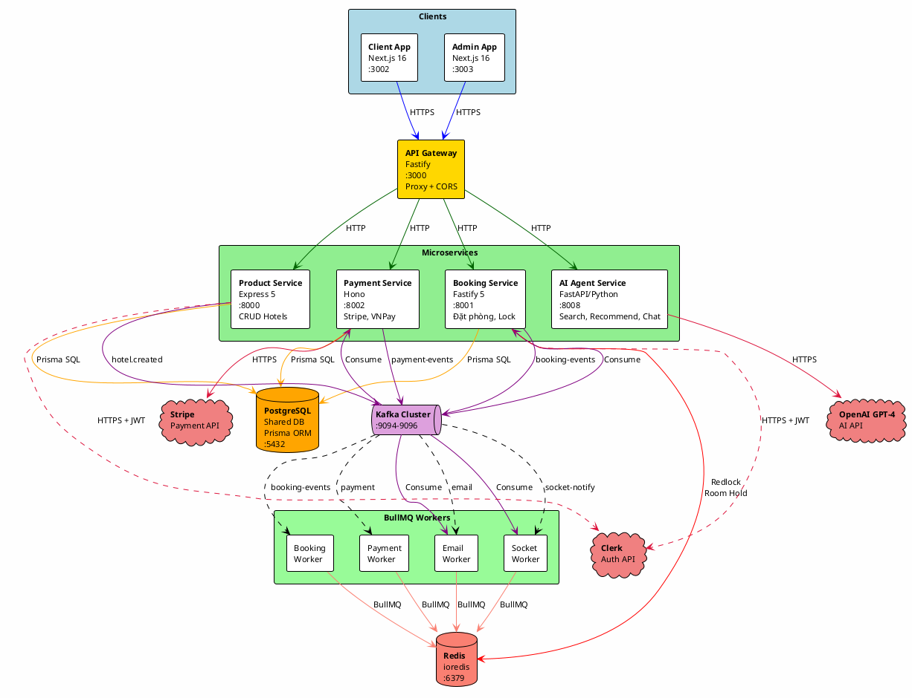

# STAZY - System Architecture Documentation

## 1. Overview

Stazy là một hệ thống đặt phòng khách sạn microservices, sử dụng:

- **Shared Database PostgreSQL** (Prisma ORM) cho tất cả services chính
- **MongoDB** (Mongoose) - legacy, vẫn kết nối nhưng không dùng cho queries chính
- **Redis** cho distributed locking & room hold (booking-service)
- **Kafka** cho event-driven communication giữa services
- **BullMQ** (backed by Redis) cho async job processing

---

## 2. Architecture Overview Diagram



| Mũi tên                 | Technology      | Mô tả                        |
| ----------------------- | --------------- | ---------------------------- |
| Client/Admin -> Gateway | **HTTPS**       | Browser -> reverse proxy     |
| Gateway -> Services     | **HTTP**        | Fastify http-proxy           |
| Services -> PostgreSQL  | **Prisma SQL**  | Shared database (:5432)      |
| Booking -> Redis        | **Redlock**     | Distributed lock + Room hold |
| BullMQ -> Redis         | **BullMQ**      | Job queue backend (:6379)    |
| Services <-> Kafka      | **Kafka**       | Event-driven (:9094-9096)    |
| Payment -> Stripe       | **HTTPS**       | Checkout + Webhook           |
| AI -> OpenAI            | **HTTPS**       | GPT-4 Chat + BI              |
| Services -> Clerk       | **HTTPS + JWT** | Auth & SSO                   |

---

## 3. Database Architecture Analysis

### 3.1. PostgreSQL (Shared Database)

**Package:** `@repo/product-db` (Prisma + @prisma/adapter-pg)

**Connection:** `DATABASE_URL` environment variable

| Service              | Tables Accessed                            | Framework              |
| -------------------- | ------------------------------------------ | ---------------------- |
| Product Service      | Hotel, Category, User                      | Express                |
| Booking Service      | Booking, ChatMessage, Interaction, Hotel   | Fastify                |
| Payment Service      | Payment, StripeProduct                     | Hono                   |
| Socket Service       | ChatMessage                                | Fastify + Socket.io    |
| Client App (Next.js) | User, Favorite, Review, Interaction, Hotel | Next.js Server Actions |

**Prisma Schema Tables:** Hotel, Category, User, Booking, Payment, Review, Favorite, Interaction, ChatMessage, StripeProduct, Badge

### 3.2. MongoDB (Legacy)

**Package:** `@repo/booking-db` (Mongoose)
**Connection:** `MONGO_URL` environment variable

- `connectBookingDB()` được gọi trong booking-service startup
- NHƯNG tất cả route handlers đều dùng Prisma (PostgreSQL) cho queries
- **Conclusion:** MongoDB là legacy, không còn được dùng cho data operations chính

---

## 4. Redis Architecture

**Package:** `ioredis` + `redlock`
**Location:** `apps/booking-service/src/utils/redis.ts`
**Connection:** `REDIS_HOST` env var (default: `localhost`)

### Usage

| Function      | Route                     | Purpose                             |
| ------------- | ------------------------- | ----------------------------------- |
| `setHold()`   | `POST /bookings`          | Giữ chỗ tạm thời khi user đặt phòng |
| `getHold()`   | `GET /check-availability` | Kiểm tra phòng đang bị giữ bởi ai   |
| `clearHold()` | Sau booking thành công    | Xóa hold sau booking confirmed      |

**Key pattern:** `hold:{hotelId}:{checkIn}:{checkOut}`
**Distributed Lock:** Redlock algorithm để prevent race condition

---

## 5. Kafka Architecture

**Package:** `@repo/kafka` | **Export:** `createKafkaClient`, `createProducer`, `createConsumer`

### Topics

| Topic               | Producer                  | Consumer                | Action                                               |
| ------------------- | ------------------------- | ----------------------- | ---------------------------------------------------- |
| `hotel.created`     | Product Service           | Payment Service         | -> BullMQ stripe-product-queue -> Tạo Stripe Product |
| `hotel.deleted`     | Product Service           | Payment Service         | -> BullMQ stripe-product-queue -> Xóa Stripe Product |
| `booking-events`    | Booking (Outbox), Payment | Payment, Booking, Email | BOOKING_CREATED, PAYMENT_PROCESSED, PAYMENT_FAILED   |
| `payment-events`    | Payment (Stripe Webhook)  | Booking, Email          | PAYMENT_FAILED -> cancel booking                     |
| `booking.confirmed` | Booking (BullMQ Worker)   | Socket Service          | Notify user realtime                                 |
| `user.created`      | External (Clerk)          | Email Service           | Send welcome email                                   |

### Booking Happy Path Flow

```
POST /bookings -> Redis Lock -> Prisma INSERT -> Outbox -> Kafka booking-events
  -> Payment Service -> BullMQ -> Stripe Checkout Session
  -> Stripe Webhook -> Kafka PAYMENT_PROCESSED
  -> Booking Service -> BullMQ -> Update PENDING->CONFIRMED -> Kafka booking.confirmed
  -> Socket Service -> BullMQ -> Notify user realtime
  -> Email Service -> BullMQ -> Send confirmation email
```

---

## 6. BullMQ Architecture

**Package:** `@repo/bullmq` | **Backend:** Redis (:6379)

| Service | Queue                  | Trigger                      | Action                         |
| ------- | ---------------------- | ---------------------------- | ------------------------------ |
| Booking | `booking-events-queue` | Kafka: PAYMENT_PROCESSED     | Update booking -> CONFIRMED    |
| Booking | `booking-events-queue` | Kafka: PAYMENT_FAILED        | Update booking -> CANCELLED    |
| Booking | `saga-timeout-queue`   | Delayed job                  | Auto-cancel if payment timeout |
| Payment | `payment-queue`        | Kafka: BOOKING_CREATED       | Create Stripe Checkout Session |
| Payment | `stripe-product-queue` | Kafka: hotel.created/deleted | Sync Stripe Products           |
| Email   | `email-queue`          | Direct HTTP                  | Send email via Nodemailer      |
| Email   | `email-events-queue`   | Kafka: user/booking/payment  | Send notification emails       |
| Socket  | `socket-events-queue`  | Kafka: booking.confirmed     | Notify user via Socket.io      |

---

## 7. Route Mapping per Service

### Gateway (Fastify :3000)

| Prefix          | Upstream                | Rewrite |
| --------------- | ----------------------- | ------- |
| `/api/products` | `http://localhost:8000` | `/`     |
| `/api/bookings` | `http://localhost:8001` | `/`     |
| `/api/payments` | `http://localhost:8002` | `/`     |
| `/api/search`   | `http://localhost:8008` | `/`     |

### Product Service (Express :8000)

| Method | Route               | Auth   | Kafka                    |
| ------ | ------------------- | ------ | ------------------------ |
| GET    | `/hotels`           | Public | -                        |
| GET    | `/hotels/:id`       | Public | -                        |
| POST   | `/hotels`           | Admin  | Produce: `hotel.created` |
| DELETE | `/hotels/:id`       | Admin  | Produce: `hotel.deleted` |
| GET    | `/hotels/my-hotels` | User   | -                        |
| GET    | `/categories`       | Public | -                        |

### Booking Service (Fastify :8001)

| Method | Route                     | Auth   | Kafka                   | Redis             | BullMQ       |
| ------ | ------------------------- | ------ | ----------------------- | ----------------- | ------------ |
| POST   | `/bookings`               | User   | Produce: booking-events | setHold + Redlock | saga-timeout |
| GET    | `/bookings/user-bookings` | User   | -                       | -                 | -            |
| GET    | `/bookings`               | Admin  | -                       | -                 | -            |
| GET    | `/check-availability`     | Public | -                       | getHold           | -            |
| GET    | `/messages`               | -      | -                       | -                 | -            |
| GET    | `/admin`                  | Admin  | -                       | -                 | -            |

### Payment Service (Hono :8002)

| Method | Route              | Auth   | Kafka                                   | BullMQ |
| ------ | ------------------ | ------ | --------------------------------------- | ------ |
| POST   | `/webhooks/stripe` | Public | Produce: booking-events, payment-events | -      |
| GET    | `/sessions`        | User   | -                                       | -      |
| POST   | `/vnpay`           | User   | -                                       | -      |

### Search/AI Service (FastAPI :8008)

| Method | Route                  | Auth   | DB                |
| ------ | ---------------------- | ------ | ----------------- |
| POST   | `/search-by-base64`    | Public | In-memory vectors |
| POST   | `/search-by-text`      | Public | In-memory vectors |
| GET    | `/recommend/{user_id}` | Public | JSON files        |
| GET    | `/similar/{hotel_id}`  | Public | JSON files        |
| POST   | `/agent/chat`          | Public | OpenAI API        |
| POST   | `/api/admin/chat`      | Admin  | OpenAI API        |

### Email Service (HTTP :8003)

| Kafka Consumer   | Trigger              | BullMQ             |
| ---------------- | -------------------- | ------------------ |
| `user.created`   | Welcome email        | email-events-queue |
| `booking-events` | Booking confirmation | email-events-queue |
| `payment-events` | Payment notification | email-events-queue |

### Socket Service (Fastify + Socket.io :3005)

| Protocol       | Event               | DB                         |
| -------------- | ------------------- | -------------------------- |
| WebSocket      | `client_message`    | PostgreSQL (ChatMessage)   |
| WebSocket      | `admin_reply`       | PostgreSQL (ChatMessage)   |
| Kafka Consumer | `booking.confirmed` | BullMQ socket-events-queue |

---

## 8. Port Allocation

| Service           | Port | Framework           | Language   |
| ----------------- | ---- | ------------------- | ---------- |
| Gateway           | 3000 | Fastify             | TypeScript |
| Client App        | 3002 | Next.js             | TypeScript |
| Admin App         | 3003 | Next.js             | TypeScript |
| Socket Service    | 3005 | Fastify + Socket.io | TypeScript |
| Product Service   | 8000 | Express             | TypeScript |
| Booking Service   | 8001 | Fastify             | TypeScript |
| Payment Service   | 8002 | Hono                | TypeScript |
| Email Service     | 8003 | HTTP (native)       | TypeScript |
| Search/AI Service | 8008 | FastAPI             | Python     |

---

## 9. Summary Table: Infrastructure <-> Routes

| Route                                  | Redis             | Kafka Producer                 | Kafka Consumer                               | BullMQ                  |
| -------------------------------------- | ----------------- | ------------------------------ | -------------------------------------------- | ----------------------- |
| `POST /api/products/hotels`            | -                 | `hotel.created`                | -                                            | -                       |
| `DELETE /api/products/hotels/:id`      | -                 | `hotel.deleted`                | -                                            | -                       |
| `POST /api/bookings/bookings`          | setHold + Redlock | -                              | -                                            | saga-timeout            |
| `GET /api/bookings/check-availability` | getHold           | -                              | -                                            | -                       |
| `POST /api/payments/webhooks/stripe`   | -                 | booking-events, payment-events | -                                            | -                       |
| (Booking Consumer)                     | -                 | -                              | booking-events, payment-events               | booking-events          |
| (Payment Consumer)                     | -                 | -                              | hotel.created, deleted, booking-events       | payment, stripe-product |
| (Email Consumer)                       | -                 | -                              | user.created, booking-events, payment-events | email-events            |
| (Socket Consumer)                      | -                 | -                              | booking.confirmed                            | socket-events           |
