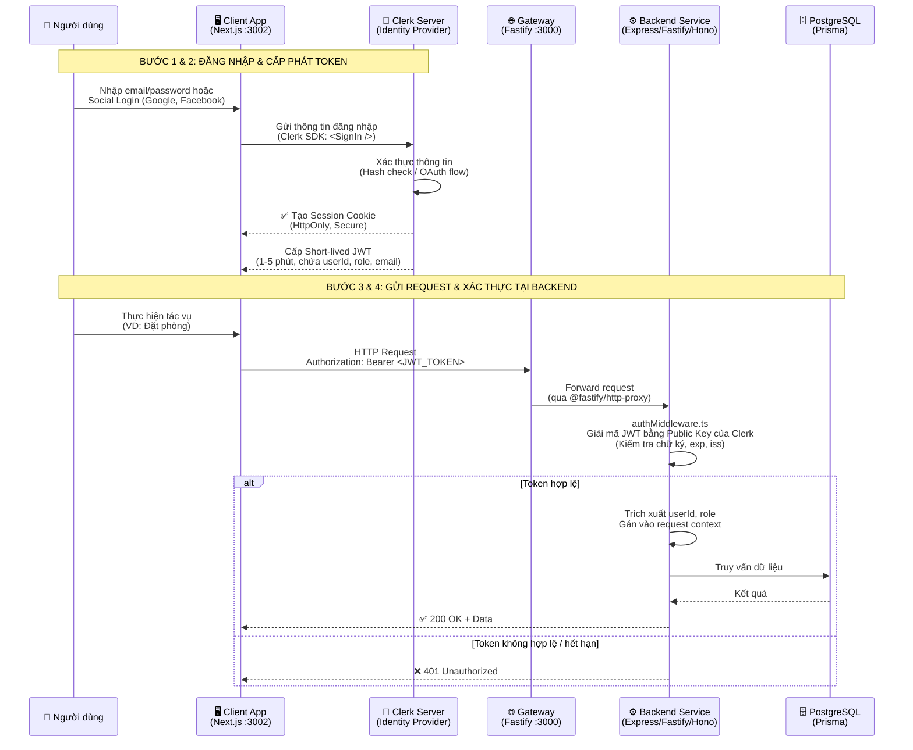
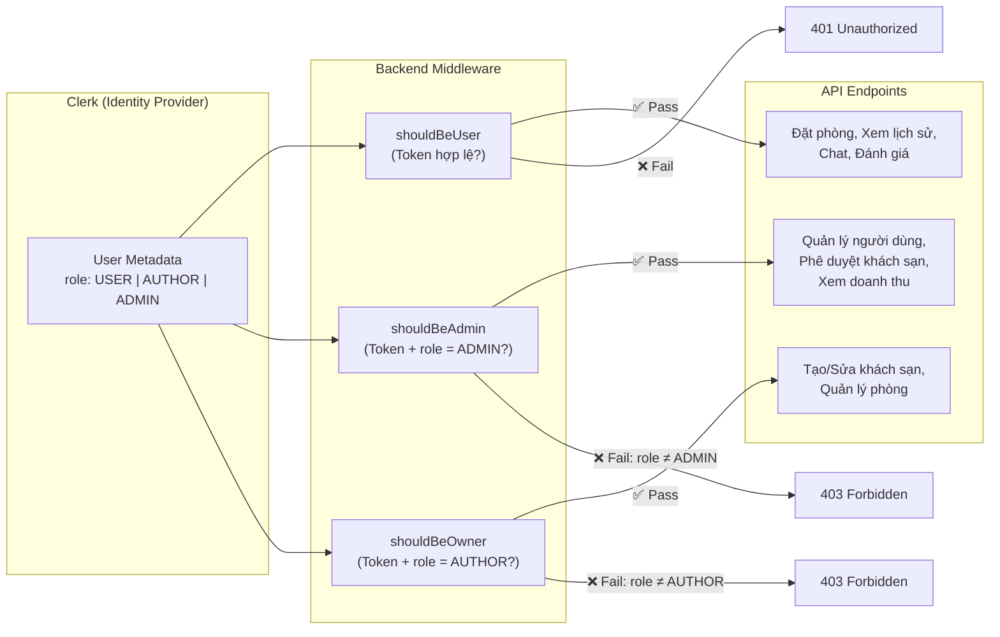
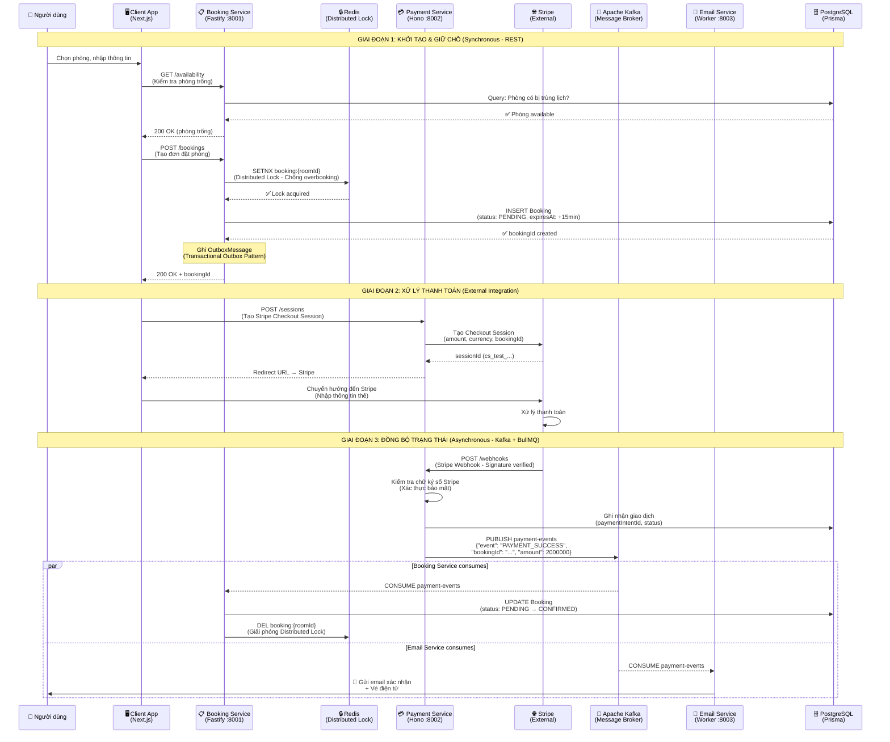
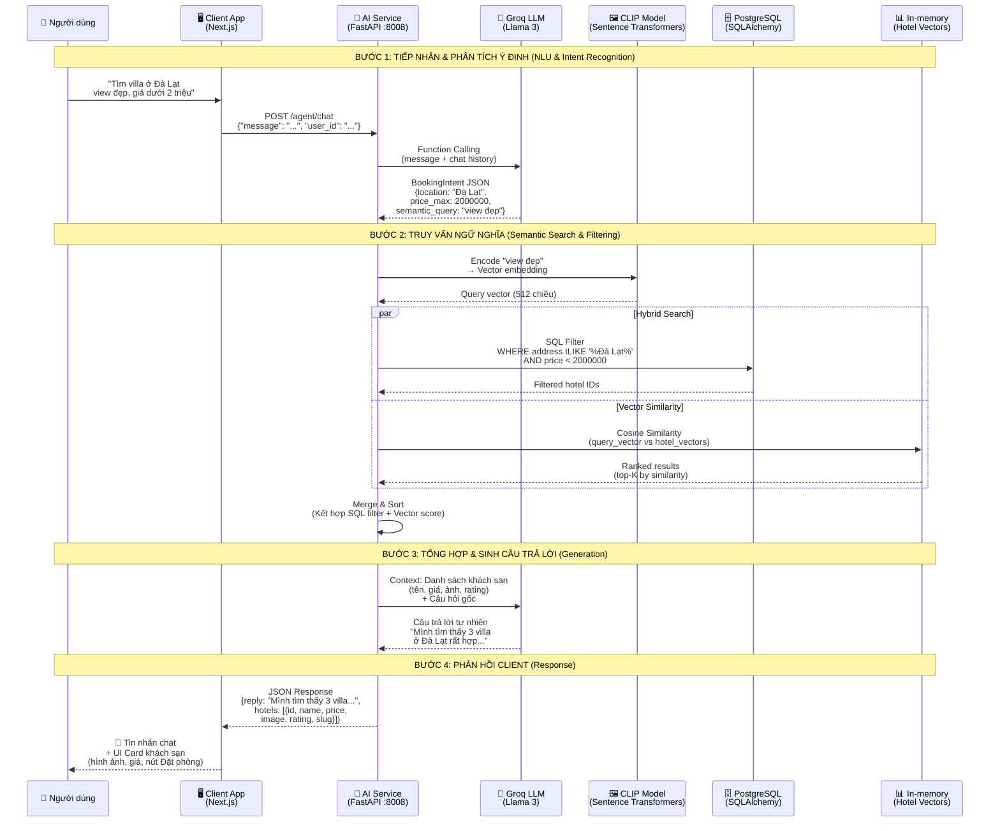
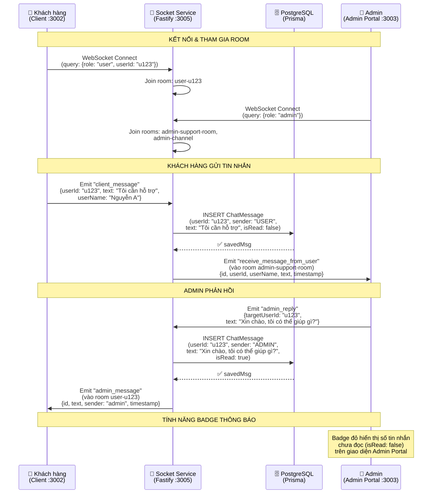
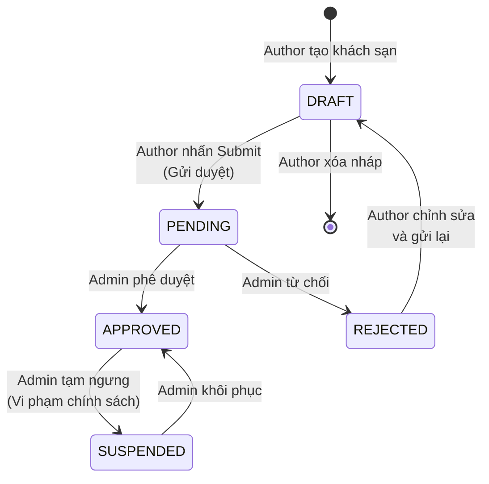
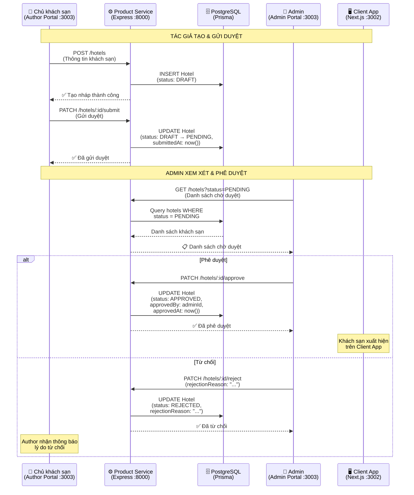

## 3.4.4. Thiết kế luồng xác thực và phân quyền (Authentication & Authorization) với Clerk

Trong kiến trúc Microservices phân tán, việc quản lý phiên đăng nhập (session) theo cách truyền thống (stateful) trở nên phức tạp và khó mở rộng. Do đó, hệ thống Stazy Hotel áp dụng cơ chế stateless authentication sử dụng chuẩn JSON Web Token kết hợp với Clerk để quản lý việc đăng nhập.

### Quản lý đăng nhập định danh

Thay vì tự xây dựng module đăng nhập, lưu trữ mật khẩu và xử lý các vấn đề bảo mật phức tạp (như mã hóa, MFA, CSRF), hệ thống ủy quyền toàn bộ trách nhiệm này cho Clerk.

**Vai trò của Clerk:**

- Lưu trữ thông tin định danh (User Identity): Email, Password (Hash), Social Provider (Google, Facebook).
- Quản lý vòng đời phiên đăng nhập (Session Lifecycle).
- Cấp phát JWT Template: Hệ thống cấu hình Clerk để tùy biến nội dung JWT, đính kèm các thông tin cần thiết như userId, role, email vào trong token.

### Luồng xác thực (Authentication Flow)

Quy trình xác thực diễn ra theo mô hình Bearer Token Authentication.

**Bước 1: Đăng nhập tại Client (Frontend)**

- Người dùng thực hiện đăng nhập trên giao diện Next.js thông qua Clerk SDK (`<SignIn />` component).
- Clerk xác thực thông tin. Nếu thành công, Clerk tạo một Session cookie tại trình duyệt (HttpOnly).

**Bước 2: Cấp phát Token**

Khi Client cần gọi API xuống Backend (ví dụ: Tạo đơn đặt phòng), Clerk SDK tại Frontend sẽ tự động lấy một Short-lived Access Token (JWT) từ Clerk Server. Token này có thời gian sống ngắn (ví dụ: 1-5 phút) để đảm bảo an toàn.

**Bước 3: Gửi Request**

- Client gửi HTTP Request đến API Gateway hoặc trực tiếp đến Microservice (Booking Service).
- Token được đính kèm trong Header: `Authorization: Bearer <JWT_TOKEN>`.

**Bước 4: Xác thực tại Backend (Middleware)**

- Tại các Microservice, một Middleware (`authMiddleware.ts`) sẽ chặn mọi request đến.
- Middleware sử dụng Public Key của Clerk để giải mã và kiểm tra tính hợp lệ của JWT (Chữ ký số, Thời gian hết hạn `exp`, Nhà phát hành `iss`).
- **Thành công:** Middleware trích xuất `userId` từ token và gán vào ngữ cảnh request (`userId`), sau đó chuyển tiếp cho Controller xử lý.
- **Thất bại:** Trả về lỗi `401 Unauthorized` ngay lập tức.

### Thiết kế phân quyền

Hệ thống áp dụng mô hình **Role-Based Access Control (RBAC)** để phân chia quyền hạn giữa ba vai trò: Khách hàng (USER), Chủ khách sạn (AUTHOR), và Quản trị viên (ADMIN).

- **Lưu trữ Role:** Role của người dùng được lưu trong Metadata của Clerk và được đồng bộ với PostgreSQL thông qua script `sync-roles.ts`.
- **Cơ chế kiểm tra:**
  - Middleware `shouldBeUser`: Chỉ yêu cầu token hợp lệ (bất kỳ ai đã đăng nhập). Áp dụng cho các API như: Đặt phòng, Xem lịch sử, Chat, Đánh giá.
  - Middleware `shouldBeOwner`: Kiểm tra token hợp lệ và role phải là AUTHOR. Áp dụng cho các API: Tạo/Sửa khách sạn, Quản lý phòng.
  - Middleware `shouldBeAdmin`: Ngoài việc token hợp lệ, Middleware sẽ kiểm tra thêm claim `role` trong payload của JWT. Nếu role không phải là ADMIN, hệ thống từ chối truy cập với lỗi `403 Forbidden`. Áp dụng cho các API: Quản lý người dùng, Phê duyệt khách sạn, Xem doanh thu.

---

## 3.4.5. Thiết kế luồng đặt phòng và thanh toán

Quy trình đặt phòng và thanh toán là nghiệp vụ quan trọng và phức tạp nhất của hệ thống Stazy Hotel. Do dữ liệu đơn hàng nằm ở Booking Service nhưng dữ liệu thanh toán lại nằm ở Payment Service (Stripe/VNPay Integration), hệ thống áp dụng mẫu thiết kế **Saga Orchestration Pattern** kết hợp **Transactional Outbox Pattern** để đảm bảo tính nhất quán dữ liệu phân tán (Distributed Data Consistency). Quy trình gồm 3 giai đoạn:

### Giai đoạn 1: Khởi tạo & giữ chỗ (Synchronous — REST)

Đây là giai đoạn tương tác trực tiếp với người dùng, yêu cầu phản hồi tức thì.

- **Kiểm tra khả dụng (Check Availability):** Client gọi API `GET /availability` tới Booking Service. Hệ thống truy vấn PostgreSQL để đảm bảo phòng chưa bị đặt trùng lịch.
- **Tạo đơn tạm (Drafting):** Client gọi API `POST /bookings`.
  - Booking Service thiết lập Distributed Lock trong Redis (Redlock) để chống overbooking.
  - Booking Service tạo một bản ghi với trạng thái `PENDING` (Chờ thanh toán).
  - Thiết lập thời gian hết hạn (`expiresAt`) là 15 phút.
  - Ghi `OutboxMessage` vào bảng `outbox_messages` (Transactional Outbox Pattern) để đảm bảo message delivery.
  - **Kết quả:** Trả về `bookingId` ngay lập tức cho Client để chuyển sang màn hình thanh toán. Lúc này phòng đã được "khóa mềm" (Soft lock).

### Giai đoạn 2: Xử lý thanh toán (External Integration)

Giai đoạn này phụ thuộc vào hành vi của người dùng và cổng thanh toán bên thứ 3 (Stripe/VNPay).

- **Thanh toán:** Client sử dụng `bookingId` để khởi tạo phiên thanh toán với Stripe thông qua Payment Service (`POST /sessions`).
- **Webhook Trigger:** Khi thanh toán thành công, Stripe sẽ gọi ngược lại (Callback) vào Webhook URL của Payment Service (`POST /webhooks`).
- **Xác thực:** Payment Service kiểm tra chữ ký số (Signature) của Stripe để đảm bảo tính bảo mật, sau đó ghi nhận giao dịch thành công.

### Giai đoạn 3: Đồng bộ trạng thái & hoàn tất (Asynchronous — Kafka + BullMQ)

Đây là nơi kiến trúc Event-Driven phát huy tác dụng. Payment Service không gọi trực tiếp Booking Service (để tránh lỗi dây chuyền nếu Booking Service bị quá tải/bảo trì).

- **Phát sự kiện (Publish):** Payment Service publish message vào Kafka Topic `payment-events` với nội dung: `{"event": "PAYMENT_SUCCESS", "bookingId": "uuid-...", "amount": 2000000, "timestamp": 1715420000}`.
- **Tiêu thụ sự kiện (Consume):**
  - **Booking Service:** Nhận message từ Kafka → Tìm đơn hàng theo ID → Cập nhật trạng thái từ `PENDING` sang `CONFIRMED` → Giải phóng Distributed Lock (Redis): Chủ động xóa key trong Redis (mặc dù khóa có thời gian tự hết hạn, việc xóa chủ động giúp dọn dẹp bộ nhớ ngay lập tức).
  - **Email Service:** Nhận message từ Kafka → Gửi email xác nhận đặt phòng và vé điện tử cho khách hàng.

**Saga Timeout (BullMQ):** Để xử lý trường hợp người dùng không hoàn thành thanh toán trong 15 phút, Booking Service sử dụng BullMQ saga-timeout queue. Khi timeout xảy ra, hệ thống tự động hủy booking và giải phóng Distributed Lock.

---

## 3.4.6. Thiết kế luồng AI chat và tìm kiếm (AI Agent Flow)

Tính năng AI Chatbot trong Stazy Hotel không chỉ là một mô hình ngôn ngữ (LLM) thông thường mà là một **AI Agent** (Tác tử thông minh) có khả năng sử dụng công cụ. Hệ thống áp dụng kiến trúc **RAG (Retrieval-Augmented Generation)** để kết hợp sức mạnh hiểu ngôn ngữ tự nhiên của LLM với dữ liệu chính xác từ cơ sở dữ liệu khách sạn.

Quy trình xử lý một yêu cầu tìm kiếm phức tạp (ví dụ: "Tìm villa ở Đà Lạt view đẹp, giá dưới 2 triệu") diễn ra qua 4 bước chính:

### Bước 1: Tiếp nhận & phân tích ý định (NLU & Intent Recognition)

- Client App gửi tin nhắn của người dùng đến AI Service (Python/FastAPI) qua cổng 8008.
- Agent Controller gọi API sang Groq (LLM — Llama 3) kèm theo lịch sử chat.
- **Chức năng:** LLM không trả lời ngay, mà thực hiện **Function Calling** để trích xuất cấu trúc dữ liệu (BookingIntent) từ câu nói tự nhiên:
  - `location`: "Đà Lạt"
  - `price_max`: 2.000.000
  - `semantic_query`: "view đẹp" (Từ khóa trừu tượng dùng cho vector search).

### Bước 2: Truy vấn ngữ nghĩa (Semantic Search & Filtering)

Đây là bước quan trọng nhất để tìm ra kết quả chính xác mà SQL truyền thống không làm được.

- **Vectorization:** Hệ thống sử dụng model `sentence-transformers` (CLIP-ViT-B-32) để chuyển đổi từ khóa trừu tượng "view đẹp" thành một vector số học (Embedding) 512 chiều.
- **Hybrid Search:** AI Service thực hiện truy vấn hỗn hợp vào Database:
  - **Lọc cứng (Filter):** Dùng SQL `WHERE` để lọc `address ILIKE '%Đà Lạt%'` và `price < 2000000` trên PostgreSQL.
  - **Lọc mềm (Vector Similarity):** Tính toán khoảng cách Cosine giữa vector câu hỏi và vector mô tả của các khách sạn còn lại (từ in-memory hotel_vectors). Sắp xếp kết quả theo độ tương đồng cao nhất.

### Bước 3: Tổng hợp và sinh câu trả lời (Generation)

- Danh sách các khách sạn tìm được (bao gồm tên, giá, ảnh, điểm đánh giá) được đưa ngược trở lại vào ngữ cảnh (Context) của LLM.
- LLM đóng vai trò là nhân viên tư vấn, sinh ra câu trả lời tự nhiên dựa trên dữ liệu thật vừa tìm được (ví dụ: "Mình tìm thấy 3 villa ở Đà Lạt rất hợp với ý bạn...").

### Bước 4: Phản hồi client (Response)

- AI Service trả về JSON chứa cả văn bản trả lời của AI và danh sách đối tượng khách sạn.
- Client app nhận JSON và render ra giao diện: Tin nhắn chat + UI card khách sạn (có hình ảnh và nút đặt phòng) giúp người dùng thao tác ngay lập tức.

**Ưu điểm của việc thiết kế kết hợp hybrid search và structured output:**

- **Hybrid Search:** Kết hợp sự chính xác của tìm kiếm từ khóa (Keyword Search) với sự thấu hiểu ngữ cảnh của tìm kiếm vector (Semantic Search).
- **Structured Output:** Sử dụng khả năng Function Calling của LLM để đảm bảo dữ liệu đầu ra luôn đúng định dạng JSON, giúp Frontend dễ dàng hiển thị giao diện đồ họa (Rich UI) thay vì chỉ text đơn thuần.

---

## 3.4.7. Thiết kế luồng chat hỗ trợ thời gian thực (Real-time Customer Support Flow)

Bên cạnh AI Chatbot tự động, hệ thống Stazy Hotel cung cấp tính năng chat trực tiếp giữa khách hàng (User) và đội ngũ hỗ trợ (Admin) thông qua giao thức WebSocket (Socket.io). Luồng này đảm bảo trải nghiệm hỗ trợ tức thì, không cần tải lại trang.

**Cơ chế hoạt động:**

- **Kết nối:** Khi user mở trang chat, Socket.io client kết nối đến Socket Service (port 3005) với query params `{role, userId}`.
- **Room-based messaging:** Socket Service tự động phân người dùng vào room phù hợp:
  - User: Join room `user-{userId}` (room riêng cho từng khách hàng).
  - Admin: Join room `admin-support-room` và `admin-channel`.
- **Lưu trữ tin nhắn:** Mọi tin nhắn (cả từ User và Admin) đều được lưu vào PostgreSQL thông qua Prisma (`ChatMessage` model) với các trường: `userId`, `sender` (USER | ADMIN | AI), `text`, `isRead`, `metadata`.
- **Badge thông báo:** Tin nhắn từ User được lưu với `isRead: false`. Admin Portal hiển thị badge đỏ cho các cuộc hội thoại có tin chưa đọc, giúp admin không bỏ lỡ yêu cầu hỗ trợ.

---

## 3.4.8. Thiết kế luồng phê duyệt khách sạn (Hotel Approval Workflow)

Để đảm bảo chất lượng danh sách khách sạn trên nền tảng, hệ thống Stazy Hotel triển khai quy trình phê duyệt bắt buộc trước khi khách sạn được hiển thị công khai. Quy trình này áp dụng mô hình **State Machine** với các trạng thái rõ ràng.

**Các trạng thái trong vòng đời khách sạn:**

| Trạng thái  | Mô tả                              | Có hiển thị trên Client? |
| ----------- | ---------------------------------- | ------------------------ |
| `DRAFT`     | Author đang soạn, chưa gửi duyệt   | ❌ Không                 |
| `PENDING`   | Đang chờ Admin duyệt               | ❌ Không                 |
| `APPROVED`  | Đã được duyệt, hiển thị công khai  | ✅ Có                    |
| `REJECTED`  | Bị từ chối (kèm lý do)             | ❌ Không                 |
| `SUSPENDED` | Bị tạm ngưng do vi phạm chính sách | ❌ Không                 |

**Cơ chế kiểm soát truy cập:**

- Chỉ **Author** (role = AUTHOR) mới có thể tạo/sửa khách sạn của mình.
- Chỉ **Admin** (role = ADMIN) mới có quyền phê duyệt/từ chối/tạm ngưng.
- **User** thường chỉ thấy các khách sạn có `status = APPROVED`.

---

## Tổng kết các luồng hoạt động chính

| STT | Luồng                      | Dịch vụ tham gia                           | Cơ chế giao tiếp         | Mẫu thiết kế                              |
| --- | -------------------------- | ------------------------------------------ | ------------------------ | ----------------------------------------- |
| 1   | Xác thực & Phân quyền      | Client, Gateway, Backend, Clerk            | Synchronous (REST + JWT) | Bearer Token + RBAC                       |
| 2   | Đặt phòng & Thanh toán     | Client, Booking, Payment, Email, Stripe    | Hybrid (Sync + Async)    | Saga Orchestration + Transactional Outbox |
| 3   | AI Chat & Tìm kiếm         | Client, AI Service, Groq, PostgreSQL       | Synchronous (REST)       | RAG + Function Calling + Hybrid Search    |
| 4   | Chat hỗ trợ thời gian thực | Client, Admin, Socket Service, PostgreSQL  | Asynchronous (WebSocket) | Room-based Messaging                      |
| 5   | Phê duyệt khách sạn        | Author, Admin, Product Service, PostgreSQL | Synchronous (REST)       | State Machine (Stateless)                 |
