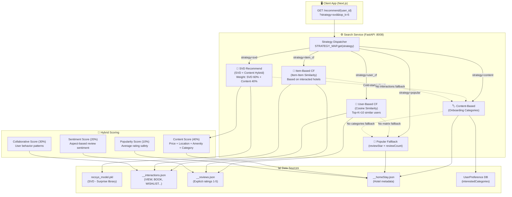
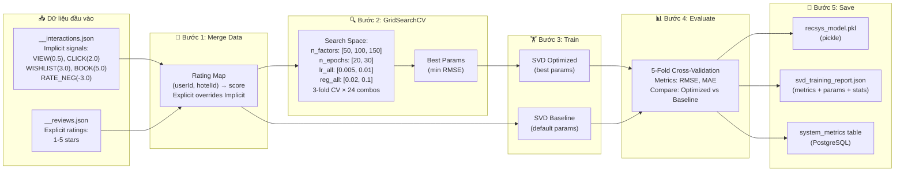
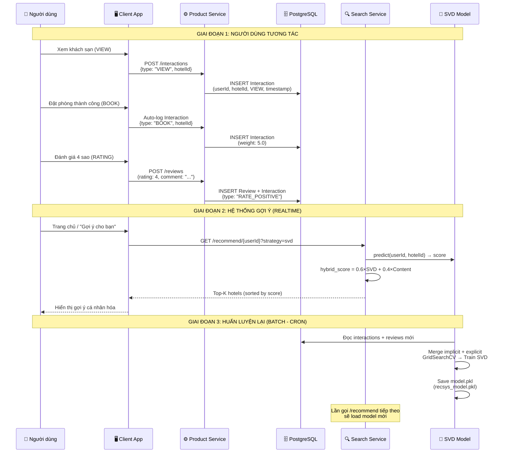
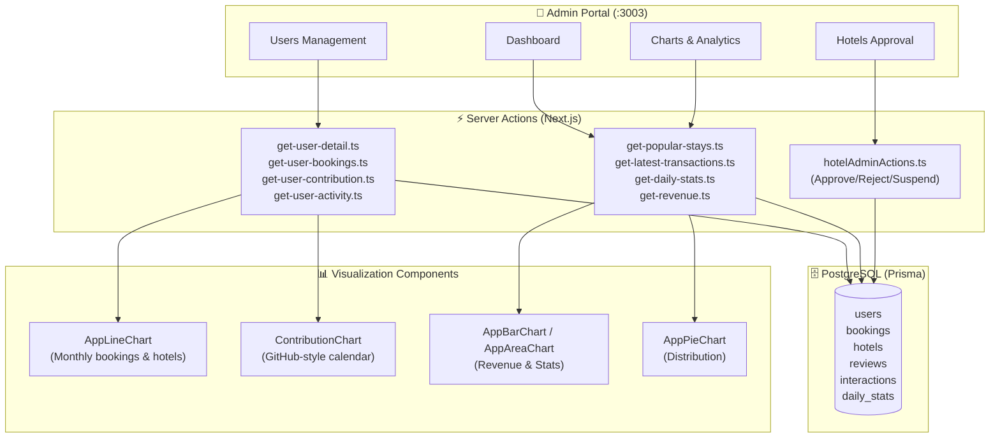
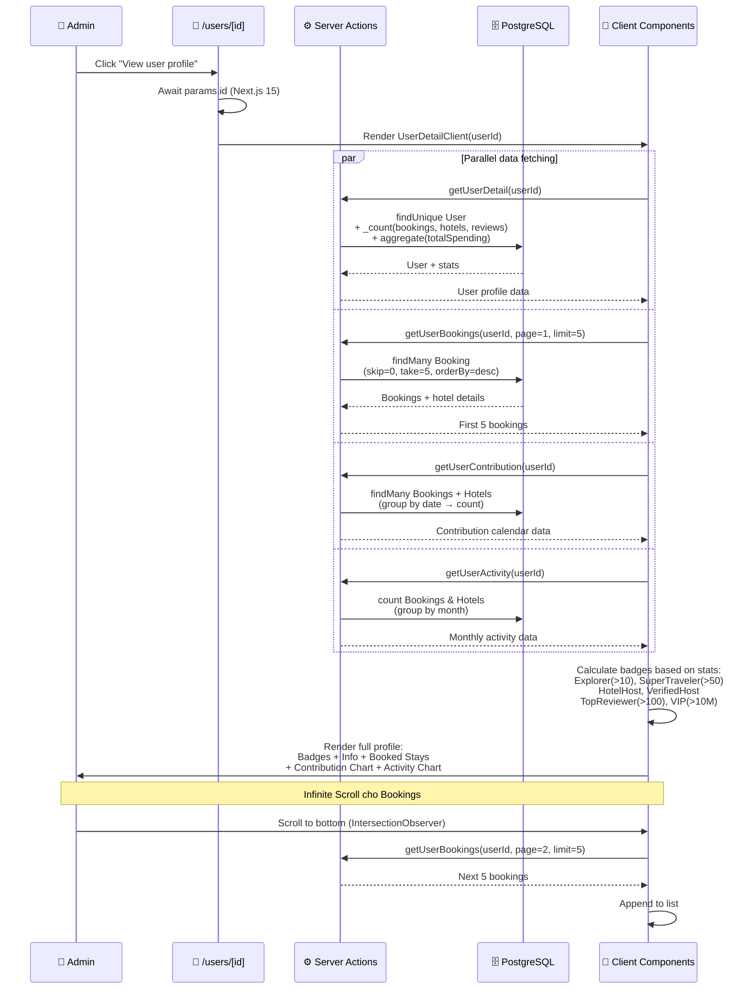
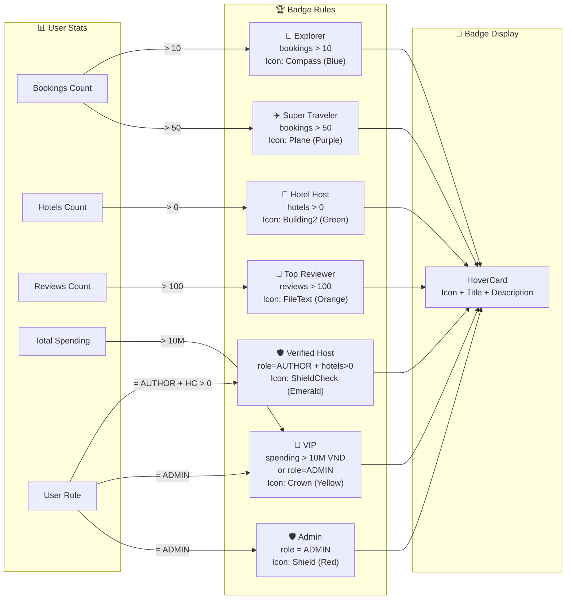
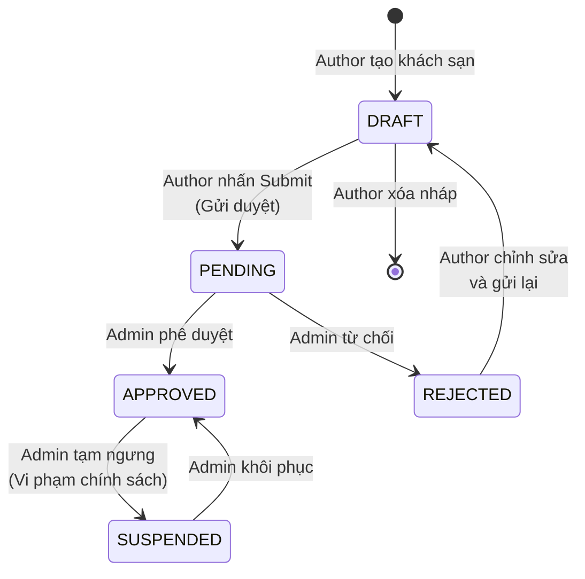
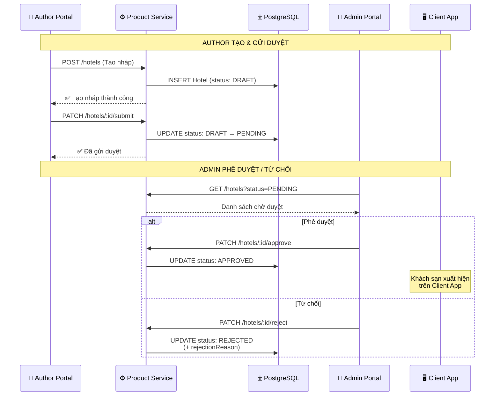
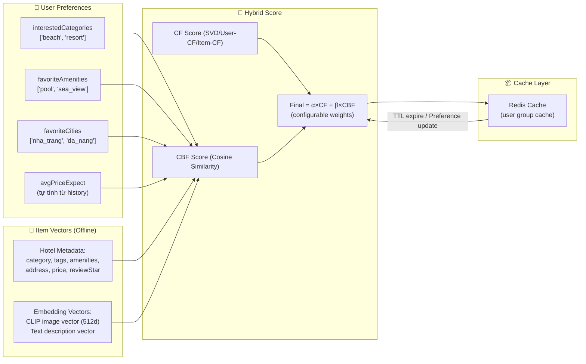

# Bản cập nhật 2 — Hệ thống gợi ý & Các luồng hoạt động quan trọng

## Mục tiêu

- Mô tả chi tiết kiến trúc hệ thống gợi ý (Recommendation Engine) đa chiến lược đã triển khai.
- Trình bày luồng huấn luyện mô hình SVD và đánh giá offline.
- Minh họa các luồng hoạt động quan trọng khác: Admin Dashboard, User Profile & Badges, Interaction → Recommendation feedback loop.

---

## 1. Kiến trúc hệ thống gợi ý (Multi-Strategy Recommendation Engine)

Hệ thống Stazy triển khai **5 chiến lược gợi ý** trong file `src/recommend.py`, với cơ chế fallback tự động khi chiến lược chính không khả dụng (cold-start, sparse data).

### Bảng chiến lược & cơ chế fallback

| Chiến lược      | Mô tả                                             | Dữ liệu đầu vào                       | Fallback khi cold-start |
| --------------- | ------------------------------------------------- | ------------------------------------- | ----------------------- |
| `svd` (default) | SVD Matrix Factorization + Content Hybrid (60/40) | `recsys_model.pkl` + User profile     | → `content` → `popular` |
| `user_cf`       | User-Based CF (Cosine Similarity, K=10)           | User-Item Matrix từ interactions      | → `content` → `popular` |
| `item_cf`       | Item-Based CF (Item-Item Similarity)              | User-Item Matrix transpose            | → `content` → `popular` |
| `content`       | Content-Based (Onboarding categories)             | `UserPreference.interestedCategories` | → `popular`             |
| `popular`       | Top-rated hotels (reviewStar × reviewCount)       | Hotel metadata                        | — (ultimate fallback)   |

---

## 2. Luồng huấn luyện mô hình SVD (Training Pipeline)

Quy trình huấn luyện offline được thực hiện bởi `train_svd.py` với 5 bước: Load Data → GridSearchCV → Train Final → Evaluate → Save.

---

## 3. Luồng tương tác người dùng → Gợi ý (Interaction → Recommendation Feedback Loop)

Mỗi hành vi của người dùng (VIEW, BOOK, WISHLIST, RATE...) được ghi vào bảng `Interaction` và gián tiếp cải thiện chất lượng gợi ý qua chu kỳ huấn luyện lại mô hình.

---

## 4. Luồng quản trị Admin Dashboard

Admin Dashboard là trung tâm điều khiển của hệ thống, cho phép quản trị viên theo dõi thống kê, phê duyệt khách sạn, quản lý người dùng và xem biểu đồ doanh thu.

### Luồng chi tiết: Xem profile người dùng (User Detail Page)

---

## 5. Luồng User Badges (Huy hiệu người dùng)

Huy hiệu được tính toán realtime dựa trên dữ liệu thống kê của người dùng. Mỗi badge có icon Lucide, màu sắc riêng và mô tả chi tiết.

---

## 6. Luồng phê duyệt khách sạn (Hotel Approval Workflow)

---

## 7. Luồng Content-Based Filtering (Đề xuất mở rộng)

Dựa trên sở thích tường minh (Explicit Preferences) được lưu trong bảng `UserPreference`, hệ thống có thể mở rộng sang Content-Based Filtering.

---

## 8. Tổng kết các luồng hoạt động chính

| STT | Luồng                      | Dịch vụ tham gia                           | Cơ chế giao tiếp         | Mẫu thiết kế                                         |
| --- | -------------------------- | ------------------------------------------ | ------------------------ | ---------------------------------------------------- |
| 1   | Xác thực & Phân quyền      | Client, Gateway, Backend, Clerk            | Synchronous (REST + JWT) | Bearer Token + RBAC                                  |
| 2   | Đặt phòng & Thanh toán     | Client, Booking, Payment, Email, Stripe    | Hybrid (Sync + Async)    | Saga Orchestration + Transactional Outbox            |
| 3   | AI Chat & Tìm kiếm         | Client, AI Service, Groq, PostgreSQL       | Synchronous (REST)       | RAG + Function Calling + Hybrid Search               |
| 4   | Chat hỗ trợ thời gian thực | Client, Admin, Socket Service, PostgreSQL  | Asynchronous (WebSocket) | Room-based Messaging                                 |
| 5   | Phê duyệt khách sạn        | Author, Admin, Product Service, PostgreSQL | Synchronous (REST)       | State Machine (Stateless)                            |
| 6   | Hệ thống gợi ý             | Client, Search Service, PostgreSQL, Redis  | Synchronous (REST)       | Multi-Strategy Hybrid (SVD + CF + Content + Popular) |
| 7   | Huấn luyện mô hình SVD     | train_svd.py, PostgreSQL                   | Batch (Offline)          | GridSearchCV + Cross-Validation                      |
| 8   | Admin Dashboard            | Admin Portal, Server Actions, PostgreSQL   | Synchronous (REST + SSR) | Server Components + React Query                      |
| 9   | Interaction Feedback Loop  | Client, Product Service, Search Service    | Hybrid (Sync + Batch)    | Event Logging → Model Retraining                     |
| 10  | Content-Based Filtering    | Search Service, PostgreSQL, Redis          | Synchronous (REST)       | User Preference → Cosine Similarity                  |

---

## 9. Lộ trình đề xuất mở rộng

- **Bước 1**: Thu thập & chuẩn hóa thuộc tính item (2 tuần) — Chuẩn hóa `amenities`, `tags`, `suitableFor` cho tất cả khách sạn.
- **Bước 2**: Triển khai CBF prototype + offline evaluation (1-2 tuần) — Tính `item_vector` từ metadata, đánh giá Precision@K.
- **Bước 3**: Kết hợp Hybrid experiment, A/B testing (2-4 tuần) — So sánh CTR đặt phòng giữa CF-only và CF+CBF.
- **Bước 4**: Productionization — Feature store (Redis/Milvus), caching, monitoring, auto-retrain.

---

_Tài liệu tham khảo: xem [task/update_report_1.md](task/update_report_1.md) để đối chiếu luồng xác thực và luồng đặt phòng đã thiết kế trước đó._
