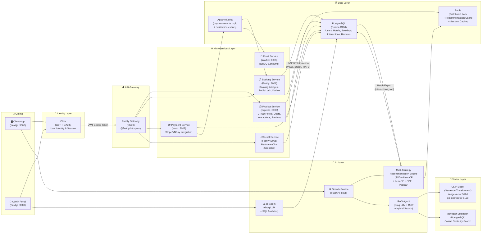
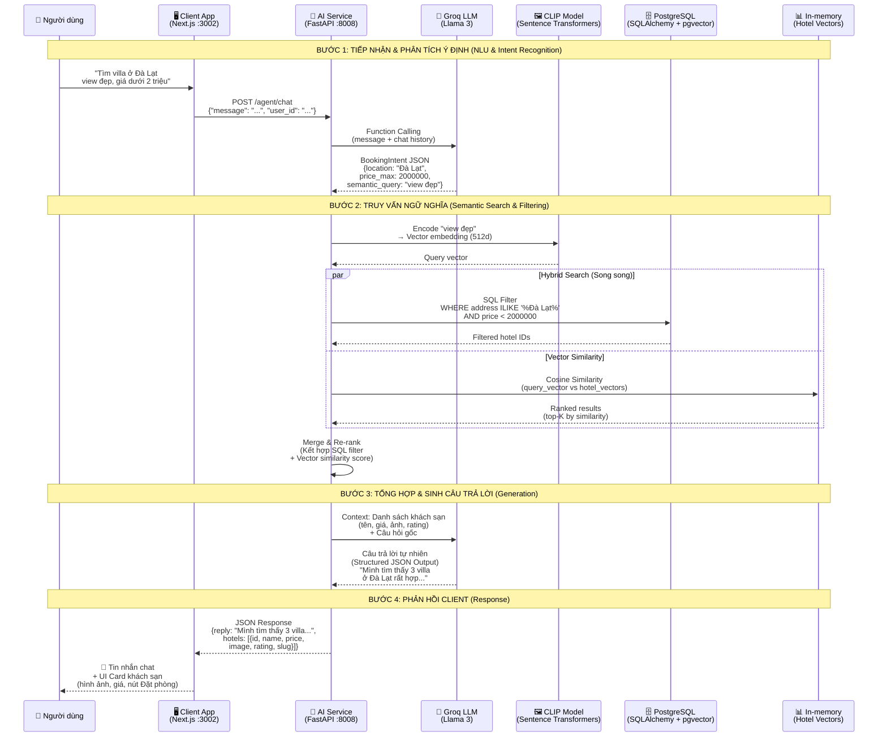
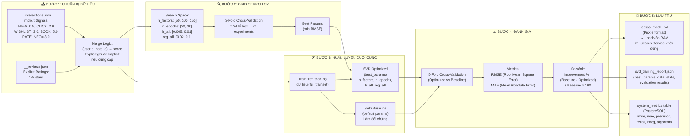

## 3.4.9. Thiết kế kiến trúc hệ thống Hybrid & Microservices (System Architecture Overview)

Hệ thống Stazy Hotel được xây dựng theo kiến trúc Microservices kết hợp với các module AI (Collaborative Filtering, Content-Based Filtering, RAG) và hạ tầng phân tán (Message Broker, Cache Layer, Vector Database). Sơ đồ tổng quan dưới đây mô tả cách các thành phần tương tác với nhau trong kiến trúc hybrid.

**Mô tả các lớp kiến trúc:**

- **Identity Layer (Clerk):** Quản lý xác thực stateless bằng JWT. Frontend lấy short-lived token từ Clerk SDK, đính kèm vào header `Authorization: Bearer <token>`. Gateway và các Microservice xác thực token bằng Public Key của Clerk.
- **API Gateway (Fastify :3000):** Proxy ngược (reverse proxy) sử dụng `@fastify/http-proxy`, chuyển tiếp request đến đúng Microservice. Áp dụng rate limiting và CORS.
- **Microservices Layer:** 5 service độc lập, mỗi service quản lý database của riêng mình (Database per Service pattern). Giao tiếp nội bộ qua Kafka (async) hoặc REST (sync).
- **AI Layer (Search Service :8008):** Chứa 3 module AI chính:
  - **Multi-Strategy Recommendation Engine:** 5 chiến lược (SVD, User-CF, Item-CF, Content-Based, Popular) với cơ chế fallback tự động.
  - **RAG Agent:** AI Chatbot sử dụng Groq LLM (Llama 3) + CLIP vector search + SQL hybrid search.
  - **BI Agent:** Phân tích kinh doanh tự động bằng LLM, sinh báo cáo từ dữ liệu PostgreSQL.
- **Data Layer:** PostgreSQL (Prisma ORM) làm nguồn dữ liệu chính, Redis cho distributed lock và cache, Kafka cho event-driven communication.
- **Vector Layer:** CLIP model encode hình ảnh và mô tả thành vector 512 chiều, lưu vào PostgreSQL với pgvector extension để thực hiện cosine similarity search.

---

## 3.4.10. Thiết kế luồng RAG & Vector-Based Content Filtering (AI Agent Flow)

Tính năng AI Chatbot trong Stazy Hotel không chỉ là một mô hình ngôn ngữ (LLM) thông thường mà là một AI Agent (Tác tử thông minh) có khả năng sử dụng công cụ. Hệ thống áp dụng kiến trúc RAG (Retrieval-Augmented Generation) kết hợp Vector-Based Content Filtering để tìm kiếm ngữ nghĩa trên dữ liệu khách sạn.

Quy trình xử lý một yêu cầu tìm kiếm phức tạp (ví dụ: "Tìm villa ở Đà Lạt view đẹp, giá dưới 2 triệu") diễn ra qua 4 bước chính:

**Bước 1: Tiếp nhận & phân tích ý định (NLU & Intent Recognition)**

- Client App gửi tin nhắn của người dùng đến AI Service (Python/FastAPI) qua cổng 8008.
- Agent Controller gọi API sang Groq (LLM — Llama 3) kèm theo lịch sử chat.
- LLM không trả lời ngay, mà thực hiện Function Calling để trích xuất cấu trúc dữ liệu (BookingIntent) từ câu nói tự nhiên: `location`, `price_max`, `semantic_query`.

**Bước 2: Truy vấn ngữ nghĩa (Semantic Search & Filtering)**

- **Vectorization:** Hệ thống sử dụng model `sentence-transformers` (CLIP-ViT-B-32) để chuyển đổi từ khóa trừu tượng "view đẹp" thành vector 512 chiều.
- **Hybrid Search:** Thực hiện truy vấn hỗn hợp song song:
  - **Lọc cứng (SQL Filter):** `WHERE address ILIKE '%Đà Lạt%' AND price < 2000000` trên PostgreSQL.
  - **Lọc mềm (Vector Similarity):** Tính toán Cosine Similarity giữa query vector và hotel vectors (in-memory hoặc pgvector).
  - **Merge & Re-rank:** Kết hợp kết quả SQL filter với vector similarity score.

**Bước 3: Tổng hợp và sinh câu trả lời (Generation)**

- Danh sách khách sạn tìm được đưa vào ngữ cảnh (Context) của LLM.
- LLM sinh câu trả lời tự nhiên dựa trên dữ liệu thật (Structured JSON Output).

**Bước 4: Phản hồi client (Response)**

- AI Service trả về JSON chứa cả văn bản trả lời và danh sách khách sạn.
- Client render giao diện: Tin nhắn chat + UI card khách sạn (hình ảnh, giá, nút Đặt phòng).

**Vector-Based Content Filtering (Mở rộng cho Recommendation):**

Bên cạnh RAG search, hệ thống sử dụng CLIP embeddings để cải thiện chất lượng gợi ý:

- **Offline Pipeline:** Encode tất cả hình ảnh khách sạn → `imageVector` (512d) và mô tả → `policiesVector` (512d), lưu vào PostgreSQL với pgvector extension.
- **Online Pipeline:** Khi user tương tác (VIEW, BOOK, WISHLIST), hệ thống tính user preference vector dựa trên weighted average của các hotel vectors user đã tương tác.
- **Hybrid Scoring:** Kết hợp vector similarity với metadata matching: `Final = 0.5 × VectorSim + 0.3 × MetadataMatch + 0.2 × Popularity`.

---

## 3.4.11. Thiết kế luồng huấn luyện và đánh giá mô hình SVD (SVD Training Pipeline)

Để đảm bảo chất lượng gợi ý, hệ thống triển khai quy trình huấn luyện mô hình SVD (Singular Value Decomposition) offline với đầy đủ các bước: chuẩn bị dữ liệu, tìm kiếm siêu tham số (Hyperparameter Tuning), huấn luyện mô hình cuối cùng, đánh giá chéo (Cross-Validation) và lưu trữ kết quả. Quy trình này được thực hiện bởi `train_svd.py` và đánh giá bởi `evaluate.py`.

**Bước 1: Chuẩn bị dữ liệu (Data Preparation)**

- Tải dữ liệu từ 2 nguồn: `__interactions.json` (implicit signals) và `__reviews.json` (explicit ratings).
- Chuyển đổi implicit signals thành điểm số theo trọng số: VIEW=0.5, CLICK_BOOK_NOW=2.0, ADD_TO_WISHLIST=3.0, RATE_POSITIVE=4.5, BOOK=5.0, RATE_NEGATIVE=-3.0.
- Merge logic: Explicit ratings ghi đè implicit nếu cùng cặp (userId, hotelId), vì explicit feedback đáng tin cậy hơn.
- Kết quả: DataFrame `(userId, hotelId, score)` với score range [−3.0, 5.0].

**Bước 2: Tìm kiếm siêu tham số (GridSearchCV)**

- Sử dụng thư viện Surprise với GridSearchCV trên không gian 24 tổ hợp tham số × 3-fold Cross-Validation.
- Không gian tìm kiếm: `n_factors` [50, 100, 150], `n_epochs` [20, 30], `lr_all` [0.005, 0.01], `reg_all` [0.02, 0.1].
- Chọn tổ hợp cho RMSE thấp nhất trên validation set.

**Bước 3: Huấn luyện mô hình cuối cùng (Final Training)**

- Huấn luyện 2 mô hình trên toàn bộ dữ liệu:
  - **SVD Optimized:** Sử dụng best params từ GridSearchCV.
  - **SVD Baseline:** Sử dụng default params (làm đối chứng so sánh).

**Bước 4: Đánh giá (Evaluation)**

- 5-Fold Cross-Validation trên cả 2 mô hình.
- Metrics: RMSE (Root Mean Square Error), MAE (Mean Absolute Error).
- Tính phần trăm cải thiện: `Improvement = (Baseline − Optimized) / Baseline × 100%`.

**Bước 5: Lưu trữ (Persistence)**

- Lưu model dưới dạng pickle (`recsys_model.pkl`) → được load vào RAM khi Search Service khởi động.
- Lưu báo cáo huấn luyện (`svd_training_report.json`) chứa best params, data stats, evaluation results.
- Ghi metrics vào bảng `system_metrics` trong PostgreSQL để theo dõi qua Admin Dashboard.

**Đánh giá bổ sung (Dual-Feedback Evaluation — `evaluate.py`):**

Ngoài đánh giá SVD, hệ thống đánh giá riêng biệt cho 2 loại feedback:

- **System A (Implicit CF):** User-Based CF (Cosine Similarity, K=5) trên temporal split (60/20/20). Metrics: Precision@K, Recall@K, NDCG@K. So sánh với Baseline (Top Popular Items).
- **System B (Explicit CF):** User-Based CF (Pearson Correlation, Mean-Centering, K=10) trên temporal split. Metrics: RMSE, MAE. So sánh với Baseline (User Mean).

```mermaid
flowchart TB
    subgraph Implicit["🔵 System A: Implicit CF (Ranking)"]
        A1["Convert signals → scores"]
        A2["Temporal Split 60/20/20"]
        A3["User-Item Matrix<br/>(fillna=0, Cosine Similarity)"]
        A4["User-Based CF<br/>(K=5 neighbors)"]
        A5["Metrics:<br/>Precision@5, Recall@5, NDCG@5<br/>vs Baseline: Top Popular"]
        A1 --> A2 --> A3 --> A4 --> A5
    end

    subgraph Explicit["🟢 System B: Explicit CF (Rating Prediction)"]
        B1["Prepare ratings<br/>(1-5 stars từ reviews)"]
        B2["Temporal Split 60/20/20"]
        B3["Mean-Centering<br/>(Pearson Correlation)"]
        B4["User-Based CF<br/>(K=10 neighbors,<br/>bias correction)"]
        B5["Metrics:<br/>RMSE, MAE<br/>vs Baseline: User Mean"]
        B1 --> B2 --> B3 --> B4 --> B5
    end
```

---

## Tổng kết các luồng hoạt động chính

| STT | Luồng                            | Dịch vụ tham gia                              | Cơ chế giao tiếp                  | Mẫu thiết kế                                               |
| --- | -------------------------------- | --------------------------------------------- | --------------------------------- | ---------------------------------------------------------- |
| 1   | Xác thực & Phân quyền            | Client, Gateway, Backend, Clerk               | Synchronous (REST + JWT)          | Bearer Token + RBAC                                        |
| 2   | Đặt phòng & Thanh toán           | Client, Booking, Payment, Email, Stripe       | Hybrid (Sync + Async)             | Saga Orchestration + Transactional Outbox                  |
| 3   | AI Chat & Tìm kiếm               | Client, AI Service, Groq, PostgreSQL          | Synchronous (REST)                | RAG + Function Calling + Hybrid Search                     |
| 4   | Kiến trúc Hybrid & Microservices | Toàn bộ hệ thống                              | Hybrid (REST + WebSocket + Kafka) | Microservices + AI Layer + Vector Layer                    |
| 5   | RAG & Vector-Based CBF           | AI Service, Groq, CLIP, PostgreSQL (pgvector) | Synchronous (REST)                | RAG + CLIP Embedding + Hybrid Search                       |
| 6   | Huấn luyện & đánh giá SVD        | train_svd.py, evaluate.py, PostgreSQL         | Batch (Offline)                   | GridSearchCV + Cross-Validation + Dual-Feedback Evaluation |

---

_Tài liệu tham khảo:_

- _[task/update_report_1.md](task/update_report_1.md) — Luồng xác thực, đặt phòng, AI chat, chat realtime, phê duyệt khách sạn_
- _[task/update_report_2.md](task/update_report_2.md) — Kiến trúc hệ thống gợi ý, luồng Admin Dashboard_
